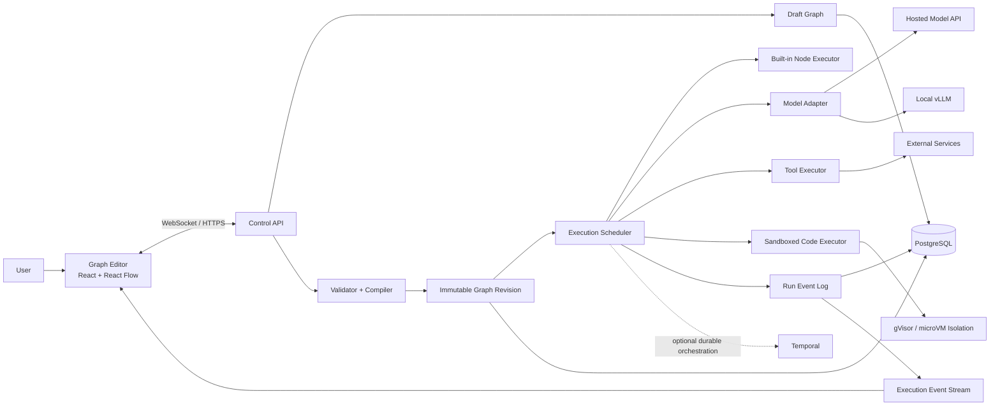
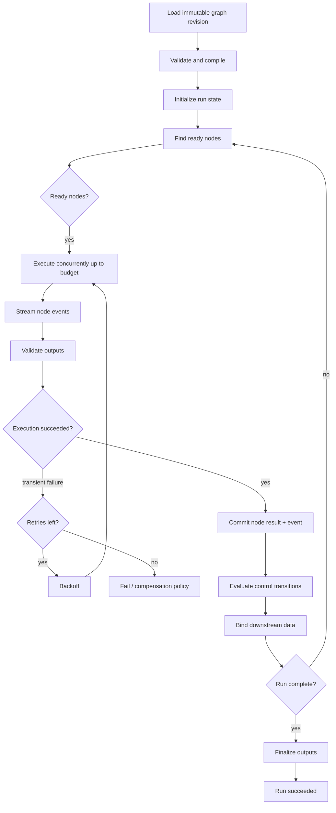
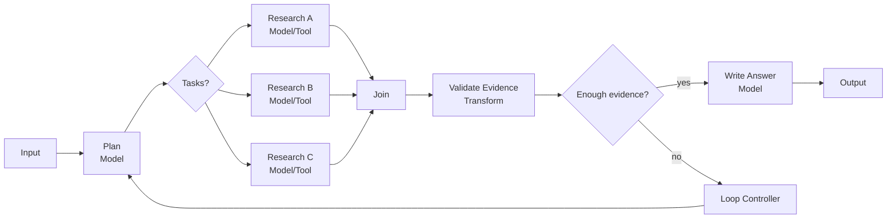

# Designing and Building a User-Editable Model Execution Harness

## Executive summary

A useful definition of a **model harness** is not “a large prompt” and not merely an agent framework. It is the software system surrounding model invocation: it owns task state, context construction, tool access, execution order, streaming, retries, approvals, isolation, persistence, and the final result. OpenAI describes its Codex harness in essentially these terms, including conversation state, streaming, tools, sandboxing and approvals; LangGraph similarly separates a higher-level agent harness from the orchestration runtime underneath it. citeturn7search0turn8search13

For the system you described—a canvas where arbitrary users create nodes, wire them together, and expect models to obey the resulting chain—the most important architectural decision is:

> **The model should not be responsible for “following the graph.” The harness should follow the graph.**

The graph should compile into an executable intermediate representation. The scheduler deterministically decides which node runs next, what inputs it receives, which branches activate, when loops terminate, and what outputs become available. A model-call node receives only the instructions and bound inputs relevant to that node. Model-based routing can exist, but only as an explicit node whose output is schema-constrained and interpreted by the harness. This separates deterministic orchestration from inherently external model calls, similar to Temporal's distinction between deterministic workflow logic and nondeterministic Activities such as API or LLM calls. citeturn22search2turn22search26

My recommended baseline architecture is:

**React + TypeScript + React Flow** for the graph editor; **Python + FastAPI + Pydantic** for the control API and graph compiler; an **asyncio-based execution engine initially**, with **Temporal** added when runs must survive crashes, span minutes/hours/days, or coordinate many workers; **PostgreSQL** for graphs/revisions/runs/events; WebSockets for live execution events and editor communication; **Yjs** if true simultaneous collaborative editing is needed; an adapter layer around the **OpenAI Responses API** and OpenAI-compatible local servers such as **vLLM**; and Docker/Kubernetes with **gVisor or Firecracker-class isolation for user-controlled executable nodes**. FastAPI directly supports WebSockets, PostgreSQL provides indexed `jsonb`, Yjs is a CRDT designed for collaborative applications, Temporal supplies replay-based durable workflows, and vLLM exposes OpenAI-compatible interfaces including a Responses endpoint. citeturn13search2turn14search0turn13search3turn22search6turn22search5

A strong implementation should have **three representations of a graph**:

1. The **editable document**, containing UI positions, collapsed panels, comments and draft state.
2. An **immutable semantic graph revision**, containing only execution-relevant nodes, edges, configurations, schemas and policies.
3. A **compiled execution plan**, normalized into typed ports, control transitions, join policies, loop boundaries, node executors and prompt plans.

The distinction is valuable because changing a node's screen position should not invalidate a production deployment or its semantic hash.

The graph itself should support two logically distinct edge classes:

- **Data edges** move typed values from an output port to an input port.
- **Control edges** decide execution order.

Many visual systems conflate these concepts. For an AI harness, separating them substantially simplifies branching, joins, retries, loops and debugging.

For persistence, I recommend canonical JSON as the authoritative portable graph representation and JSON Schema for node configuration/input/output contracts. JSON is a standardized language-independent interchange format and JSON Schema provides a formal validation vocabulary. Protocol Buffers are useful later for high-volume internal RPC or execution-event transport, but are a poor primary authoring format; protobuf wire serialization order is not inherently canonical, whereas JSON Canonicalization Scheme, RFC 8785, exists specifically to create invariant JSON suitable for hashing/signatures. citeturn12search3turn12search0turn12search21turn12search14

A good first production version does **not** need unrestricted “Code” nodes. Let ordinary users build custom nodes from declarative instructions, schemas, model settings and subgraphs. Treat arbitrary executable code as a separate, privileged node category, because prompt injection, excessive agency, improper output handling and unbounded resource use are recognized LLM-application risks. OWASP also explicitly recommends enforcing strict controls outside the model rather than trusting system prompts to enforce them. citeturn16search0turn16search4turn16search13turn16search19

The resulting high-level design is:



This division follows the broader pattern visible in workflow runtimes: graph/state definitions are separate from the runner that executes them. LangGraph formalizes graphs around shared state, nodes and edges—including cycles—while systems such as Apache Beam similarly distinguish graph topology from the runner responsible for execution. citeturn8search0turn8search4

## Harness concepts, architecture patterns, and open-source references

The term **harness** is useful because it captures more than orchestration. An orchestration framework can answer “which function runs next?” A complete harness additionally answers “what did the model see, what is it allowed to do, how is state persisted, how are failures recovered, what does the user approve, how is execution observed, and what happens if generated code is hostile?” OpenAI's 2026 description of Codex explicitly treats the harness as the execution system around the model rather than merely the prompt. citeturn7search0turn7search2

Several architecture patterns are worth distinguishing.

**Linear prompt pipelines** are the simplest: input → model → transform → model → output. They are easy to reason about but quickly become unwieldy once users need parallelism, branching or iteration.

**Directed acyclic workflows** generalize this into a DAG. Independent branches can run concurrently, and joins combine their outputs. This is an excellent default for data-processing and retrieval workflows.

**State graphs** add cycles and conditionally chosen transitions. LangGraph's graph API explicitly models shared state, nodes and edges and supports cyclic execution; its execution model draws on Pregel-style iterative graph computation. citeturn8search0turn8search1

**Durable workflows** persist enough event history to reconstruct execution after process or machine failure. Temporal does this through recorded workflow history and deterministic replay, automatically restoring pre-failure workflow state. citeturn22search6turn22search14

**Agent loops** let a model dynamically choose tools or subtasks rather than statically predefining every path. LangGraph describes this distinction as predetermined workflows versus more dynamic agents. citeturn8search9

Your system should support both workflow and agent behavior, but represent them explicitly. A deterministic conditional node is fundamentally different from a `model_router` node, even though both can draw two outgoing arrows on a canvas.

A good graph compiler can therefore target an internal representation such as:

```text
Graph
 ├── declarative nodes
 ├── typed input/output ports
 ├── data dependencies
 ├── control transitions
 ├── branch predicates
 ├── loop regions
 ├── join policies
 ├── capability/security requirements
 └── execution policies
       ├── timeout
       ├── retry
       ├── concurrency
       └── resource budget
```

The harness then becomes a stack:

```text
┌──────────────────────────────────────────────┐
│ Product / Graph Editor / API                 │
├──────────────────────────────────────────────┤
│ Graph Schema + Validation + Versioning       │
├──────────────────────────────────────────────┤
│ Compiler / Prompt Compiler / Policy Compiler │
├──────────────────────────────────────────────┤
│ Scheduler / State Machine / Checkpointing    │
├──────────────────────────────────────────────┤
│ Model / Tool / Code / Subgraph Executors     │
├──────────────────────────────────────────────┤
│ Sandbox / Secrets / RBAC / Budgets           │
├──────────────────────────────────────────────┤
│ Persistence / Events / Traces / Metrics      │
└──────────────────────────────────────────────┘
```

Several open-source projects are especially useful as implementation references rather than something you necessarily have to adopt wholesale.

| Project | License | What is relevant to your harness | Advantages | Limitations for your exact goal |
|---|---|---|---|---|
| [OpenAI Codex](https://github.com/openai/codex) | Apache-2.0 citeturn18search0turn18search4 | A real open agent harness around model execution, including local execution concepts. OpenAI describes the surrounding harness as managing state, streaming, tools, sandboxing and approvals. citeturn7search0 | Excellent reference for harness boundaries, approval/sandbox concepts and model-facing execution. | Specialized for coding-agent use rather than a general visual workflow language. |
| [LangGraph](https://github.com/langchain-ai/langgraph) | MIT citeturn18search1turn18search5 | Low-level orchestration for long-running, stateful agents; graph abstraction with nodes, state and transitions. citeturn8search0 | Closest conceptual match to a cyclic AI execution graph; strong reference for state/checkpoint semantics. | It is an execution framework, not the complete user-editable visual product you are describing. |
| [Haystack](https://github.com/deepset-ai/haystack) | Apache-2.0 citeturn18search2turn18search10 | Modular Python pipelines and agent workflows with explicit retrieval/routing/generation components. citeturn18search10 | Strong reference for typed/modular LLM and RAG components. | Your visual language, durable runtime and UI still need to be built around it. |
| [LlamaIndex](https://github.com/run-llama/llama_index) | MIT for the main repository citeturn19search0turn19search4 | Connectors, indexing, retrieval and knowledge-aware LLM application components. citeturn19search4 | Particularly useful as a data/retrieval subsystem behind graph nodes. | Data/RAG is more central than general-purpose workflow runtime semantics. |
| [Microsoft Agent Framework](https://github.com/microsoft/agent-framework) | MIT citeturn19search1 | Production-oriented agent and multi-agent workflows in Python and .NET; Microsoft also maintains a Go implementation. citeturn19search5turn19search13 | Useful reference for cross-language agent abstractions and enterprise-oriented orchestration. | A relatively broad framework surface if your desired primitive is a small, stable graph IR. |
| [Pydantic AI](https://github.com/pydantic/pydantic-ai) + [Pydantic AI Harness](https://github.com/pydantic/pydantic-ai-harness) | MIT citeturn18search3turn18search11 | Typed model/agent loop plus an official harness capability library. citeturn18search7turn18search11 | Particularly attractive when your backend graph schemas are already Pydantic models. | It does not itself provide the end-user node canvas and graph authoring semantics. |
| [Langflow](https://github.com/langflow-ai/langflow) | MIT citeturn11search0turn11search2 | Existing open-source visual workflow/agent product; useful UX and product-architecture reference. citeturn11search0 | Closest reference for what an end user sees when assembling AI components visually. | More useful as a reference/application than as the minimal execution kernel for a new bespoke harness. |

I would **not** make one of these frameworks your persisted graph format. That creates unnecessary coupling between your users' saved workflows and a particular library's internal API. Instead, define your own small versioned graph schema and write adapters/compilers to whichever runtime components you choose.

For example:

```text
Your Graph IR
     |
     +--> native asyncio executor
     |
     +--> Temporal workflow/activities
     |
     +--> LangGraph adapter
     |
     +--> test/replay executor
```

That architecture also lets you replace a model framework without migrating every saved graph.

## The node editor, graph representation, and serialization layer

For the web UI, **React Flow is the most straightforward default**. It is MIT-licensed, provides node dragging, panning, zooming, selection and edge manipulation, and its nodes are normal React components. Its Handle abstraction lets you expose multiple named input/output connection points from custom nodes. citeturn20search7turn20search4turn20search0

Other serious options have different strengths.

| UI/runtime library | License | Best use | Assessment |
|---|---|---|---|
| [React Flow](https://reactflow.dev/) | MIT citeturn20search5turn20search7 | A polished custom React workflow builder | **Recommended default.** Treat it strictly as a view/editor layer and keep execution semantics server-side. |
| [Rete.js](https://retejs.org/) | MIT citeturn21view0 | Visual programming where editor and processing semantics are closely coupled | TypeScript-first and explicitly processing-oriented; includes graph-processing modules and integrates with React/Vue/Angular-style frontends. citeturn21view0 |
| [LiteGraph.js](https://github.com/jagenjo/litegraph.js) | MIT citeturn20search3 | Fast all-in-one graph-editor prototypes | Includes an editor and can execute graphs without the editor, making it attractive for small prototypes. citeturn20search3 |
| [Cytoscape.js](https://js.cytoscape.org/) | MIT for the core and first-party extensions citeturn21view1 | Large-graph visualization, layouts and graph algorithms | Excellent graph-analysis/visualization substrate and JSON-serializable, but less purpose-built for form-heavy workflow nodes. citeturn21view1 |
| [Tauri](https://v2.tauri.app/) | Open-source desktop framework | Packaging the same web editor as a desktop app | Lets you combine a web frontend with native/Rust-side capabilities and webview IPC; its capability system can restrict webview access to native commands. citeturn13search0turn13search12 |

A powerful design is to define **ports independently of handles**. React Flow handles are presentation objects; your backend port is the semantic object:

```json
{
  "name": "document",
  "direction": "input",
  "schema": {
    "type": "object",
    "properties": {
      "text": { "type": "string" }
    },
    "required": ["text"]
  },
  "cardinality": "one",
  "required": true
}
```

The React Flow handle might have ID `document`, but the runtime cares about the port contract, not React Flow itself.

The underlying semantic graph should look roughly like this:

```json
{
  "schema_version": "1.0",
  "graph_id": "research-pipeline",
  "revision_id": "rev_01J...",
  "nodes": [],
  "edges": [],
  "entrypoints": ["input_1"],
  "outputs": ["output_1"],
  "policies": {
    "max_node_executions": 100,
    "max_parallelism": 8,
    "max_wall_time_ms": 300000
  }
}
```

I recommend **JSON + JSON Schema as your public contract**. JSON is standardized by RFC 8259; JSON Schema supplies a vocabulary for describing and validating its structure. citeturn12search3turn12search0

Protocol Buffers become useful when you have millions of runtime events, internal cross-language workers, or high-throughput RPC. Protobuf is language/platform-neutral, strongly schema-driven and designed for compact serialized data; it also has well-defined compatibility rules around adding/removing fields. citeturn12search2turn12search1

| Format | Use it for | Why | Avoid as |
|---|---|---|---|
| JSON | Graph source, API, import/export, debugging | Human-readable and ecosystem-neutral. citeturn12search3 | Extremely high-volume binary event traffic. |
| JSON Schema | Node config, input/output and graph validation | Explicit machine-readable contracts. citeturn12search0 | Runtime event encoding itself. |
| Canonical JSON | Revision/content hashes, signatures | RFC 8785 specifies deterministic canonicalization. citeturn12search14 | Primary UI representation with temporary fields included. |
| Protobuf | Worker RPC and high-volume execution events | Compact, typed, evolvable binary serialization. citeturn12search2turn12search1 | Your user-authored canonical graph. |

Do not calculate the execution revision hash over UI details. Derive something like:

```python
semantic_graph = strip_fields(
    editable_document,
    "position",
    "selected",
    "viewport",
    "color",
    "collapsed",
    "comment_position",
)

revision_hash = sha256(canonical_json(semantic_graph))
```

This means moving a box from `(100, 200)` to `(120, 200)` does not create a new executable program.

One subtlety is important if you ever hash Protobuf bytes directly: protobuf documentation does not guarantee a universal serialization order, so serialized bytes should not be treated as your canonical graph identity. citeturn12search21

For collaborative editing, ordinary WebSockets are enough when each graph has essentially one editor at a time. For Google-Docs-style simultaneous editing, Yjs is a CRDT intended to synchronize shared application state across collaborators and includes concepts for presence/awareness. citeturn13search3turn13search35

A sensible collaboration architecture is:

```text
React Flow local state
        │
        ▼
Yjs document ───── WebSocket provider ───── Yjs document
        │                                    │
        ▼                                    ▼
User A                                         User B

            periodic / explicit publish
                       │
                       ▼
               Semantic Graph Compiler
                       │
                       ▼
             Immutable graph revision
```

**Do not execute directly from the live CRDT document.** Compile a fixed revision first. Otherwise one user can move, delete or modify a node while another user's run is halfway through it.

## Data model, node types, validation, and versioning

The most extensible model is not merely `Node { type, config }`. Define both a **NodeType** and a **NodeInstance**.

A `NodeType` describes what a class of nodes is allowed to do:

```text
NodeType
  id                    "model.call"
  spec_version          "2.1"
  display_name          "Model Call"
  config_schema         JSON Schema
  input_port_schema     [...]
  output_port_schema    [...]
  executor_ref          "builtin:model_call:v2"
  capabilities          ["model:invoke"]
  execution_class       builtin | tool | sandbox | subgraph
  ui_component          "ModelCallNode"
```

A `NodeInstance` is one particular box on the user's graph:

```text
NodeInstance
  id                    "summarize_27"
  type_ref              "model.call@2.1"
  label                 "Summarize evidence"
  config                {...}
  input_bindings        {...}
  execution_policy      {...}
  metadata              {...}
```

This makes “anyone can create a node” manageable. Ordinary users can create new **instances** and declarative **templates** without being allowed to upload executable server code.

The core built-in types should look like this:

| Attribute | Input | Transform | Model call | Conditional | Loop | Output |
|---|---|---|---|---|---|---|
| `id` / `type_ref` | Required | Required | Required | Required | Required | Required |
| Input ports | Usually none | One or more | Prompt/context variables | Values tested | Loop state | One or more |
| Output ports | One or more | One or more | Text/structured/tool result | Named branch control ports | State/body/exit | Usually none |
| `config_schema` | Input form/defaults | Transform parameters | Provider/model/instructions | Predicate expression | Until/max iterations | Format/sink |
| `output_schema` | Required | Required | **Strongly recommended** | Branch enum | Loop-state schema | Optional |
| Side effects | No | Prefer none | External model call | No by default | Depends on body | Possibly |
| Retry policy | Usually none | Optional | Yes | Usually none | Per child node | Sink dependent |
| Timeout | Minimal | Recommended | Required | Minimal | Overall + per iteration | Recommended |
| Determinism | High | High if pure | External/nondeterministic | High if expression-based | Deterministic controller | Sink dependent |
| Special validation | User input conforms | Function/executor exists | Model/provider allowed | Every route resolves | Bounded loop | Required value reachable |

The definitions above are a proposed harness schema; the state/node/edge separation follows graph runtimes such as LangGraph, while the explicit deterministic-controller versus external-side-effect distinction is consistent with Temporal's replay model. citeturn8search0turn22search2

I would add at least three extension types later: `tool_call`, `join`, and `subgraph`. A first-class join is particularly valuable because parallel branch semantics otherwise become implicit.

A usable Python schema might look like:

```python
from __future__ import annotations

from enum import StrEnum
from typing import Any, Literal

from pydantic import BaseModel, Field


class NodeKind(StrEnum):
    INPUT = "input"
    TRANSFORM = "transform"
    MODEL_CALL = "model_call"
    CONDITIONAL = "conditional"
    LOOP = "loop"
    OUTPUT = "output"


class Port(BaseModel):
    name: str
    schema_: dict[str, Any] = Field(
        default_factory=dict,
        alias="schema",
    )
    required: bool = True


class RetryPolicy(BaseModel):
    max_attempts: int = Field(default=1, ge=1, le=10)
    initial_backoff_ms: int = Field(default=500, ge=0)
    max_backoff_ms: int = Field(default=30_000, ge=0)
    retryable_errors: list[str] = Field(default_factory=list)


class ExecutionPolicy(BaseModel):
    timeout_ms: int = Field(default=60_000, ge=1)
    retry: RetryPolicy = Field(default_factory=RetryPolicy)
    max_concurrency: int = Field(default=1, ge=1)
    cacheable: bool = False


class NodeBase(BaseModel):
    id: str
    label: str
    inputs: list[Port] = Field(default_factory=list)
    outputs: list[Port] = Field(default_factory=list)
    execution: ExecutionPolicy = Field(default_factory=ExecutionPolicy)
    metadata: dict[str, Any] = Field(default_factory=dict)


class ModelCallNode(NodeBase):
    kind: Literal["model_call"] = "model_call"
    provider: str
    model: str

    # Template is compiled by the harness, not executed as code.
    instructions_template: str

    # Secret identifier; never persist the raw credential here.
    credential_ref: str | None = None

    output_schema: dict[str, Any] | None = None

    # Keep generation configuration explicit and versioned.
    generation: dict[str, Any] = Field(default_factory=dict)


class ConditionalNode(NodeBase):
    kind: Literal["conditional"] = "conditional"

    # Safe DSL, not Python eval().
    expression: str
    branches: dict[str, str]


class LoopNode(NodeBase):
    kind: Literal["loop"] = "loop"
    body_entry_node: str
    until_expression: str
    max_iterations: int = Field(ge=1, le=10_000)


class Edge(BaseModel):
    id: str
    kind: Literal["data", "control"]

    source_node: str
    source_port: str | None = None

    target_node: str
    target_port: str | None = None

    # For branch/control edges.
    condition_label: str | None = None


class GraphRevision(BaseModel):
    schema_version: str
    graph_id: str
    revision_id: str
    parent_revision_id: str | None = None

    nodes: list[dict[str, Any]]
    edges: list[Edge]

    entrypoints: list[str]
    output_nodes: list[str]

    policies: dict[str, Any] = Field(default_factory=dict)
```

For dynamic custom node types, keep the executor registry separate:

```python
class ExecutorRegistry:
    def __init__(self) -> None:
        self._executors: dict[str, NodeExecutor] = {}

    def register(self, type_ref: str, executor: NodeExecutor) -> None:
        if type_ref in self._executors:
            raise ValueError(f"Executor already registered: {type_ref}")
        self._executors[type_ref] = executor

    def resolve(self, type_ref: str) -> NodeExecutor:
        try:
            return self._executors[type_ref]
        except KeyError as exc:
            raise ValueError(f"Unknown node type: {type_ref}") from exc
```

That registry is an important security boundary: a graph document cannot invent `executor_ref: "/bin/bash"` and cause arbitrary execution.

A serialized graph could be:

```json
{
  "schema_version": "1.0",
  "graph_id": "article-pipeline",
  "revision_id": "sha256:312e...",
  "entrypoints": ["question"],
  "output_nodes": ["answer"],
  "nodes": [
    {
      "id": "question",
      "type_ref": "input.text@1",
      "config": {
        "field": "question"
      }
    },
    {
      "id": "research",
      "type_ref": "model.call@2",
      "config": {
        "provider": "openai",
        "model": "${MODEL_NAME}",
        "instructions_template":
          "Research the supplied question. Return evidence as structured JSON."
      }
    },
    {
      "id": "enough",
      "type_ref": "conditional.expression@1",
      "config": {
        "expression": "research.confidence >= 0.8"
      }
    },
    {
      "id": "answer",
      "type_ref": "model.call@2",
      "config": {
        "provider": "openai",
        "model": "${MODEL_NAME}",
        "instructions_template":
          "Answer using only the validated evidence supplied to this node."
      }
    }
  ],
  "edges": [
    {
      "id": "e1",
      "kind": "data",
      "source_node": "question",
      "source_port": "text",
      "target_node": "research",
      "target_port": "question"
    },
    {
      "id": "e2",
      "kind": "control",
      "source_node": "research",
      "target_node": "enough"
    },
    {
      "id": "e3",
      "kind": "control",
      "source_node": "enough",
      "condition_label": "true",
      "target_node": "answer"
    }
  ]
}
```

Validation should happen in layers.

**Schema validation** checks document structure and per-node configuration against JSON Schema.

**Referential validation** verifies unique node/edge IDs, known node types, valid source/target IDs and valid ports.

**Type validation** verifies that every data edge's source schema is compatible with the target port's schema.

**Control-flow validation** checks reachability, entrypoints, output paths and branch destinations. An arbitrary cycle should normally be rejected unless it is represented as, or contained by, an explicitly bounded loop construct.

**Loop validation** should require `max_iterations` even when there is an `until` condition. Never let “until the model thinks it is done” be an unbounded runtime primitive.

**Capability validation** ensures a node requests only capabilities the graph/project is permitted to use.

**Resource validation** checks graph-wide ceilings such as maximum node executions, maximum branch fan-out, loop iterations, model calls and execution duration.

The compiler should consequently fail before execution for a graph such as:

```text
A.model_output:text
        │
        └──────────────► B.input:integer
```

rather than allowing `B` to fail five minutes into a run.

Versioning should follow an immutable-revision model:

```text
Graph
 ├── mutable draft
 │
 └── published revisions
      ├── r17  <── run_8001
      ├── r18
      └── r19  <── run_8002
```

Each `Run` should pin:

```text
graph_id
revision_id
semantic_hash
compiler_version
node_type_versions
model/provider configuration
policy_revision
created_at
created_by
```

Temporal's deployment guidance illustrates why versioning executable workflows matters: replay-oriented workflows can become nondeterministic when execution code changes, so workflow versioning/worker versioning is required for some changes. Your graph harness should take the same general lesson and never silently reinterpret an old run under newly changed graph semantics. citeturn22search38

## Execution semantics, model chaining, and runtime implementation

Internally, make the engine **asynchronous even if the public call is synchronous**. A synchronous endpoint can simply await a run, whereas an async core naturally supports parallel branches, token streaming, external APIs, human approvals and durable jobs.

Each node execution should have an explicit state machine:

```text
PENDING
   │
   ▼
READY
   │
   ▼
RUNNING ─────────► WAITING
   │                 │
   │                 └────► RUNNING
   │
   ├────► SUCCEEDED
   ├────► FAILED
   ├────► CANCELLED
   └────► SKIPPED
```

A run itself should be an event-driven state machine:



The central scheduler can initially be quite small:

```python
import asyncio
from collections import deque
from typing import Any


class RunContext:
    def __init__(self, graph, inputs: dict[str, Any]):
        self.graph = graph
        self.values: dict[tuple[str, str], Any] = {}
        self.completed: set[str] = set()
        self.failed: set[str] = set()
        self.inputs = inputs


async def execute_graph(graph, inputs, registry, event_sink):
    ctx = RunContext(graph, inputs)

    ready = deque(find_initial_nodes(graph))
    running: dict[asyncio.Task, str] = {}

    async def start(node_id: str):
        node = graph.node(node_id)
        executor = registry.resolve(node.type_ref)

        bound_inputs = bind_inputs(node, graph, ctx)

        await event_sink.emit(
            "node.started",
            node_id=node_id,
        )

        result = await execute_with_retry(
            executor=executor,
            node=node,
            inputs=bound_inputs,
            event_sink=event_sink,
        )

        validate_node_output(node, result)
        return result

    while ready or running:
        # Fill available execution slots.
        while ready and len(running) < graph.max_parallelism:
            node_id = ready.popleft()

            if node_id in ctx.completed:
                continue

            task = asyncio.create_task(start(node_id))
            running[task] = node_id

        if not running:
            raise RuntimeError(
                "Graph is blocked: no runnable nodes but run is incomplete"
            )

        done, _ = await asyncio.wait(
            running,
            return_when=asyncio.FIRST_COMPLETED,
        )

        for task in done:
            node_id = running.pop(task)

            try:
                output = task.result()
            except Exception as exc:
                ctx.failed.add(node_id)
                await event_sink.emit(
                    "node.failed",
                    node_id=node_id,
                    error=serialize_error(exc),
                )
                raise

            persist_outputs(ctx, node_id, output)
            ctx.completed.add(node_id)

            await event_sink.emit(
                "node.succeeded",
                node_id=node_id,
                output_summary=safe_summary(output),
            )

            for downstream_id in activated_successors(
                graph,
                node_id,
                ctx,
            ):
                if dependencies_satisfied(
                    graph,
                    downstream_id,
                    ctx,
                ):
                    ready.append(downstream_id)

    return collect_graph_outputs(graph, ctx)
```

For a serious implementation, `persist_outputs()` and `node.succeeded` need to participate in a consistent persistence protocol, and the engine needs cancellation, checkpoints, joins and loop-region handling. But the crucial point is that **the Python scheduler follows the edges—not the LLM**.

For large or long-running systems, Temporal is a natural second-stage runtime. It persists workflow event history and replays deterministic workflow code to resume after failures; importantly for this application, its documentation explicitly says nondeterministic operations such as LLM calls, API requests and database access belong in Activities outside the deterministic replay path. citeturn22search2turn22search26

That yields a clean mapping:

```text
Graph control flow     → Temporal Workflow
Model call             → Temporal Activity
Tool/API call          → Temporal Activity
Sandbox code           → Temporal Activity
Sleep/timer            → Workflow timer
Human approval         → Signal/update/wait state
Subgraph               → Child workflow or compiled region
```

Temporal also supports automatic Activity retries, and retry state is persisted across worker failure. citeturn3search12turn3search16

**Parallelism and joins.** If branches do not depend on one another, execute them concurrently. A join node should declare one of a small number of policies:

```text
ALL       wait for every active branch
ANY       resume after the first successful branch
N_OF_M    resume after a quorum
ORDERED   combine results in defined port order
```

Do not implicitly depend on completion timing for output order. Two parallel model calls can finish in either order.

**Streaming.** Treat streaming as a sequence of typed run events rather than a special model-only feature:

```json
{
  "run_id": "run_123",
  "node_id": "draft",
  "attempt": 1,
  "sequence": 38,
  "type": "model.output.delta",
  "data": {
    "text": "partial token data"
  }
}
```

OpenAI's Responses API itself uses typed semantic streaming events, which is a useful conceptual precedent. citeturn22search0

Guarantee ordering **within a node/attempt** using `sequence`; do not manufacture a total ordering between simultaneously executing branches unless required.

**Batching.** A batcher can group model calls only when their provider/model/settings/output format are compatible. Do not delay interactive single-user calls merely to chase batching efficiency. Introduce micro-batching behind the model adapter when profiling shows it matters.

**Retries.** Distinguish retryable infrastructure failures from semantic failures:

```text
429 / rate limit                  retry
temporary network failure         retry
provider 5xx                      usually retry
output-schema failure             perhaps one constrained repair/retry
invalid graph                     never retry
permission denied                 never retry
unsafe tool request               never retry
user cancellation                 never retry
```

Store an explicit attempt number and preserve all attempts for debugging.

**Side effects and transactionality.** Do not claim ACID atomicity across an LLM request, an email send, a database write and a third-party API call. A local database transaction can atomically record your own state, but external side effects need idempotency keys, deduplication and, where appropriate, compensating actions. Think in terms of a saga rather than one giant transaction.

The most important prompt architecture is a **prompt compiler**. For every model node, deterministically assemble:

```text
provider-level policy
        +
node instructions
        +
typed input bindings
        +
explicit context selected by the node
        +
tool definitions permitted to this node
        +
output contract
```

Do not concatenate “everything upstream” by default.

A model call might conceptually compile to:

```python
CompiledModelRequest(
    node_id="summarize",
    provider="openai",
    model="configured-model",
    instructions=(
        "Summarize the supplied evidence. "
        "Do not introduce facts not present in the evidence."
    ),
    input={
        "evidence": upstream_value,
        "question": graph_input,
    },
    output_schema={
        "type": "object",
        "properties": {
            "summary": {"type": "string"},
            "confidence": {
                "type": "number",
                "minimum": 0,
                "maximum": 1
            }
        },
        "required": ["summary", "confidence"],
        "additionalProperties": False
    }
)
```

OpenAI's Structured Outputs are useful here because, unlike basic JSON mode, they are designed to enforce adherence to a supplied schema. You should still validate the result again in the harness before committing it to graph state. citeturn22search16

A provider adapter can hide the distinction between hosted OpenAI and a compatible local service:

```python
from dataclasses import dataclass
from openai import AsyncOpenAI


@dataclass(frozen=True)
class ModelEndpoint:
    api_key: str
    base_url: str | None = None


class OpenAICompatibleModel:
    def __init__(self, endpoint: ModelEndpoint):
        kwargs = {"api_key": endpoint.api_key}

        if endpoint.base_url:
            kwargs["base_url"] = endpoint.base_url

        self.client = AsyncOpenAI(**kwargs)

    async def generate(
        self,
        *,
        model: str,
        instructions: str,
        input_text: str,
    ) -> str:
        response = await self.client.responses.create(
            model=model,
            instructions=instructions,
            input=input_text,
        )

        return response.output_text
```

The current OpenAI documentation recommends the Responses API for new integrations, and the official Python SDK supports it. citeturn22search4turn22search12

The same adapter pattern can point at a local vLLM server:

```python
local_model = OpenAICompatibleModel(
    ModelEndpoint(
        api_key="local-development-key",
        base_url="http://localhost:8000/v1",
    )
)

result = await local_model.generate(
    model="your-local-model",
    instructions="Extract a structured answer.",
    input_text="...",
)
```

vLLM's current serving documentation exposes OpenAI-compatible Completions, Chat Completions and Responses endpoints, and its documentation states that the official OpenAI client can be used against its compatible APIs. citeturn22search5turn22search1

Do not leak provider-specific configuration throughout the scheduler. Use a neutral interface:

```python
class ModelProvider(Protocol):
    async def invoke(
        self,
        request: CompiledModelRequest,
        events: EventSink,
    ) -> ModelResult:
        ...
```

This lets `model_call` remain a stable graph primitive even as providers change.

The React Flow side can remain simple:

```tsx
import { useCallback } from "react";
import {
  ReactFlow,
  addEdge,
  useEdgesState,
  useNodesState,
  type Connection,
} from "@xyflow/react";

import "@xyflow/react/dist/style.css";

export function HarnessEditor() {
  const [nodes, setNodes, onNodesChange] = useNodesState([]);
  const [edges, setEdges, onEdgesChange] = useEdgesState([]);

  const onConnect = useCallback(
    (connection: Connection) => {
      setEdges((existing) =>
        addEdge(
          {
            ...connection,
            id: crypto.randomUUID(),
          },
          existing
        )
      );
    },
    [setEdges]
  );

  async function publish() {
    // IMPORTANT:
    // Convert React Flow's visual state into your own canonical schema.
    const graph = compileEditorDocument(nodes, edges);

    const response = await fetch("/api/graphs/current/publish", {
      method: "POST",
      headers: { "content-type": "application/json" },
      body: JSON.stringify(graph),
    });

    if (!response.ok) {
      throw new Error(await response.text());
    }
  }

  return (
    <>
      <button onClick={publish}>Publish</button>

      <ReactFlow
        nodes={nodes}
        edges={edges}
        onNodesChange={onNodesChange}
        onEdgesChange={onEdgesChange}
        onConnect={onConnect}
        nodeTypes={nodeTypes}
        fitView
      />
    </>
  );
}
```

React Flow explicitly supports custom React nodes and customizable source/target handles, so a `ModelCallNode` can contain model selectors, an instruction editor and named ports directly inside its visual box. citeturn20search4turn20search0

For deterministic chaining, enforce these rules:

| Rule | Purpose |
|---|---|
| Pin a graph revision for every run | UI edits cannot mutate an active execution. |
| Compile before execution | Runtime never interprets partially valid graph documents. |
| Give each port an explicit schema | Upstream/downstream contracts are checkable. |
| Let the scheduler choose control transitions | The model cannot silently skip graph nodes. |
| Use deterministic predicates for ordinary conditionals | Normal routing is reproducible from the same state. |
| Make LLM routing an explicit `model_router` node | Nondeterministic routing is visible to authors. |
| Constrain model-router output to an enum/schema | Arbitrary model text cannot become a node ID. |
| Require a hard maximum on every loop | A malformed prompt cannot create infinite execution. |
| Store compiled request hashes and results | Runs can be audited and replayed with recorded model outputs. |
| Pin provider/model/config where reproducibility matters | Hidden runtime configuration changes are minimized. |

Temporal's requirement that workflow code make the same workflow API calls in the same sequence during replay is a useful mental model for the deterministic part of your engine. External model invocation should be treated as a recorded side effect, not something you pretend is bit-for-bit deterministic. citeturn22search2turn22search10

## Recommended production stack and persistence architecture

For an open-ended project with no fixed scale or language constraints, I would start with this stack:

| Layer | Recommended default | Why |
|---|---|---|
| Graph frontend | TypeScript, React, React Flow | React Flow is specifically designed for node-based editors and provides custom nodes/handles under MIT. citeturn20search7turn20search5 |
| Desktop | Tauri wrapping the same frontend | Reuses HTML/JS/CSS UI while exposing native capabilities through a Rust/webview architecture. citeturn13search0turn13search4 |
| Backend API | Python, FastAPI, Pydantic | Fits the proposed typed graph schema; FastAPI has native WebSocket and security/dependency primitives. citeturn13search2turn13search14 |
| Basic runtime | Python `asyncio` | Lowest-complexity route to concurrent graph execution. |
| Durable runtime | Temporal | Durable history/replay and scalable workers; external LLM/API operations map cleanly to Activities. citeturn22search6turn22search26 |
| Database | PostgreSQL | Keep relational revision/run metadata plus flexible JSON graph/config documents; PostgreSQL supports indexed `jsonb` via GIN. citeturn14search0turn14search8 |
| Collaboration | WebSockets; optional Yjs | FastAPI supports WebSockets; Yjs supplies CRDT-based collaborative state. citeturn13search2turn13search3 |
| Hosted model adapter | OpenAI Responses API | Recommended by OpenAI for new integrations. citeturn22search4 |
| Local model serving | vLLM | Provides OpenAI-compatible serving, including Responses support in current documentation. citeturn22search5turn22search9 |
| Containers | Docker | Straightforward packaging with CPU/memory constraints. citeturn14search1 |
| Cluster orchestration | Kubernetes when warranted | Resource requests/limits and namespace quotas provide multi-workload resource controls. citeturn14search2turn14search14 |
| Untrusted execution | gVisor or Firecracker-class sandbox | gVisor is designed to isolate untrusted workloads; Firecracker microVMs add a virtualization boundary plus a jailer. citeturn15search10turn15search1 |
| Telemetry | OpenTelemetry | Common model for traces, logs, metrics and cross-service context. citeturn14search7turn14search11 |
| CI/CD | GitHub Actions + image registry | GitHub Actions supports build/test/deploy workflows and official guidance for building/publishing container images. citeturn22search23turn22search3 |

I would initially deploy the backend as four logical services, even if two or three share a process during development:

```text
CONTROL PLANE
┌────────────────────┐
│ API / Auth / Graph │
│ Publish / Versions │
└─────────┬──────────┘
          │
       Postgres
          │
┌─────────▼──────────┐
│ Run Coordinator    │
└─────────┬──────────┘
          │
          ▼
EXECUTION PLANE
┌───────────────────────────────┐
│ Worker pool                   │
│ ┌─────────┐ ┌─────────┐      │
│ │ model   │ │ tool    │ ...  │
│ └─────────┘ └─────────┘      │
└───────────┬───────────────────┘
            │
            ▼
┌───────────────────────────────┐
│ Sandbox workers for untrusted │
│ transforms/code only          │
└───────────────────────────────┘
```

The database should not simply be one `graphs JSONB` table. A better production schema is approximately:

```text
graphs
  id
  project_id
  name
  current_draft_id
  created_by

graph_drafts
  id
  graph_id
  editor_document_json
  updated_at

graph_revisions
  id
  graph_id
  parent_revision_id
  semantic_hash
  schema_version
  compiled_graph_json
  compiler_version
  created_by
  created_at

runs
  id
  graph_revision_id
  status
  trigger_type
  input_json
  output_json
  started_at
  completed_at

node_runs
  id
  run_id
  node_id
  attempt
  status
  input_hash
  started_at
  completed_at
  error_code

run_events
  run_id
  sequence
  timestamp
  node_id
  event_type
  payload_json

artifacts
  id
  run_id
  node_id
  content_type
  storage_uri
  content_hash

secret_bindings
  project_id
  logical_name
  secret_provider_ref
```

PostgreSQL's `jsonb` is useful for node configurations and event payloads because it supports structured querying and GIN indexing, while columns such as `graph_id`, `revision_id`, `status` and timestamps should remain ordinary relational fields. citeturn14search0turn14search4

Do not store large files, model-generated archives, images or embeddings directly in the graph definition. Represent large data as immutable artifact references:

```json
{
  "$artifact": "artifact_01JV...",
  "content_type": "application/pdf",
  "sha256": "..."
}
```

This prevents run state from becoming arbitrarily large.

A graph run should also have an explicit **budget**, not merely individual node timeouts:

```json
{
  "max_wall_time_ms": 900000,
  "max_node_executions": 200,
  "max_concurrent_nodes": 16,
  "max_loop_iterations": 25,
  "max_model_calls": 100,
  "max_input_tokens": 1000000,
  "max_output_tokens": 250000,
  "max_artifact_bytes": 1073741824
}
```

OWASP's current LLM risks include unbounded consumption, which reinforces making resource budgets part of the harness itself rather than hoping each node behaves sensibly. citeturn16search19

Docker containers should always receive explicit CPU/memory constraints when executing user workloads; Docker's own documentation notes that containers have no resource constraints by default unless configured. Kubernetes can impose both per-container limits and aggregate namespace quotas. citeturn14search1turn14search2

For arbitrary code, ordinary containers are not the security policy. gVisor adds an application-kernel isolation layer between containers and the host kernel, while Firecracker uses microVM virtualization and its `jailer` as another isolation layer. gVisor's own 2026 guidance for autonomous-agent workloads emphasizes that a stronger sandbox is necessary but does not replace policies deciding *what* may execute. citeturn15search0turn15search1turn15search7

A code node therefore needs something close to:

```text
ephemeral filesystem
no host mounts
read-only base image
non-root user
no privileged container
network = deny by default
explicit destination allowlist when networking is required
no inherited cloud credentials
secret injection only for authorized capability
CPU quota
memory limit
PID limit
wall-clock timeout
artifact-size quota
fresh sandbox per run/attempt
```

The same principle applies to native desktop packaging. Tauri's capability mechanism lets you restrict which webviews/windows can access particular IPC/native commands; a graph editor should not automatically gain full filesystem/process privileges merely because it is running as a desktop application. citeturn13search12

## Testing, debugging, observability, deployment, and security

A visual harness requires considerably more testing than “send prompt and compare output,” because there are at least four different systems to validate: graph compilation, deterministic control execution, model behavior, and UI authoring.

The most valuable test hierarchy is:

| Test class | What it should prove |
|---|---|
| Schema tests | Every node/config/edge validates correctly and bad documents are rejected. |
| Compiler golden tests | A known graph always compiles into the expected semantic IR. |
| Graph property tests | Invalid cycles, missing ports, unreachable nodes and incompatible schemas cannot slip through. |
| Executor unit tests | Each node executor behaves correctly without a complete graph. |
| Fake-model tests | Entire graph execution works with deterministic stubbed model responses. |
| Replay tests | A stored run can be reconstructed using recorded external results. |
| Failure-injection tests | Worker death, timeout, rate limit, malformed model output and cancellation produce correct state transitions. |
| Sandbox tests | Forbidden filesystem/network/process operations actually fail. |
| UI end-to-end tests | Drag → wire → configure → save → reload → publish preserves graph semantics. |
| Provider contract tests | OpenAI/local adapters produce the same internal `ModelResult` shape. |
| Load tests | Parallel branches and many concurrent runs respect global and tenant budgets. |

A particularly powerful technique is to make model calls **recordable/replayable**:

```text
Normal run:
graph → model request → provider → response → recorded ModelResult

Replay:
graph → identical request hash → recorded ModelResult
                              X no provider call
```

This lets you test scheduler determinism separately from model variability.

The debugger should treat a run like a distributed program. Each node should expose:

```text
status
attempt
compiled inputs
prompt/request preview
output
state diff
start/end time
latency
retry history
control edge selected
artifacts
logs
trace/span ID
```

Support **break before node**, **break after node**, **resume**, **cancel**, and—where side effects permit it—**rerun node from checkpoint**.

A run timeline could look like:

```text
00.000  input        succeeded
00.002  search_a     started
00.003  search_b     started
01.482  search_b     succeeded
02.107  search_a     succeeded
02.110  join         succeeded
02.111  writer       started
02.400  writer       streaming
04.982  writer       succeeded
04.984  output       succeeded
```

OpenTelemetry is a strong foundation because its model spans traces, metrics and logs, and context propagation provides correlation across distributed services. citeturn14search7turn14search11turn14search23

I would model:

```text
Run                    = trace
Node execution         = span
Retry attempt          = child span
Model request          = child span
Tool invocation        = child span
Sandbox execution      = child span
```

Useful span attributes include:

```text
harness.graph_id
harness.graph_revision
harness.node_id
harness.node_type
harness.attempt
harness.loop_iteration
ai.provider
ai.model
ai.input_tokens
ai.output_tokens
ai.streaming
executor.sandbox_type
executor.timeout_ms
```

Metrics should include node/run latency histograms, success/error/retry rates, queue depth, currently running nodes, provider latency, token use, model spend where available, loop iteration counts, rejected graphs, sandbox terminations and per-tenant resource use.

Do **not** make raw prompts and model responses ordinary unrestricted log attributes. They can contain private user data, credentials, retrieved confidential material or maliciously injected content. Record sensitive payloads in a separately permissioned store with explicit retention rules.

The security model should assume nodes can process hostile text. OWASP identifies prompt injection as an attack in which input alters a model's behavior or output in unintended ways, and also identifies improper output handling, sensitive information disclosure, excessive agency, supply-chain risks and unbounded consumption among major LLM-application risks. citeturn16search0turn16search4turn16search28

This leads to one of the strongest design rules in the entire report:

> **Instructions are not permissions.**

A model node saying:

```text
"You may only read files under /documents"
```

is not an access-control mechanism.

Instead:

```text
Model output
    │
    ▼
Tool request
    │
    ▼
Harness authorization check
    │
    ├── capability allowed?
    ├── user/project allowed?
    ├── argument schema valid?
    ├── resource allowed?
    ├── approval required?
    └── policy permits action?
            │
            ▼
         Executor
```

OWASP explicitly advises against relying on system prompts to enforce strict controls and recommends external mechanisms for such behavior. citeturn16search13

Access control should distinguish at least:

| Permission | Meaning |
|---|---|
| `graph.view` | Inspect graph configuration. |
| `graph.edit` | Modify a draft. |
| `graph.publish` | Create executable immutable revision. |
| `run.start` | Execute published graph. |
| `run.inspect` | View execution data. |
| `secret.bind` | Associate a credential with graph/project. |
| `tool.invoke:<tool>` | Permit runtime invocation of a capability. |
| `sandbox.execute` | Run user-authored executable transforms. |
| `admin.node_type.publish` | Install a new executable node implementation. |

This can be implemented as application-level RBAC/ABAC; Kubernetes itself uses RBAC to regulate access to cluster resources, providing a well-established infrastructure analogue. citeturn16search2

The runtime identity should be narrower than the user who authored the workflow. A person with broad organization access should not accidentally confer every one of those permissions to every graph they edit.

This is also why custom-node extensibility should have tiers:

```text
Tier A — User template
  instruction + config + schemas
  no new executable code

Tier B — Subgraph
  reusable composition of approved node types
  no new executable code

Tier C — Approved tool node
  invokes registered connector with explicit capability

Tier D — Sandboxed code node
  untrusted program under resource/network/secret limits

Tier E — Native executor plugin
  trusted server code installed by administrator
```

“Anyone can create nodes” can safely mean A and B. It should **not** automatically mean E.

For CI/CD, GitHub Actions can build/test on pull requests, execute deployment pipelines, and publish Docker images to registries. citeturn22search11turn22search3

A production pipeline should conceptually be:

```mermaid
flowchart LR
    PR[Pull Request] --> S[Schema + Type Checks]
    S --> U[Unit / Compiler Tests]
    U --> G[Graph Property Tests]
    G --> I[Integration Tests]
    I --> SEC[Dependency + Container Security Checks]
    SEC --> IMG[Build Immutable Images]
    IMG --> STAGE[Deploy Staging]
    STAGE --> SMOKE[Provider / Runtime Smoke Tests]
    SMOKE --> PROD[Promote Same Image to Production]
    PROD --> OBS[Observe / Rollback]
```



Do not rebuild a different artifact for production. Promote the tested image digest.

A practical repository layout might be:

```text
harness/
├── apps/
│   ├── web/                 # React + React Flow
│   └── desktop/             # optional Tauri wrapper
├── services/
│   ├── api/                 # FastAPI control plane
│   ├── runner/              # scheduler / workers
│   └── sandbox-runner/
├── packages/
│   ├── graph-schema/
│   ├── graph-compiler/
│   ├── model-adapters/
│   ├── node-sdk/
│   └── observability/
├── proto/                   # optional runtime event/RPC schemas
├── migrations/
├── tests/
│   ├── compiler/
│   ├── graph-fixtures/
│   ├── replay/
│   └── e2e/
├── deploy/
│   ├── docker/
│   └── kubernetes/
└── .github/workflows/
```

For the first deployment, Docker Compose with API + runner + PostgreSQL is sufficient. Kubernetes is justified when you need independent worker scaling, multi-tenant resource enforcement, GPU pools or isolated sandbox nodes; Kubernetes ResourceQuota and container resource controls can cap aggregate and per-workload resource consumption. citeturn14search2turn14search14

Legal considerations should be handled at two separate layers.

First, **software licensing**: the projects above are predominantly MIT or Apache-2.0, but you must retain applicable license/copyright notices and independently inspect optional integrations and transitive dependencies rather than assuming the top-level repository license resolves every dependency question. The cited repositories provide the authoritative top-level licenses for Codex, LangGraph, Haystack, LlamaIndex, Microsoft Agent Framework and Pydantic AI. citeturn18search4turn18search1turn18search2turn19search0turn19search1turn18search3

Second, **runtime content and data governance**: node authors may route private data to model providers, external tools or local models. The harness should therefore record which capabilities/providers a graph uses before publication, apply organization policies to them, expose those capabilities to reviewers, and permit secrets by reference rather than embedding credentials in the graph. NIST's Generative AI profile is intended to help organizations incorporate risk-management considerations throughout the generative-AI lifecycle, while OWASP's GenAI guidance identifies prompt injection, information disclosure, supply-chain and agency risks directly relevant to an orchestration platform. citeturn16search6turn17view0turn16search0

## Recommended build blueprint

The cleanest path is to treat your harness as a **small programming language for model workflows**, not as a collection of draggable prompts.

The graph editor is effectively the IDE. The JSON graph is source code. The validator is the type checker. The compiler converts source into execution IR. The scheduler is the virtual machine. Model calls and tools are external effects. Graph revisions are deployable artifacts. Run events are the debugger trace.

That framing produces a much stronger system than directly wiring React Flow nodes to API calls.

The core interface should be:

```text
EDIT
    user manipulates graph document
             │
             ▼
VALIDATE
    schemas + types + control flow + permissions
             │
             ▼
COMPILE
    canonical semantic graph → executable IR
             │
             ▼
PUBLISH
    immutable revision + semantic hash
             │
             ▼
EXECUTE
    scheduler owns control flow
             │
       ┌─────┴──────────────┐
       ▼                    ▼
 deterministic          external effects
 control logic          model/tool/code
       │                    │
       └─────────┬──────────┘
                 ▼
             event log
                 │
                 ▼
          observable result
```

For an initial implementation, I would deliberately constrain the execution language to:

```text
Input
Transform
Model Call
Conditional
Loop
Join
Tool Call
Subgraph
Output
```

That is already enough to express sophisticated systems such as:



Notice that `Q` is a harness decision. The model can supply a typed value consumed by `Q`, but it cannot arbitrarily jump to whichever visual node it wants.

A model-driven router is still possible:

```text
                    Model Router
                         │
        schema: {"route": "A" | "B" | "C"}
                         │
                  harness validates
                         │
          ┌──────────────┼──────────────┐
          ▼              ▼              ▼
          A              B              C
```

Structured-output functionality is especially valuable for this boundary because it turns free-form model text into an explicit machine contract. OpenAI's current guidance recommends Structured Outputs over ordinary JSON mode when schema adherence matters. citeturn22search16

The minimum semantic compiler should output approximately:

```python
@dataclass(frozen=True)
class CompiledNode:
    node_id: str
    executor: str
    input_bindings: tuple[InputBinding, ...]
    output_contract: OutputContract
    retry_policy: RetryPolicy
    timeout_ms: int
    required_capabilities: frozenset[str]


@dataclass(frozen=True)
class ControlTransition:
    source: str
    destination: str
    predicate: CompiledPredicate | None


@dataclass(frozen=True)
class CompiledGraph:
    revision_id: str
    semantic_hash: str
    nodes: dict[str, CompiledNode]
    transitions: tuple[ControlTransition, ...]
    entrypoints: tuple[str, ...]
    outputs: tuple[str, ...]
    max_parallelism: int
    execution_budget: ExecutionBudget
```

At that point the actual runtime becomes pleasantly boring. That is desirable. Models can be sophisticated and unpredictable; the harness should be comparatively small, typed and explicit.

The recommended maturity progression is:

| Stage | Runtime | Capabilities | What not to add yet |
|---|---|---|---|
| Prototype | React Flow + FastAPI + asyncio + PostgreSQL | DAG, model calls, transforms, conditionals, streaming | Collaboration, arbitrary code, Kubernetes |
| Product MVP | Same core + immutable revisions + event log | Loops, joins, subgraphs, tools, retries, budgets, RBAC | Native plugin marketplace |
| Production | Durable workflow layer such as Temporal | Checkpoint/recovery, distributed workers, approvals, cancellation | Unrestricted executable nodes |
| Multi-tenant platform | Kubernetes + stronger sandbox tier | Quotas, isolated code nodes, project policies, collaborative editing | Shared credentials or implicit permissions |
| Extensible ecosystem | Versioned NodeType SDK | Signed/approved plugins, reusable node packages | Letting graph JSON directly name arbitrary server executables |

Temporal becomes valuable exactly when execution is no longer safely tied to the lifetime of an HTTP process: its documented model records event history, reconstructs workflow state after failure, and requires nondeterministic external interactions such as LLM calls to live outside deterministic replay logic. citeturn22search6turn22search2

React Flow should remain replaceable because its job is visual authoring, not semantics. Its MIT-licensed custom-node and multiple-handle model makes it an unusually good fit today, but your saved workflows should not know or care that React Flow produced them. citeturn20search7turn20search0

Likewise, the model layer should remain replaceable. OpenAI currently recommends Responses for new API integrations, while vLLM provides a compatible serving surface for local models, so a common provider interface gives you hosted/local portability without infecting graph semantics with provider-specific details. citeturn22search4turn22search5

The resulting system has a simple governing principle:

> **Users author intent and control flow visually; models execute bounded semantic tasks; the harness remains the authority over state, order, permissions, resources and side effects.**

That boundary is what turns a node canvas into a reliable execution harness rather than a diagram that merely asks an LLM to behave like one.