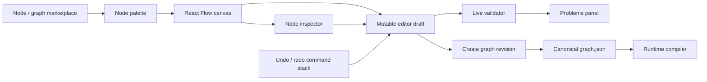
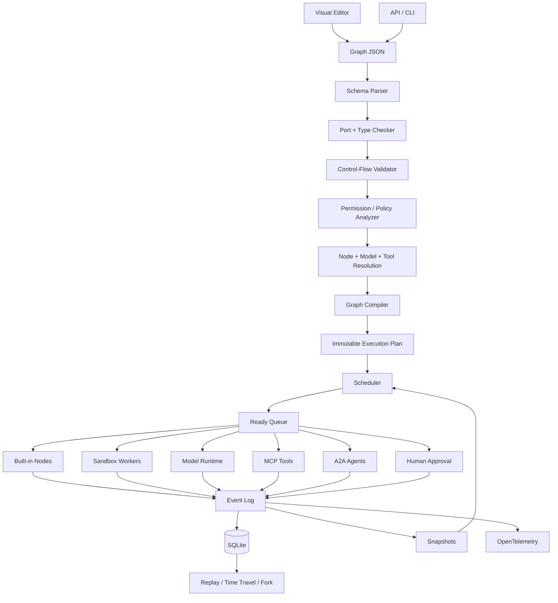
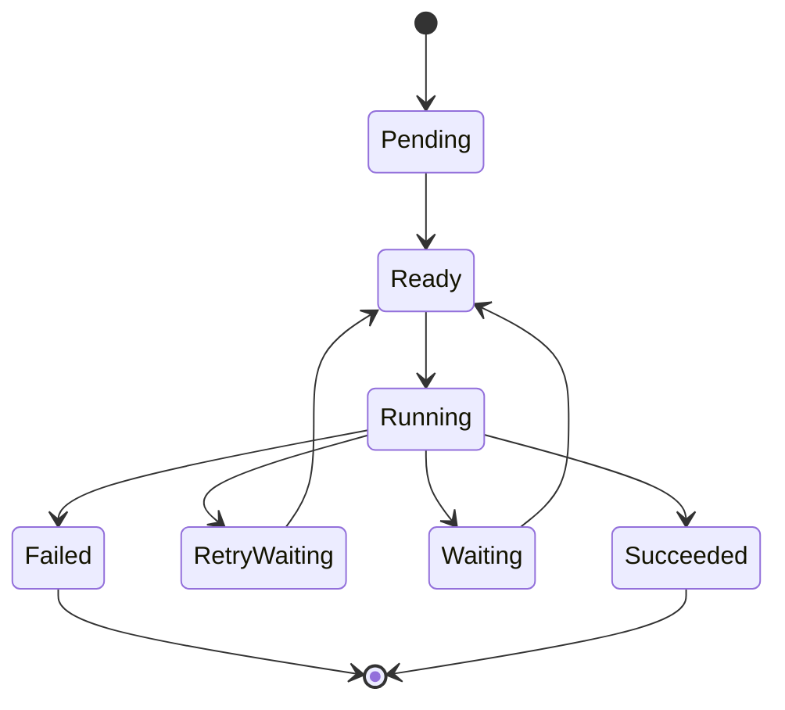
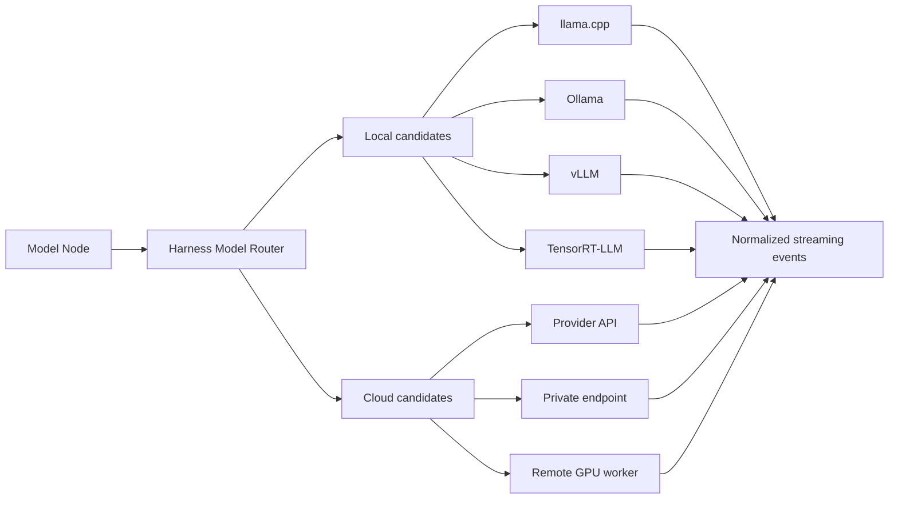
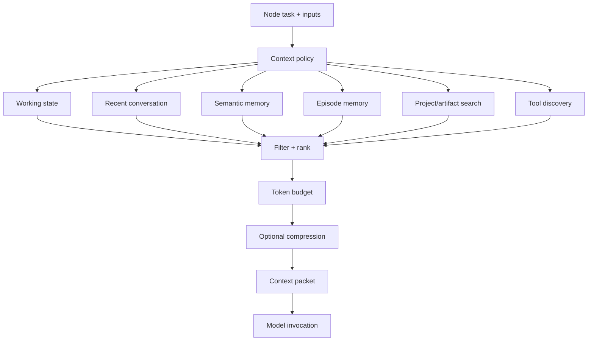
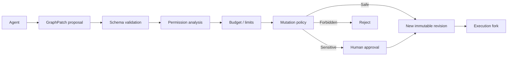
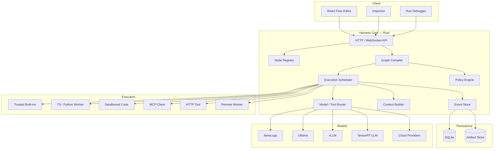
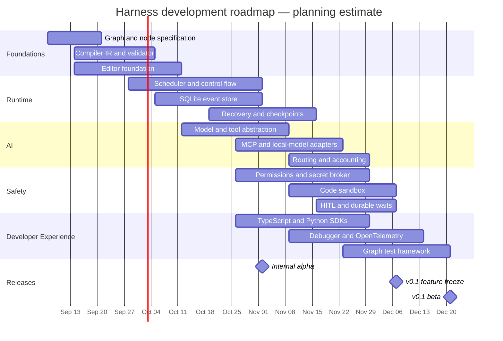

# Designing a Lightweight Visual Graph AI Harness

## Executive summary

The proposed **harness** is best thought of as a small durable orchestration kernel with a visual programming environment on top:

> **Users draw a graph; the compiler turns that graph into a validated execution plan; the runtime executes nodes against models, tools, agents, code, memory, and humans; every meaningful state transition is recorded so a run can pause, recover, replay, branch, or be inspected.**

The central architectural recommendation is **not** to build another LangChain-style agent framework and not to embed a conventional workflow engine wholesale. Instead, borrow the strongest ideas from several systems:

- **LangGraph:** checkpointed graph state, interrupts, replay/fork and agent-oriented cyclic execution. Its current persistence model explicitly separates thread-scoped checkpoints from cross-thread stores, and its checkpointers support recovery, replay and forking. citeturn19search8turn19search24
- **Temporal:** durable event history and the separation of deterministic orchestration from nondeterministic side effects. Temporal reconstructs workflow state by replaying history and explicitly requires external calls, including LLM invocations, to live outside the deterministic workflow path. citeturn13search0turn13search12
- **Node-RED/n8n:** approachable visual graph UX and a large-node/plugin model. Node-RED separates a node's editor definition from its runtime implementation and can distribute nodes through its palette/Flow Library; n8n supports custom nodes and workflow history. citeturn2search3turn2search10turn9search6turn2search1
- **Prefect/Dagster/Windmill:** general task scheduling, concurrency, worker/resource pools, retries and external triggers. Prefect supports task runners, pause/suspend, schedules and events; Dagster has run coordinators, queues and run monitoring; Windmill models flows as DAG/state-machine workflows with loops, branches, parallel execution and suspend/resume. citeturn5search31turn5search1turn6search11turn6search8turn4search1turn4search25
- **Mastra/Flowise/Dify:** AI-native workflow ergonomics, where models, tools and agents are first-class graph elements. Mastra exposes branching, parallelism, loops, suspend/resume and persistent workflows; Flowise provides visual Agentflows; Dify combines a visual Workflow Studio with models, tools, plugins and a marketplace. citeturn3search31turn3search24turn4search0turn4search2turn4search12

My recommended **v0.1** is:

```text
React + React Flow editor
          │
          ▼
Canonical versioned Graph JSON
          │
          ▼
Rust compiler + runtime daemon
          │
     ┌────┴─────┐
     │ SQLite   │  append-only events + snapshots
     └────┬─────┘
          │
  ┌───────┼─────────┬───────────┬────────────┐
  ▼       ▼         ▼           ▼            ▼
Models   Tools    MCP tools   Code worker   Human gate
  │       │                     │
  ├ local llama.cpp/Ollama      ├ sandbox
  └ cloud/OpenAI-like APIs      └ remote worker
```

For the first release, I would **not allow arbitrary unstructured cycles**. The canvas can look cyclic, but the compiler should require loops to pass through explicit `Loop`, `While`, `Retry`, or agent-loop control nodes. This preserves the usability of agent loops without inheriting the debugging and safety problems of unrestricted cycles. This hybrid resembles LangGraph's stateful graph idea while preserving workflow-engine-style validation. LangGraph demonstrates that checkpointed cyclic agent execution is viable, while Temporal demonstrates why nondeterministic external work should be isolated from replayable orchestration. citeturn19search12turn13search12

The runtime itself should stay **model-agnostic, tool-agnostic and deployment-agnostic**. A model node should be able to point to a cloud provider, `llama.cpp`, Ollama, vLLM or TensorRT-LLM without changing graph semantics. `llama.cpp` currently provides a lightweight C/C++ inference stack, an OpenAI-compatible server, quantization, many hardware backends and CPU+GPU hybrid inference; Ollama exposes tools, embeddings and structured output; vLLM exposes OpenAI-compatible serving and scaling-oriented interfaces; TensorRT-LLM focuses on high-performance NVIDIA deployment with features such as in-flight batching and multi-GPU/multi-node inference. citeturn17view0turn13search10turn13search6turn13search2turn18search1turn16search2

For interoperability, use **MCP for tools/context** and **A2A for remote agents** rather than inventing competing protocols. The July 28, 2026 MCP specification defines tool exposure, transport and HTTP authorization, while A2A v1.0 is now a stable interoperability protocol for discovering and communicating with agents. citeturn14search16turn14search24turn14search8turn14search21turn14search17

The most important design principle is this:

> **The model should never be the scheduler, permission system, transaction manager, or source of truth for graph state.**

The model may decide *what it wants to do*. The harness decides *whether that action is legal, affordable, schedulable and durable*.

### Recommended boundaries

Several parameters were unspecified. These are proposed engineering objectives rather than measurements of existing products:

| Profile | Core package target* | Idle RSS target* | Runtime overhead target* | Startup target* | Intended use |
|---|---:|---:|---:|---:|---|
| Ultra-light | 10–30 MB | 30–80 MB | p95 <3 ms/node | <250 ms | CLI, embedded, edge |
| **Balanced v0.1** | **30–80 MB** | **60–150 MB** | **p95 <10 ms/node** | **<750 ms** | Recommended |
| Desktop bundle | 60–150 MB | 120–300 MB | p95 <10 ms/node | UI <1.5 s | Tauri/webview app |
| Server | Size less important | <250 MB control plane | p95 <5 ms/node | <1 s | Multi-worker deployment |

\*These targets exclude model weights, browser engines supplied by the OS, isolated code containers and remote worker processes. “Runtime overhead” means harness scheduling/storage overhead, not LLM/tool latency.

For cost efficiency, I would target **control-plane compute below roughly 1% of model/tool cost for typical model-heavy workloads**, make model/tool spend visible per node, and give every execution a hard cost/token/runtime budget. This is a proposed product target rather than an industry benchmark.

The important thing is that a user who only wants:

```text
Input → Prompt → Model → Output
```

should not need Kubernetes, Redis, Postgres, Temporal, a vector database or a separate queue. **SQLite + the local process should be enough.**

## Visual graph model and universal node contract

The editor is where most users will decide whether the product feels like an AI operating system or an engineering tool.

### Editor architecture

**React Flow is the strongest default for the canvas**, rather than using the editor layer of another workflow product. React Flow exposes nodes, edges, handles/ports, cycle validation and serialization primitives; its examples also cover save/restore and undo/redo patterns. This gives the harness control over its own semantics instead of coupling visual representation to somebody else's execution engine. citeturn10search7turn10search5turn10search2turn10search8

Rete.js is a credible alternative because it combines a TypeScript node editor with processing-oriented abstractions, but that creates a greater temptation to let the editor architecture become the runtime architecture. citeturn10search4

The recommended editor model is therefore:



Node-RED validates the usefulness of a palette-oriented visual model and separately defined editor/runtime behavior, while n8n demonstrates that users expect historical workflow revisions in addition to ordinary editor undo. citeturn2search3turn2search10turn2search1

### Node palette

A useful initial palette would contain a small number of **semantic primitives**, with providers hidden below them:

| Category | v0.1 nodes |
|---|---|
| I/O | Input, Output, File, Artifact |
| AI | Model, Agent, Embedding |
| Tools | Tool, MCP Tool, HTTP/API |
| Control | Branch, Switch, Merge, Parallel, Map, Loop, Retry |
| State | Get State, Set State, Memory Search |
| Human | Approval, Form/Input, Review |
| Execution | Code, Subgraph |
| Timing | Delay, Schedule, Webhook Trigger |
| Debug | Assert, Log, Eval |

Do **not** create separate primitive types named `OpenAI`, `Claude`, `Gemini`, `Qwen`, etc. Those are implementations of the `Model` contract. This prevents provider churn from changing graph semantics.

Likewise:

```text
Model
 └── provider/model selector

Tool
 └── implementation selector

Agent
 └── graph/model/tool policy

Code
 └── execution runtime selector
```

Dify's visual workflow and plugin system and Mastra's ability to compose agents/tools inside workflows support this separation between workflow semantics and implementation details. citeturn4search2turn4search6turn3search9

### Canonical graph DSL

The visual canvas should **not itself be the source of truth**.

Use a versioned, canonical JSON representation:

```json
{
  "schemaVersion": "harness.graph/v0.1",
  "graph": {
    "id": "research-report",
    "revision": "01J...",
    "entrypoints": ["user_input"]
  },
  "nodes": [
    {
      "id": "researcher",
      "type": "ai.model",
      "nodeVersion": "1.0.0",
      "config": {
        "modelPolicy": "research-fast"
      },
      "permissions": [
        "model:invoke"
      ],
      "retry": {
        "maxAttempts": 2
      },
      "timeoutMs": 60000
    }
  ],
  "edges": [
    {
      "from": {"node": "user_input", "port": "text"},
      "to": {"node": "researcher", "port": "prompt"}
    }
  ],
  "limits": {
    "maxRuntimeMs": 600000,
    "maxCostUsd": 2.0,
    "maxLoopIterations": 20
  }
}
```

Keep **presentation metadata** separate:

```json
{
  "nodeId": "researcher",
  "position": {"x": 880, "y": 420},
  "collapsed": false
}
```

That distinction matters because moving a node twenty pixels should not produce a meaningful runtime revision.

### Versioning, undo and graph packages

Use three distinct mechanisms:

**Undo/redo** is a transient editor command stack:

```text
add node
move node
change config
connect edge
delete node
```

**Revision history** stores immutable graph snapshots:

```text
Draft
  ↓ publish
Revision A ── hash: 91fd...
  ↓ edit/publish
Revision B ── hash: f7c2...
```

**Run history** points to the exact immutable revision that executed:

```text
Run 824
graphRevision = f7c2...
compiledPlanHash = c991...
nodePackageLock = ...
modelPolicyRevision = ...
```

This distinction is crucial for reproducibility. n8n provides historical workflow versions, while Temporal's workflow-versioning model illustrates why long-running executions cannot safely assume orchestration code remains unchanged underneath them. citeturn2search1turn13search20turn13search36

An exported graph should be a package resembling:

```text
research-agent.harness/
├── graph.json
├── ui.json
├── harness.lock
├── README.md
├── assets/
└── signatures.json
```

`harness.lock` should pin:

```text
node package + version + digest
schema version
model policy revision
MCP server definition/version when available
subgraph revision hashes
```

Secrets must remain references:

```json
"credential": {
  "secretRef": "github-prod"
}
```

and never be exported as plaintext.

### The universal node specification

A node needs two related objects:

```text
NodeDefinition
   ↓ instantiated as
NodeInstance
```

`NodeDefinition` describes what the package can do. `NodeInstance` contains user configuration for one graph.

A suitable definition is:

```ts
interface NodeDefinition<I, O, C> {
  apiVersion: "harness.node/v0.1";

  type: string;
  version: string;

  inputSchema: JSONSchema;
  outputSchema: JSONSchema;
  configSchema: JSONSchema;

  permissions: PermissionDeclaration[];
  resources?: ResourceHints;

  execution: {
    runtime: "builtin" | "worker" | "wasm" | "mcp" | "http";
    idempotent?: boolean;
    sideEffects?: boolean;
  };

  execute(
    context: ExecutionContext,
    input: I,
    config: C
  ): Promise<NodeResult<O>>;
}
```

A node result should not merely be an arbitrary object:

```ts
type NodeResult<T> =
  | {
      status: "success";
      output: T;
      events?: NodeEvent[];
      usage?: Usage;
    }
  | {
      status: "waiting";
      wait: WaitCondition;
    }
  | {
      status: "error";
      error: NodeError;
    };
```

The required semantic surface is:

| Contract | Purpose |
|---|---|
| `inputs` | Typed values entering node |
| `config` | User/runtime configuration |
| `permissions` | Capabilities the node might exercise |
| `execute()` | Execution entry point |
| `outputs` | Typed results |
| `events` | Streams/progress/tool/model events |
| `errors` | Structured failure taxonomy |
| `resources` | CPU/GPU/memory/network hints |
| `sideEffects` | Whether external world may change |
| `idempotency` | Whether retry is safe |
| `secrets` | References, never embedded values |

Typed event streams are particularly useful for AI execution; LangGraph's current event streaming distinguishes state updates, messages, tool execution, lifecycle, checkpoints, human input and tasks. citeturn19search0

### TypeScript SDK

A developer-facing SDK can be much smaller than the internal contract:

```ts
import { defineNode, z } from "@harness/sdk";

export default defineNode({
  type: "example.uppercase",
  version: "1.0.0",

  input: z.object({
    text: z.string(),
  }),

  output: z.object({
    text: z.string(),
  }),

  permissions: [],

  async execute(ctx, input) {
    ctx.emit({
      type: "progress",
      message: "Converting text",
    });

    return {
      text: input.text.toUpperCase(),
    };
  },
});
```

### Python SDK

The Python interface should produce the same language-neutral manifest:

```python
from harness import node, Context
from pydantic import BaseModel


class Input(BaseModel):
    text: str


class Output(BaseModel):
    text: str


@node(
    type="example.uppercase",
    version="1.0.0",
    permissions=[],
)
async def uppercase(ctx: Context, data: Input) -> Output:
    await ctx.emit("progress", message="Converting text")
    return Output(text=data.text.upper())
```

Python code should normally execute **out of process**, not inside the core daemon. The language SDK is therefore an ergonomic wrapper around the protocol, not a requirement for the core to embed Python.

### Marketplace

The marketplace should distribute **node definitions and graph templates**, but installing something must not implicitly authorize it.

The flow should be:

```text
Marketplace
     ↓
Download manifest/package
     ↓
Verify digest/signature
     ↓
Display requested capabilities
     ↓
User/admin grants subset
     ↓
Lock exact package revision
     ↓
Install
```

Dify already separates marketplace/plugin sources and installation mechanisms, demonstrating why plugins and workflow content should remain modular rather than being linked into a central application binary. citeturn4search6turn4search12turn4search27

A graph marketplace can then expose templates such as:

```text
Deep Research
GitHub Bug Fixer
Company Analyst
Data Analyst
Video Pipeline
SEO Research
Daily Intelligence
Code Review
```

Installing a template installs its **declarative graph first** and then resolves required node packages. That is substantially safer than executing arbitrary setup code from a template.

## Compiler, execution engine and competing systems

The compiler/executor boundary is arguably the most important part of the project.

### Recommended architecture



The persistence design combines the useful ideas behind LangGraph checkpointing and Temporal event-history replay without requiring the full Temporal server architecture. LangGraph persists graph state for failure recovery, human interruption and time travel; Temporal recreates workflow state by replaying durable event history. citeturn19search8turn19search24turn13search24

### Compilation pipeline

A graph should never immediately execute after deserializing.

Compilation should perform:

```text
Parse
  ↓
Schema validation
  ↓
Resolve node definitions
  ↓
Check port compatibility
  ↓
Validate control flow
  ↓
Expand explicit loops/subgraphs
  ↓
Calculate permission closure
  ↓
Resolve node versions
  ↓
Resolve model/tool policies
  ↓
Compute resource requirements
  ↓
Build scheduling regions
  ↓
Freeze immutable ExecutionPlan
  ↓
Hash plan
```

An execution plan could resemble:

```rust
struct ExecutionPlan {
    graph_revision: RevisionId,
    plan_hash: Hash,
    tasks: Vec<TaskSpec>,
    dependencies: Vec<Dependency>,
    limits: RunLimits,
    permission_set: PermissionSet,
}
```

This means the runtime executes the **plan**, not the editable graph.

### DAGs versus cycles

There are three credible designs:

| Design | Advantages | Problems | Recommendation |
|---|---|---|---|
| Pure DAG | Very simple validation/scheduling | Poor match for iterative agents | Too restrictive |
| Arbitrary cyclic graph | Extremely expressive | Hard to bound, debug, replay and secure | Avoid initially |
| **DAG + structured control/loop regions** | Agent loops without arbitrary cycles | Compiler slightly more complex | **Recommended** |

The user can draw:

```text
Model
  ↓
Evaluate
  ├── done ────────→ Output
  │
  └── continue
         ↓
        Tool
         ↓
       Model ↺
```

but internally the compiler creates:

```text
LoopRegion {
    body: [...]
    exitCondition: ...
    maxIterations: 20
    maxDuration: ...
    maxCost: ...
}
```

Every loop should have at least one enforced bound:

```text
max iterations
max wall time
max tokens
max spend
```

Preferably several.

LangGraph demonstrates the value of combining deterministic and agentic steps in a persistent graph, including recovery and extended execution. citeturn19search12turn19search4

### Scheduling

Each node transitions through an explicit state machine:



The scheduler needs both **dependency readiness** and **resource readiness**:

```text
ready(node) =
    predecessors_satisfied
    AND required_resources_available
    AND rate_limit_available
    AND budget_available
    AND approvals_satisfied
```

Initial scheduling can be a local priority queue with semaphores for:

```text
global concurrency
provider concurrency
model concurrency
GPU slots
sandbox slots
tool/domain quotas
user/project limits
```

Prefect's task runners support concurrency/parallelism, Dagster has run queues and concurrency controls, and Windmill uses worker groups/tags and queues; these are good precedents for keeping scheduling/resource allocation separate from graph semantics. citeturn5search1turn5search19turn6search11turn4search25

### Parallel execution and joins

Support first-class fan-out:

```text
             ┌─ Search web ────┐
Input ───────┼─ Search files ──┼─ Join → Synthesize
             └─ Search DB ─────┘
```

and map:

```text
Companies[100]
     ↓
Map(AnalyzeCompany, concurrency=10)
     ↓
Results[100]
```

Join modes should be explicit:

```text
ALL
ANY
FIRST_SUCCESS
QUORUM(n)
```

rather than hidden inside prompts.

### Determinism

It is important to be precise here:

**An AI graph cannot generally promise deterministic output.**

LLM calls, search APIs, clocks, remote tools and databases are external nondeterministic operations.

What the harness *can* make deterministic is:

1. The compiled orchestration plan.
2. The mapping between recorded events and state.
3. Replaying previously recorded outputs without re-triggering side effects.

Temporal formalizes this separation: workflow orchestration must remain deterministic while API calls, database operations and LLM/AI calls are external activities. citeturn13search12turn13search4

Therefore use two replay modes.

**Recorded replay**

```text
node A executed → recorded output A1
node B executed → recorded output B1
node C executed → recorded output C1

Replay:
A → use A1
B → use B1
C → use C1
```

No external effects occur.

**Fork/re-execute**

```text
checkpoint B
     ↓
change B configuration
     ↓
create execution branch
     ↓
B2 → C2 → ...
```

LangGraph already supports replaying/forking from checkpoints, making this an especially appropriate AI-facing debugging model. citeturn19search24

### Checkpoints and crash recovery

Do not serialize the entire process memory.

Persist:

```text
RunStarted
NodeScheduled
NodeStarted
ModelRequestPrepared
ModelUsageReserved
NodeSucceeded
OutputStored
CheckpointCreated
ApprovalRequested
ApprovalReceived
RunCompleted
```

Large outputs belong in an artifact/blob store and are referenced by digest.

SQLite can store:

```text
runs
events
snapshots
artifacts
graph_revisions
node_packages
approvals
usage
```

For v0.1:

```text
append event → transaction commit → scheduler transition
```

Then periodically materialize snapshots so recovery does not need to replay thousands of events.

Temporal's event-history approach establishes the durability principle, while LangGraph shows a lighter checkpoint-oriented version specifically for stateful agent graphs. citeturn13search0turn13search24turn19search8

### Side effects and retries

A hard problem is:

```text
charge credit card
send email
merge PR
delete file
publish post
```

The harness cannot guarantee exactly-once execution against arbitrary external services.

Use:

```text
at-least-once scheduler
        +
idempotency key where supported
        +
recorded intent/result
        +
human approval for critical operations
```

Any node declaring:

```json
{
  "sideEffects": true,
  "idempotent": false
}
```

should receive stricter retry behavior.

Temporal's model similarly separates retryable external Activities from deterministic workflow replay rather than pretending arbitrary external side effects can be replayed safely. citeturn13search12turn13search28

### Time-travel debugger

The UI should expose a timeline:

```text
Run #82                                     $0.184
──────────────────────────────────────────────────
Input              0.00s      ✓
Planner            1.92s      ✓  $0.011
Web search         3.11s      ✓  $0.003
SEC search         1.42s      ✓
Researcher        13.40s      ✓  $0.083
Reviewer            4.21s      ✕  $0.028
```

Clicking a node shows:

```text
Inputs
Resolved context
Model/tool configuration
Permissions
Start/end timestamps
Events
Outputs
Usage
Cost
Error
Retry history
Artifacts
```

Then:

```text
        [ Replay ]
[ Fork from here ]
[ Replace output ]
[ Run downstream ]
```

This is not merely a nice debugging feature: checkpoint forking is already an explicit LangGraph capability. citeturn19search24

### Observability and accounting

Use OpenTelemetry as the export boundary instead of inventing a proprietary tracing model. OpenTelemetry defines common semantic conventions across traces, metrics and logs, and its GenAI work covers model, token and tool-call observability. citeturn14search19turn14search7

Every node should produce a span resembling:

```text
graph.run
 ├─ node.planner
 │    └─ gen_ai.invoke
 ├─ node.search
 │    └─ tool.invoke
 ├─ node.researcher
 │    ├─ gen_ai.invoke
 │    └─ tool.invoke
 └─ node.writer
      └─ gen_ai.invoke
```

Track at minimum:

```text
input tokens
output tokens
cached tokens
model cost
tool cost
sandbox compute
wall time
queue time
TTFT
retry count
provider
model
worker
context size
```

Budget accounting should occur before the call:

```text
estimate
   ↓
reserve budget
   ↓
execute
   ↓
receive actual usage
   ↓
reconcile
```

This prevents parallel branches from each independently believing the entire remaining budget is available.

### Comparison of existing systems

| System | Visual / graph orientation | Durability & control flow | Extensibility | What the harness should learn | Fit as core |
|---|---|---|---|---|---|
| **LangGraph** | Code-first state graph | Strong checkpointing, recovery, interrupts and time-travel/fork | Python/JS ecosystem | Best reference for AI graph state and debugging | **High conceptual fit** citeturn19search8turn19search24turn19search4 |
| **Temporal** | Code-first workflows | Extremely strong durable history/replay; deterministic workflow requirement | Language SDKs/workers | Best reference for durable execution semantics | **High conceptual, low lightweight fit** citeturn13search12turn13search24 |
| **n8n** | Strong visual editor | Execution/history-oriented automation | Custom-node ecosystem | UX, integrations, revisions | **Medium** citeturn2search1turn9search6 |
| **Prefect** | Primarily Python-defined | Retries, resume, task runners, pause/HITL, event triggers | Python tasks/infrastructure | Simple orchestration APIs and deployments | **Medium** citeturn5search31turn5search1turn5search2 |
| **Dagster** | Data/asset oriented | Queues, retries, monitoring, re-execution | Python ecosystem | Operational control plane | **Low-medium** for AI harness citeturn6search11turn6search0turn6search6 |
| **Node-RED** | Excellent lightweight visual flow metaphor | Event-flow oriented | Mature node/package model | Palette, node UX and simple deployment | **High UX inspiration** citeturn2search13turn2search3turn2search30 |
| **Flowise** | Strong visual AI workflow | Agentflow supports AI control-flow patterns | AI integrations | Easy AI authoring UX | **High UX inspiration** citeturn4search0turn4search17 |
| **Windmill** | Visual/code workflow | DAG/state-machine flow, loops, parallel branches, suspend | Scripts and workers | Remote workers and script execution | **High execution inspiration** citeturn4search1turn4search25 |
| **Mastra** | Code-first AI workflows + Studio | Branch, parallel, loops, suspend, persistence | TypeScript tools/agents | Modern TypeScript AI workflow semantics and evals | **Very high conceptual fit** citeturn3search31turn3search24 |
| **Dify** | Strong visual AI Studio | Workflow/agent nodes, HITL capabilities | Plugin/model/tool marketplace | Product UX, packaging and marketplace | **High UX/product inspiration** citeturn4search2turn4search12turn4search32 |

The resulting design should therefore **look more like Node-RED/Dify, behave internally like a much smaller LangGraph/Temporal hybrid, and execute arbitrary work more like Windmill**.

## Models, hybrid execution, context, memory and protocols

Models should be treated as a dynamically resolved resource rather than baked into graph structure.

### Model abstraction

A model node should specify requirements, not necessarily a provider:

```yaml
model:
  mode: route

  require:
    modalities: [text]
    tools: true
    structured_output: true
    context_tokens: 64000

  policy:
    privacy: local-preferred
    quality_floor: 0.85
    max_cost_usd: 0.03
    max_p95_latency_ms: 5000

  fallback:
    allowed: true
```

The router then resolves:

```text
Node requirements
      ↓
Hard capability filter
      ↓
Privacy / jurisdiction policy
      ↓
Availability filter
      ↓
Budget filter
      ↓
Quality / latency / cost score
      ↓
Model/deployment selected
```

A simple score can begin as:

\[
S(m)=w_q Q_m-w_c C_m-w_l L_m+w_r R_m
\]

where:

- \(Q_m\) = measured quality on the graph/node's relevant eval set,
- \(C_m\) = expected request cost,
- \(L_m\) = observed latency,
- \(R_m\) = reliability/availability.

This is superior to a static global ranking because the best coding model is not necessarily the best classification, OCR, embedding or low-latency routing model.

### Router marketplace

A model/deployment registry should store:

```text
provider
model identifier
endpoint
modalities
tool support
structured-output support
context size
cost schedule
observed TTFT
observed output throughput
error rate
privacy classification
region
local/cloud
hardware affinity
user-defined eval score
```

Do **not hardcode current model prices into the graph**. Provider pricing and model catalogs change. Store a pricing/config revision separately and retain the resolved historical price for accounting.

LiteLLM is useful as an optional adapter/reference: its router supports load balancing, retries, cooldowns and fallbacks across deployments/providers, and current routing capabilities include per-model strategies and routing plugins. citeturn13search1turn13search17turn13search25

The harness should nevertheless maintain its **own normalized model interface**, so LiteLLM is replaceable.

### Local and cloud execution

The same logical node:

```text
Model(prompt)
```

should be resolvable against:



The runtimes serve different purposes:

| Runtime | Best role in harness | Strength | Main tradeoff |
|---|---|---|---|
| **llama.cpp** | Embedded/local default | Minimal C/C++ stack, broad hardware support, quantization, OpenAI-compatible server, CPU/GPU hybrid | Less oriented toward large multi-tenant GPU fleets citeturn17view0 |
| **Ollama** | Easy developer/local UX | Simple model lifecycle/API; tool calling, embeddings, structured outputs | Higher-level layer rather than lowest-level embedded runtime citeturn13search10turn13search6turn13search2 |
| **vLLM** | GPU server / remote worker | Broad online serving APIs and OpenAI-compatible endpoints; intended for scaling-oriented inference | More infrastructure than lightweight local inference citeturn18search1turn18search4 |
| **TensorRT-LLM** | High-performance NVIDIA deployment | In-flight batching, paged attention and multi-GPU/multi-node capabilities | NVIDIA-centric and operationally heavier citeturn16search2turn16search22 |

For security, note that even a model server should be treated as a service boundary. Current vLLM documentation explicitly warns that its API-key setting does not protect every server endpoint and recommends additional hardening. citeturn18search4

### Remote worker protocol

Remote execution should not require the whole control plane to run remotely.

A worker announces:

```json
{
  "workerId": "gpu-tokyo-03",
  "capabilities": {
    "gpu": ["NVIDIA-H100"],
    "runtimes": ["vllm", "python", "docker"],
    "models": ["..."]
  },
  "resources": {
    "gpuSlots": 2,
    "cpu": 32,
    "memoryGb": 128
  },
  "labels": {
    "region": "asia-northeast",
    "trust": "private"
  }
}
```

The central scheduler owns durable run state; the worker merely leases a task:

```text
scheduler
   │ lease task + token
   ▼
worker
   │ heartbeat
   │ events
   │ result
   ▼
scheduler
```

If the lease expires, the task becomes eligible for retry according to its side-effect policy.

This allows:

```text
Laptop
 ├ local llama.cpp
 ├ local filesystem tools
 └ remote H100 worker
         └ vLLM
```

without migrating the graph.

### Context engineering

The naive design is:

```text
Entire conversation
+ every memory
+ every tool
+ every artifact
           ↓
          LLM
```

That will become expensive and noisy.

Instead the compiler/runtime should insert an explicit **context preparation stage** for model/agent nodes:



LangGraph explicitly separates short-term thread state from cross-thread stores, while Mastra's memory system supports semantic recall; these support the architectural idea that different classes of memory have different lifetimes and retrieval semantics. citeturn19search8turn19search36turn3search5turn3search27

### Memory taxonomy

| Memory | Contents | When to retrieve |
|---|---|---|
| **Working** | Current graph/run state | Automatically when dependency needs it |
| **Conversation** | Recent interaction | Conversational model nodes |
| **Episodic** | Summaries of previous runs/events | Similar past task or explicit history request |
| **Semantic** | Facts/preferences/knowledge | Similarity or keyword match |
| **User** | Preferences/identity settings | Only policy-relevant nodes |
| **Project** | Files/artifacts/project facts | Project-scoped tasks |
| **Procedural** | Instructions/playbooks/graph patterns | Planner/agent nodes |
| **Tool-result cache** | Previous expensive results | When cache key/freshness permit |

Each model node can declare:

```yaml
context:
  working: true

  conversation:
    max_turns: 8

  memory:
    semantic:
      top_k: 6
      min_score: 0.72
    episodic:
      top_k: 3

  artifacts:
    search: true

  max_tokens: 24000
```

This makes context policy visible in the graph instead of hiding it inside an agent library.

### Compression

Use a two-tier model:

```text
Durable original data
        │
        └───────────── immutable/artifact store

Selected source material
        ↓
Lossy context summary
        ↓
Model
```

Never replace durable history with the summary.

A summary should retain provenance:

```json
{
  "summary": "...",
  "sources": [
    {"artifact": "abc", "range": "..."},
    {"event": "evt_923"}
  ]
}
```

That allows a downstream model or debugger to return to original evidence.

### Tool discovery

Putting 300 tool schemas into every prompt is unnecessary.

Instead:

```text
Node requires tool
      ↓
Registry query
      ↓
Permission filter
      ↓
Trust/security filter
      ↓
Lexical + semantic search
      ↓
Schema compatibility rerank
      ↓
Top 3–10 tools
      ↓
Expose schemas to model
```

The registry entry should contain:

```text
name
description
input/output schema
capabilities
permissions
side-effect level
trust level
latency
cost
historical success rate
provider
```

Tool selection is therefore an ordinary retrieval problem plus a security filter.

### MCP and A2A

These protocols solve different layers.

```text
                   HARNESS
                     │
          ┌──────────┴──────────┐
          ▼                     ▼
         MCP                   A2A
          │                     │
     tool/context          remote agent
          │                     │
     database                 planner
     browser                  specialist
     GitHub                   company agent
     filesystem               remote service
```

The current MCP specification defines standardized tool schemas and invocation; its 2026 HTTP authorization specification handles protected server access. citeturn14search16turn14search8

A2A focuses on independent agents discovering capabilities and communicating/delegating work, and the protocol reached a stable v1.0 in 2026 after moving under Linux Foundation governance. citeturn14search1turn14search17turn14search21

For v0.1:

```text
Tool node → native/MCP
Agent node → local subgraph
```

For v0.2:

```text
Agent node → local subgraph OR remote A2A agent
```

This avoids prematurely complicating the first runtime while preserving interoperability.

## Security, sandboxing, self-modification and human control

Security should be a **runtime primitive**, not a prompt instruction.

This rule is fundamental:

```text
"You are not allowed to delete files"
```

is not a security boundary.

This is:

```text
node has no fs:delete capability
```

### Capability-based permission model

Permissions belong to the node execution context:

```yaml
permissions:
  filesystem:
    read:
      - "/project/**"
    write:
      - "/project/output/**"

  network:
    allow:
      - "api.example.com"

  tools:
    allow:
      - "github.read"

  secrets:
    use:
      - "github-token"

  model:
    max_cost_usd: 0.10
```

Use three layers:

```text
Package declares
        ∩
Graph requests
        ∩
User/admin grants
        =
Actual runtime capability
```

A package cannot spontaneously request a new permission during execution.

### Secret broker

Avoid dumping provider/API credentials into environment variables for arbitrary plugins.

Prefer:

```text
Node
 ↓ requests secret operation
Harness secret broker
 ↓
credential / scoped token
```

Where possible, the node sees a short-lived credential or opaque authorization handle.

### Sandboxing options

| Technology | Isolation | Startup/weight | Compatibility | Recommended role |
|---|---|---|---|---|
| Process only | Low | Excellent | Excellent | Trusted built-ins only |
| **Rootless Docker** | Medium-high | Moderate | Excellent | **v0.1 arbitrary code** |
| gVisor | Higher container isolation | Moderate | Broad OCI compatibility | Hosted untrusted workloads |
| Firecracker | VM-level isolation | Higher orchestration complexity | Linux/microVM workloads | Multi-tenant cloud v0.2+ |
| WASM/WASI | Narrow capability surface | Potentially very light | Less universal | Signed portable plugins |

Docker's rootless mode runs both the daemon and containers without root privileges; Docker also supports seccomp to restrict syscalls. citeturn15search1turn15search7

gVisor adds a userspace-kernel boundary around OCI workloads and is explicitly designed to isolate container workloads from the host kernel and one another. citeturn15search3turn15search9

Firecracker uses microVMs and is purpose-built for secure multi-tenant container/function services, providing stronger VM-style isolation while remaining lighter than conventional full VMs. citeturn15search0

Wasmtime is a standards-oriented WebAssembly runtime and is attractive for a restricted plugin ABI, but using WASM for every Python/JavaScript/code node would unnecessarily constrain package and operating-system compatibility; therefore I would treat it as an additional plugin target rather than v0.1's only sandbox. citeturn16search31

### Recommended sandbox tiers

```text
Tier 0: Built-in trusted
        ↓
same process

Tier 1: Installed trusted plugin
        ↓
worker process + explicit capabilities

Tier 2: User code
        ↓
rootless container + limits + network policy

Tier 3: Third-party/multi-tenant untrusted
        ↓
gVisor / Firecracker
```

Each execution should additionally receive:

```text
CPU quota
memory limit
wall-clock timeout
output-size limit
read-only base filesystem
temporary work directory
network default-deny
process-count limit
capability drop
```

### Self-modifying graphs

A powerful future feature is:

```text
Graph
 ↓
Agent evaluates itself
 ↓
Agent modifies graph
 ↓
Continue
```

Do **not** implement this as:

```python
runtime.graph.nodes.append(...)
```

Instead:



A mutation should be prohibited from:

```text
granting itself new permissions
weakening sandbox policy
accessing new secrets
raising its own spending ceiling
removing mandatory approval gates
changing organizational security rules
replacing the mutation validator
editing the currently executing immutable revision
```

The strongest invariant is:

> **Self-modification may change behavior, but it may not increase authority.**

Represent that mathematically as:

\[
Permissions_{new} \subseteq Permissions_{current}
\]

unless an external authorized principal approves escalation.

### Human-in-the-loop

An approval is itself a durable wait state:

```text
Research
   ↓
Draft deletion plan
   ↓
┌───────────────────────────┐
│ Human approval            │
│                           │
│ Delete 1,281 files?       │
│ [Approve] [Reject]        │
└───────────────────────────┘
   ↓
Delete
```

It should survive:

```text
process restart
browser close
machine reboot
worker migration
```

LangGraph interrupts/checkpoints are explicitly designed for pausing and resuming human-in-the-loop execution; Prefect also supports pause/suspend with typed input, and Dify has introduced human-input workflow mechanics. citeturn19search8turn5search2turn4search32

Approval policies can include:

```text
always
above $X
external-write operations
secret access
production environment
graph permission escalation
new marketplace package
```

### Event triggers and long-running agents

The graph should have external entrypoints:

```text
Manual
API
Webhook
Cron
Email/event adapter
File change
Repository event
Database event
```

Prefect's current deployment/automation model supports scheduled and external event-triggered workflows, and Dagster similarly exposes sensors for reacting to external conditions. citeturn5search4turn5search7turn6search9

A long-running agent should **sleep durably**, not occupy a worker:

```text
Monitor task
     ↓
Wait until 09:00
     ↓
persist wait condition
     ↓
worker released
     .
     .
     .
timer fires
     ↓
resume graph
```

### Threat model

| Threat | Severity | Primary defense |
|---|---:|---|
| Prompt injection requests dangerous tool call | Critical | Tool permissions outside model |
| Malicious marketplace node | Critical | Signature + sandbox + capabilities |
| Secret exfiltration | Critical | Secret broker + network allowlist |
| Graph permission self-escalation | Critical | Immutable revisions + mutation policy |
| Duplicate side effect after crash | High | Idempotency + effect records + approval |
| Infinite agent loop | High | iteration/time/token/cost ceilings |
| Sandbox escape | High | defense in depth; rootless/container/gVisor/VM |
| SSRF through tool/MCP server | High | network policy + allowlist |
| Dependency supply-chain compromise | High | pinned hashes, signatures, lockfile |
| Cost explosion from parallelism | High | transactional budget reservations |
| Context poisoning | High | provenance/trust labels on memory |
| Sensitive prompts in telemetry | High | redaction and opt-in content capture |

OpenTelemetry's GenAI conventions can include model inputs, outputs and tool details when enabled, which is precisely why prompt/tool payload collection should be treated as sensitive and configurable rather than automatically logged. citeturn14search7

## Testing, benchmarks and technology choices

A visual harness needs substantially more testing than “does the prompt return something useful?”

### Test graph format

A graph test can look like:

```yaml
name: company-research-basic

graph: company-research@sha256:...

fixture:
  input:
    company: "Example Corp"

mocks:
  search.web:
    fixture: web-results.json

  model.planner:
    fixture: planner-response.json

assert:
  run_status: success
  max_cost_usd: 0.25
  max_duration_ms: 30000

  outputs:
    report:
      schema: report.schema.json
```

Use **recorded model responses** for orchestration regression tests. Otherwise a provider/model change can make a deterministic compiler test flaky.

Then use live-model tests separately.

### Testing pyramid

```text
                    ┌───────────────┐
                    │ Live E2E AI   │
                    └───────┬───────┘
                      Graph benchmarks
                 ┌──────────┴─────────┐
                 │ Integration tests  │
                 └──────────┬─────────┘
                    crash / sandbox
              ┌─────────────┴─────────────┐
              │ Recorded execution replay │
              └─────────────┬─────────────┘
                node / graph contract tests
          ┌─────────────────┴──────────────────┐
          │ compiler / schema / property tests │
          └────────────────────────────────────┘
```

### Critical failure tests

A serious CI suite should deliberately kill the runtime:

```text
after scheduling
before node starts
while node runs
after remote side effect
before result transaction
after result transaction
before downstream scheduling
```

and verify:

```text
no lost completed output
no corrupt run state
expected retry behavior
no unintended repeated side effect
successful resume
```

This is where Temporal's event-history/replay model and LangGraph's checkpoint/fault-tolerance model are particularly valuable references. citeturn13search24turn19search24turn19search4

### Benchmark dimensions

Do not publish a single meaningless “harness score.”

Track:

| Dimension | Metrics |
|---|---|
| Runtime | node scheduling p50/p95/p99, queue delay |
| Reliability | run success, crash recovery, retry success |
| AI quality | task-specific evaluator score |
| Tooling | tool selection precision, argument validity, success |
| Context | retrieval recall/precision, context tokens |
| Model | TTFT, tokens/sec, failure rate |
| Cost | dollars/run, dollars/successful task |
| Durability | recovery time, replay correctness |
| Side effects | duplicate-effect incidents |
| Security | rejected forbidden operations |
| Memory | retrieval relevance, stale-memory rate |
| Router | quality/cost/latency versus fixed-model baseline |
| Parallelism | throughput versus concurrency |
| UX | graph creation time, validation-error rate |

TensorRT-LLM's own benchmarking interface explicitly separates throughput and latency benchmarks; the harness should similarly avoid collapsing heterogeneous performance characteristics into one figure. citeturn16search30

### Graph CI

A pull request changing a production graph might show:

```text
Graph CI: research-agent

Schema                  PASS
Permission diff         PASS
Package integrity       PASS
Compiler determinism    PASS
Unit fixtures           84 / 84
Replay fixtures         31 / 31
Security policies       PASS

Quality                 93.7% → 94.6%
Median cost             $0.184 → $0.161
p95 runtime              28.1s → 25.4s
Tool success             97.8% → 98.1%

Approved for deployment
```

Mastra already exposes persistent experiments/evaluations and live evaluation concepts, demonstrating the usefulness of treating evals as runtime engineering rather than occasional manual tests. citeturn3search17turn3search2

### Candidate technologies by layer

| Layer | Candidates | Recommendation | Rationale |
|---|---|---|---|
| Visual canvas | React Flow, Rete.js | **React Flow** | Rich node/edge UI primitives without dictating runtime semantics. citeturn10search7turn10search4 |
| Front end | React/TS | **React/TS** | Natural pairing with React Flow |
| Core runtime | Rust, Go, Node/TS | **Rust** | Best fit when small memory/strong types/control are primary; development complexity is the tradeoff |
| Async runtime | Tokio or equivalent | **Tokio with Rust core** | Fits concurrent I/O-heavy scheduler design |
| Local database | SQLite | **SQLite** | Keeps one-user install self-contained |
| Scale-out DB | Postgres | Later | Only when distributed/multi-user control plane requires it |
| Event queue | In-process, NATS, Redis, Kafka | **In-process v0.1** | Do not impose infrastructure until distributed workers require it |
| Editor serialization | Custom JSON + JSON Schema | **Custom versioned JSON** | Stable language-neutral graph interchange |
| Local inference | llama.cpp, Ollama | **Both adapters** | Embedded/minimal versus convenient managed-local UX. citeturn17view0turn13search10 |
| GPU inference | vLLM, TensorRT-LLM | **vLLM generic; TRT-LLM NVIDIA option** | Broad serving versus NVIDIA optimization. citeturn18search1turn16search2 |
| Cloud model routing | Native adapters, LiteLLM | **Native interface + optional LiteLLM** | Keeps core portable while gaining existing provider routing. citeturn13search1 |
| Tool protocol | Proprietary, MCP | **MCP + native tools** | Current standardized external-tool interface. citeturn14search16 |
| Agent protocol | REST, A2A | **A2A later** | Stable cross-agent interoperability standard as of 2026. citeturn14search17turn14search21 |
| Plugin transport | stdio RPC, HTTP, WASI | **stdio/HTTP first, WASI optional** | Broad TS/Python compatibility |
| Code sandbox | Docker, gVisor, Firecracker, WASI | **Rootless Docker v0.1** | Compatibility/complexity sweet spot. citeturn15search1turn15search7 |
| Hosted strong sandbox | gVisor, Firecracker | **Evaluate both post-v0.1** | Stronger multi-tenant isolation. citeturn15search9turn15search0 |
| Telemetry | Proprietary, OpenTelemetry | **OpenTelemetry** | Existing trace/metric/GenAI semantic conventions. citeturn14search19turn14search7 |
| Local artifacts | Filesystem/blob directory | **Content-addressed local artifacts** | Simple and debuggable |
| Cloud artifacts | S3-compatible | Later | Easy remote-worker expansion |
| Distributed durability | Custom/Postgres, Temporal | **Custom local v0.1; optional Temporal backend later** | Temporal semantics are valuable, but its infrastructure conflicts with a minimal local installation. citeturn13search24 |

The architectural theme is deliberately **progressive enhancement**:

```text
v0.1 local:
one binary + static web UI + SQLite

       ↓ same graph

team/server:
Postgres + object storage + workers

       ↓ same graph

hosted:
worker pools + strong sandboxes + routing + tenancy
```

The graph itself should not care.

## Recommended v0.1, roadmap and risk analysis

### Concrete v0.1 architecture

The implementation I would actually build is:



### What should ship in v0.1

The first meaningful public release should include:

**Graph/editor**

```text
nodes/edges/ports
typed schemas
copy/paste
undo/redo
zoom/minimap
subgraphs
live validation
import/export
immutable revisions
```

**Runtime**

```text
DAG scheduling
structured loops
branches
parallel/map
joins
retries
timeouts
cancellation
durable waits
checkpoint/recovery
streaming events
```

**Nodes**

```text
input/output
model
tool
HTTP
MCP
branch
parallel
map
loop
code
memory
approval
subgraph
webhook
schedule
```

**AI**

```text
provider adapters
local OpenAI-compatible endpoints
model router basics
tool calling
structured output
streaming
token/cost accounting
```

**Security**

```text
declarative permissions
secret references
sandboxed arbitrary code
network allowlist
runtime/resource budgets
approval gates
package lock hashes
```

**Developer support**

```text
TS SDK
Python SDK
graph CLI
test fixtures
mock nodes
run trace
OpenTelemetry export
```

### What should intentionally not ship

The fastest route to a reliable harness is refusing several tempting features initially:

```text
arbitrary unstructured cycles
multi-master distributed scheduler
real-time collaborative graph editing
unapproved autonomous graph mutation
public marketplace payments
arbitrary plugin execution in core process
Firecracker orchestration
full semantic memory platform
automatic agent creation/deletion
A2A federation
```

All can be layered on after the core execution semantics stabilize.

### Proposed roadmap

Effort assumptions are **planning estimates**, not measured vendor development times: approximately **two to three senior engineers**, one comfortable with Rust/runtime work and one or two with TypeScript/AI/platform work.

| Milestone | Scope | Effort |
|---|---|---|
| Runtime specification | DSL, node ABI, event model, permissions, compiler IR | **Medium** |
| Editor foundation | React Flow, inspector, schemas, undo/import/export | **Medium** |
| Execution kernel | DAG/parallel/branch/loop/retry/cancel | **High** |
| Durability | SQLite events, checkpoints, recovery, replay/fork | **High** |
| AI/tool adapters | model abstraction, streaming, MCP, HTTP, router | **Medium** |
| SDK/runtime workers | TS/Python SDK, worker protocol | **Medium** |
| Security | permission engine, secrets, Docker sandbox, budgets | **High** |
| HITL/events | approvals, waits, webhook, timer/schedule | **Medium** |
| Debug/observability | timeline, traces, costs, OpenTelemetry | **Medium** |
| Memory/context | context builder, memory search, compression hooks | **Medium** |
| Testing/beta hardening | graph CI, failure injection, benchmarks | **High** |
| Marketplace foundations | package registry, signatures, graph templates | **High** |

A realistic staged schedule could look like:



That is roughly a **three-to-four-month concentrated v0.1 effort** under the stated staffing assumptions. A polished hosted marketplace/multi-tenant product is a substantially larger project.

### Architectural evolution

The progression should be:

```text
                         v0.1
                          │
             ┌────────────┴────────────┐
             │ local durable runtime   │
             │ visual graphs           │
             │ model/tool nodes        │
             │ MCP                     │
             │ HITL                    │
             │ SQLite                  │
             └────────────┬────────────┘
                          │
                         v0.2
                          │
             ┌────────────┴────────────┐
             │ remote workers          │
             │ model router            │
             │ stronger memory         │
             │ marketplace             │
             │ A2A                     │
             │ graph mutation proposals│
             └────────────┬────────────┘
                          │
                         v1.x
                          │
             ┌────────────┴────────────┐
             │ multi-tenant runtime    │
             │ Firecracker/gVisor      │
             │ distributed scheduler   │
             │ hosted marketplace      │
             │ agent teams             │
             │ collaborative editor    │
             └─────────────────────────┘
```

### Key risks

| Risk | Probability | Impact | Recommended mitigation |
|---|---|---|---|
| Runtime becomes another giant workflow platform | High | High | Keep v0.1 single-process/SQLite; add distribution through interfaces |
| Arbitrary cycles make behavior impossible to reason about | High | High | Structured loop regions only |
| LLM nondeterminism breaks replay expectations | Certain | Medium-high | Distinguish recorded replay from fresh re-execution |
| Side-effect duplication after crashes | Medium | Critical | Effect classification, idempotency, approvals, durable intent/result |
| Untrusted node compromise | Medium-high | Critical | Capability model + sandbox; no arbitrary code in core |
| Prompt injection becomes permission escalation | High | Critical | Authorization outside model/prompt |
| Marketplace becomes supply-chain vector | High | Critical | Digests/signatures/lockfiles/sandbox/permission review |
| Local hardware fragmentation | High | Medium | Standard model adapter; llama.cpp/Ollama rather than own inference |
| Provider/model churn | Certain | Medium | Resolve policies dynamically; never encode provider semantics into graph DSL |
| Memory quality degrades agent behavior | Medium | High | Provenance, scopes, retrieval thresholds, inspectable context packet |
| Cost runaway through parallel agents | High | High | Transactional budget reservation + loop/concurrency ceilings |
| Editor becomes too technical | Medium | High | progressive disclosure, templates and simple semantic nodes |
| Distributed runtime attempted too early | High | High | local control plane first; remote workers through leases later |
| Graph format becomes impossible to evolve | Medium | High | versioned schema + migration + immutable revisions |
| Debug telemetry leaks sensitive context | Medium | High | redaction, access control, content logging off by default |

### The most important product decision

The final design should preserve a sharp separation between four layers:

```text
                  WHAT USER DRAWS
                         │
                         ▼
              ┌────────────────────┐
              │     Graph DSL      │
              │ declarative intent │
              └─────────┬──────────┘
                        │ compile
                        ▼
              ┌────────────────────┐
              │  Execution Plan    │
              │ validated + frozen │
              └─────────┬──────────┘
                        │ schedule
                        ▼
              ┌────────────────────┐
              │     Runtime        │
              │ durability/policy  │
              └─────────┬──────────┘
                        │ invoke
          ┌─────────────┼──────────────┐
          ▼             ▼              ▼
       Models          Tools          Agents
```

Models are **workers inside the system**, not the system itself.

That distinction is what allows the same harness to safely support all of these:

```text
Deterministic automation

Input → API → Transform → Output
```

```text
Agentic execution

Goal → Planner → Tool ↺ → Evaluator → Output
```

```text
Parallel research

            ┌→ Web ─────┐
Question ───┼→ Files ───┼→ Synthesis
            └→ Agents ──┘
```

```text
Human-controlled automation

Agent → Proposed Action → Approval → Execute
```

```text
Long-running goal

Goal
 ↓
Plan
 ↓
Todo
 ↓
Worker
 ↓
Evaluate
 ├─ incomplete → Wait / Replan ↺
 └─ complete   → Finish
```

```text
Hybrid local/cloud AI

Local files
    ↓
Local embedding
    ↓
Local Qwen/llama.cpp
    ↓ difficult step
Cloud model
    ↓
Sandbox tool
    ↓
Output
```

The research strongly suggests that no one existing project provides the exact combination being targeted. LangGraph has excellent AI-state semantics but is primarily a programming framework; Temporal has exceptional durability but introduces a much larger workflow infrastructure model; Node-RED and n8n are excellent visual automation references but are not fundamentally agent runtimes; Windmill is strong at script/worker orchestration; and Flowise, Mastra and Dify are AI-native but each couples workflow semantics more tightly to its own application/framework model. citeturn19search12turn13search24turn2search13turn9search6turn4search1turn4search0turn3search31turn4search2

The strongest opportunity is therefore to make the harness a **small universal execution substrate**, not another collection of agent abstractions:

> **Graph JSON is the program. Nodes are capabilities. The compiler is the authority. The scheduler is durable. Models provide intelligence. Tools provide effects. Memory provides context. Humans provide authority when required. Everything is observable and replayable.**

That architecture gives the project a plausible path from a **30–80 MB-class local control plane with SQLite** to remote workers, marketplaces and multi-agent systems without requiring the original graph model to be replaced. The size and memory figures here are explicit v0.1 design targets rather than measured guarantees; the architectural patterns behind durability, graph execution, AI workflow state, interoperable tools/agents and sandboxing are grounded in the current primary documentation for LangGraph, Temporal, MCP, A2A, Docker, Firecracker, local inference runtimes and the other systems compared above. citeturn19search8turn13search12turn14search16turn14search21turn15search1turn15search0turn17view0turn18search1