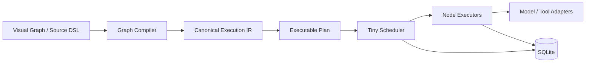
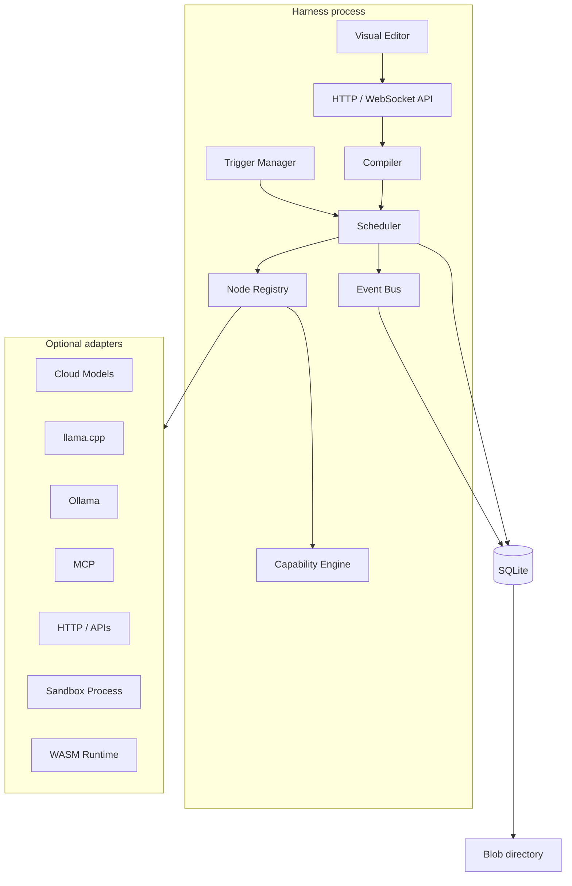
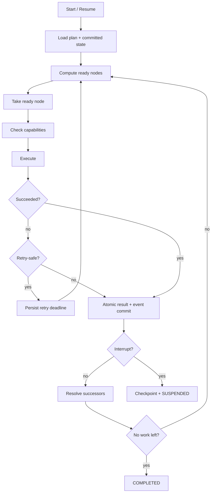
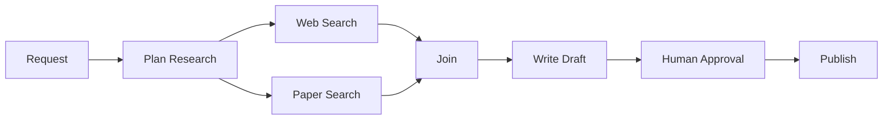
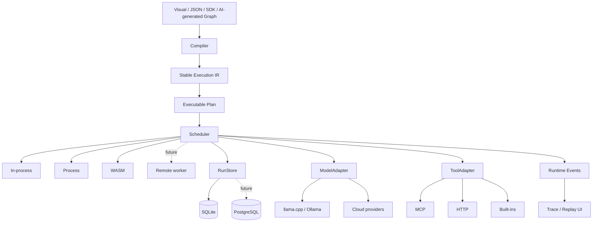

# Designing a Lightweight, Production-Grade Visual AI Harness

## Executive summary

The strongest architecture for the harness you described is **not** to embed an existing workflow engine wholesale. It is to build a small, purpose-designed graph runtime whose hard dependency surface is essentially:

```text
Node.js process
      +
SQLite file
      +
filesystem
```

Everything else—cloud models, local models, MCP servers, browsers, sandboxes, remote workers, Redis, PostgreSQL, containers, distributed queues—should be an **optional adapter**.

That direction is materially lighter than the production architectures of Temporal, Prefect at scale, Windmill, Dagster, and Dify. Temporal separates clients, a server/service, workers and database persistence; Prefect's multi-server architecture requires PostgreSQL and Redis; Windmill puts application state in PostgreSQL; Dagster's standard OSS deployment uses several long-running services; and Dify's current Docker Compose deployment starts seven core services plus eight dependent components. citeturn18search17turn16search3turn15view3turn20view3turn15view2

The closer architectural precedents are **LangGraph's graph/checkpoint semantics, Node-RED's extremely simple flow/node model, n8n's local-first SQLite mode, and Flowise's AI-oriented visual graph**. LangGraph explicitly supports durable graph execution, human interrupts and persistence; Node-RED's storage and node model stays comparatively small; n8n can run with SQLite rather than mandatory external infrastructure; and Flowise also defaults to SQLite. citeturn18search12turn18search0turn21search0turn16search0turn17search4

My core recommendation is:

> **The editable visual graph must not be the executable representation. Compile it into a small, immutable, versioned Execution IR, then lower that IR into an in-memory execution plan optimized for scheduling.**

That gives you three distinct layers:



The key architectural decisions are:

| Area | Recommended v1 decision |
|---|---|
| Graph representation | Editable source graph → canonical JSON IR → dense in-memory plan |
| Cycles | Reject arbitrary cycles; allow only explicit loop/agent-loop regions |
| Dependency analysis | SCC analysis followed by topological scheduling of the condensed DAG |
| Node contract | Declarative manifest + small executor interface |
| Scheduler | Single-process async readiness scheduler |
| Parallelism | Promises + global/per-resource semaphores |
| Persistence | SQLite WAL + append-only events + node results + sparse snapshots |
| Recovery | Reuse committed outputs; rerun safe interrupted nodes; reconcile unsafe side effects |
| Human-in-loop | Durable `SUSPENDED` run state plus resume payload |
| Model integration | Uniform HTTP-oriented adapter; llama.cpp/Ollama can remain separate local processes |
| Tools | Uniform tool manifest; optional MCP adapter |
| Security | Capability checks at compile time **and** invocation time |
| Custom code | Trusted code in-process; semi-trusted process; untrusted code preferably WASM |
| Distributed execution | Explicitly out of v1; preserve an adapter boundary for it |
| Required infrastructure | **None beyond the harness process, SQLite, and filesystem** |

There is one important qualification to “production-grade”: this design can be production-grade for **single-machine, edge, desktop, workstation and modest server deployments**, but zero external coordination infrastructure is fundamentally at odds with active-active multi-host scheduling. SQLite's WAL mode permits readers and a writer to proceed concurrently, but SQLite still serializes write transactions; other orchestration products similarly move to PostgreSQL/Redis or server architectures when horizontal coordination becomes a requirement. citeturn12search1turn12search2turn16search3turn15view3

That is not a weakness if it is an explicit product boundary. The right objective for v1 is:

> **Scale up on one machine before scaling out across machines.**

A good initial deployment should therefore look like this:

```text
harness
├── UI + local API
├── graph compiler
├── scheduler
├── node registry
├── model adapters
├── tool adapters
├── trigger service
├── permissions
├── event journal
└── data/
    ├── harness.sqlite
    └── blobs/
```

No Redis. No Kafka. No PostgreSQL. No Docker daemon. No workflow control plane.

## Design principles and architecture

The proposed harness has five primary execution domains: research pipelines, agent workflows, LLM/tool orchestration, human approval, and event-triggered automation. They share the same graph engine but make different demands on it.

Research pipelines are mostly fan-out/fan-in graphs: plan, search multiple sources concurrently, analyze, join, synthesize and publish. Agent workflows introduce bounded cycles because models repeatedly select tools. Human-in-loop introduces indefinite suspension. Event triggers introduce durable run creation independent of a user session. Tool orchestration introduces side effects whose recovery semantics differ radically from pure computation.

That is why the runtime should model **control flow, data flow, durability and effects separately** instead of treating every visible arrow as “run B after A.”

LangGraph is instructive here because its underlying graph model deliberately supports deterministic steps alongside LLM-driven steps, loops, persistence and interrupts rather than constraining agents to a pure DAG. citeturn18search12turn18search0 Windmill similarly exposes branches, loops, retries, approval steps and timeouts, while Node-RED demonstrates how far a simple event-triggered node abstraction can go without requiring an elaborate workflow language. citeturn19search1turn21search0

**Separate source, IR and plan.** This is probably the most important compiler decision.

The visual document is optimized for editing:

```json
{
  "nodes": [
    {
      "id": "search",
      "type": "tool",
      "position": { "x": 640, "y": 280 },
      "selected": false,
      "data": {
        "tool": "web.search",
        "label": "Search Web"
      }
    }
  ],
  "edges": []
}
```

Its coordinates, labels, colors, collapsed groups and selection state have no execution meaning.

The canonical IR is optimized for portability, validation and hashing:

```json
{
  "irVersion": "harness.ir/v1",
  "nodes": {
    "search": {
      "op": "tool.call@1",
      "tool": "web.search",
      "input": {
        "query": { "$ref": "plan.output.query" }
      }
    }
  }
}
```

The executable plan is optimized for runtime lookup and can be completely internal:

```ts
interface ExecutablePlan {
  nodeIds: string[];
  nodes: CompiledNode[];
  successors: Uint32Array[];
  predecessors: Uint32Array[];
  ranks: Uint32Array;
  regions: CompiledRegion[];
}
```

A visual library such as React Flow is a reasonable editor choice because it already provides node/edge manipulation and supports arbitrary custom React node components and multiple handles. It should remain a UI dependency only; none of its types should leak into the compiler/runtime package. citeturn14search2turn14search6turn14search18

That boundary lets you eventually support:

```text
React Flow UI ─┐
CLI DSL ───────┤
AI-generated ──┼──> Harness Source Graph
YAML/JSON ─────┤
SDK ───────────┘
```

without touching execution.

**Prefer declarative control nodes over embedded JavaScript.** A condition such as:

```js
score > 0.8 && approved
```

is convenient, but allowing arbitrary `eval` throughout the graph creates security, portability and reproducibility problems. A tiny expression AST is better:

```json
{
  "op": "and",
  "args": [
    {
      "op": "gte",
      "args": [
        { "ref": "review.output.score" },
        { "const": 0.8 }
      ]
    },
    { "ref": "approval.output.approved" }
  ]
}
```

The runtime can evaluate this without giving the graph arbitrary code execution.

**Keep the core's responsibility narrow.** The runtime should know how to:

```text
validate
compile
schedule
persist
resume
cancel
authorize
emit events
```

It should not know how OpenAI, Ollama, GitHub, a browser or PostgreSQL works. Those belong behind adapters.

That separation also matches the increasingly standardized tool ecosystem. The current MCP specification exposes tools with schemas as a first-class primitive, and its July 2026 protocol revision defines the protocol core as stateless. That makes MCP useful as an adapter boundary, but there is no reason to make MCP a mandatory internal runtime representation. citeturn13search9turn13search23

A production architecture can therefore stay this small:



The important word is **optional**. llama.cpp's official server is itself a lightweight C/C++ HTTP server and exposes OpenAI-compatible APIs, while Ollama exposes its local HTTP API at `localhost:11434` and also offers partial OpenAI API compatibility. That strongly favors HTTP adapters instead of loading model-native bindings into the harness process. citeturn14search0turn14search4turn14search1turn14search9

The latency cost of a loopback HTTP hop is usually a good architectural trade for isolation and replaceability in an AI harness: model inference remains outside the control process, a crashed model server does not necessarily kill the scheduler, and upgrading model runtimes does not require relinking your harness. This is a design inference from the process separation above, not a vendor benchmark.

## Graph Compiler and Execution IR

The compiler deserves to be its own package and its output should be **immutable after a run begins**.

A useful pipeline is:

```text
Visual Graph
    │
    ▼
Schema validation
    │
    ▼
Resolve node definitions + versions
    │
    ▼
Resolve ports + bindings
    │
    ▼
Type checking
    │
    ▼
Graph structural analysis
    │
    ├── SCC detection
    ├── loop-region validation
    └── reachability
    │
    ▼
Capability / effect analysis
    │
    ▼
Control-flow lowering
    │
    ▼
Canonical IR
    │
    ▼
Plan optimization
    │
    ▼
Executable Plan
```

Ajv is a reasonable lightweight validator at this boundary: it supports current JSON Schema generations including 2020-12 and compiles schemas into JavaScript validation functions, so schemas can be compiled when node definitions are loaded rather than interpreted repeatedly during every node invocation. citeturn13search6turn13search18

**A recommended IR.**

The following is intentionally boring. That is a feature.

```json
{
  "irVersion": "harness.ir/v1",
  "graphId": "research-report",
  "graphRevision": "sha256:SOURCE_HASH",
  "planHash": "sha256:CANONICAL_IR_HASH",

  "entrypoints": ["start"],

  "nodes": {
    "start": {
      "op": "trigger.input@1",
      "effect": "pure",
      "checkpoint": "step"
    },

    "plan": {
      "op": "model.chat@1",
      "model": "planner",
      "inputs": {
        "request": { "$ref": "start.output" }
      },
      "policy": {
        "timeoutMs": 60000,
        "retry": {
          "maxAttempts": 2,
          "strategy": "exponential-jitter"
        }
      },
      "effect": "external-read",
      "determinism": "nondeterministic",
      "recovery": "reuse",
      "checkpoint": "step",
      "permissions": [
        "model:planner"
      ]
    },

    "web": {
      "op": "tool.call@1",
      "tool": "web.search",
      "inputs": {
        "query": { "$ref": "plan.output.webQuery" }
      },
      "effect": "external-read",
      "recovery": "rerun",
      "checkpoint": "step",
      "permissions": [
        "tool:web.search",
        "net:https"
      ]
    },

    "papers": {
      "op": "tool.call@1",
      "tool": "paper.search",
      "inputs": {
        "query": { "$ref": "plan.output.paperQuery" }
      },
      "effect": "external-read",
      "recovery": "rerun",
      "checkpoint": "step",
      "permissions": [
        "tool:paper.search",
        "net:https"
      ]
    },

    "join": {
      "op": "control.join@1",
      "mode": "all-active",
      "inputs": {
        "web": { "$ref": "web.output" },
        "papers": { "$ref": "papers.output" }
      },
      "effect": "pure"
    },

    "write": {
      "op": "model.chat@1",
      "model": "writer",
      "inputs": {
        "research": { "$ref": "join.output" }
      },
      "effect": "external-read",
      "determinism": "nondeterministic",
      "recovery": "reuse",
      "checkpoint": "step",
      "permissions": [
        "model:writer"
      ]
    },

    "approve": {
      "op": "control.interrupt@1",
      "inputs": {
        "draft": { "$ref": "write.output" }
      },
      "checkpoint": "always"
    },

    "publish": {
      "op": "tool.call@1",
      "tool": "report.publish",
      "inputs": {
        "draft": { "$ref": "write.output" },
        "approval": { "$ref": "approve.output" }
      },
      "effect": "external-write",
      "recovery": "reconcile",
      "checkpoint": "always",
      "permissions": [
        "tool:report.publish"
      ]
    }
  },

  "edges": [
    { "from": "start", "to": "plan", "kind": "control" },
    { "from": "plan", "to": "web", "kind": "control" },
    { "from": "plan", "to": "papers", "kind": "control" },
    { "from": "web", "to": "join", "kind": "control" },
    { "from": "papers", "to": "join", "kind": "control" },
    { "from": "join", "to": "write", "kind": "control" },
    { "from": "write", "to": "approve", "kind": "control" },
    { "from": "approve", "to": "publish", "kind": "control" }
  ],

  "limits": {
    "maxConcurrency": 8,
    "maxRunMs": 3600000
  }
}
```

Several fields are deliberately execution-oriented rather than visual:

```text
effect
determinism
recovery
checkpoint
permissions
timeout
retry
```

That is precisely the information a production scheduler needs but a generic visual graph format normally lacks.

**Do not conflate effects and determinism.**

These are different:

| Example | Deterministic? | External effect? | Safe recovery |
|---|---:|---:|---|
| JSON transform | Yes | No | Rerun |
| Random sampling | No | No | Reuse committed output |
| LLM call | No | Consumes external service/cost | Prefer reuse after commit |
| HTTP GET | Usually external-read | No write intended | Usually rerun |
| Send email | No | Yes | Idempotency/reconciliation |
| Create payment | No | Yes | Strong idempotency required |

A single `pure/effectful` bit is therefore insufficient.

A useful node policy is:

```ts
type Determinism =
  | "deterministic"
  | "nondeterministic";

type Effect =
  | "pure"
  | "external-read"
  | "external-write";

type Recovery =
  | "rerun"
  | "reuse"
  | "reconcile"
  | "manual";
```

**DAG dependency resolution.**

For a graph with no cycles, compilation is straightforward:

1. Build predecessor and successor adjacency lists.
2. Compute indegree.
3. Run Kahn's topological algorithm.
4. If all nodes are emitted, the graph is acyclic.
5. Store each node's predecessor count and adjacency list in the executable plan.
6. Runtime execution begins with nodes whose readiness count is zero.

Both compilation and normal dependency bookkeeping are linear in graph size, `O(V + E)`.

Runtime does **not** need to repeatedly topologically sort. It can keep a counter:

```ts
remainingDeps[node]--;
if (remainingDeps[node] === 0) {
  readyQueue.push(node);
}
```

The resulting scheduler is dramatically simpler than repeatedly traversing the graph.

**Cycles need a different rule.**

AI agents genuinely need cycles:

```text
Model
  │
  ▼
Choose Tool
  │
  ▼
Execute Tool
  │
  └──────────► Model
```

The mistake would be to permit arbitrary visual cycles and leave their semantics implicit.

Instead, run strongly connected component analysis at compile time.

```text
SCC size = 1 and no self-loop
          ↓
      normal DAG node

SCC size > 1
     or self-loop
          ↓
Does it belong to an explicit LoopRegion?
       /            \
     no              yes
     │                │
compile error      validate bound
                       │
                       ▼
                 collapse region
                       │
                       ▼
               condensation DAG
```

The condensed graph is acyclic. The scheduler therefore only needs one scheduling model: **a DAG of normal nodes and executable regions**.

An explicit loop IR might look like:

```json
{
  "regions": [
    {
      "id": "agent-loop",
      "kind": "loop",
      "members": [
        "agent",
        "tool-router",
        "tool-call"
      ],
      "entry": "agent",
      "backedges": [
        {
          "from": "tool-call",
          "to": "agent"
        }
      ],
      "carry": {
        "messages": {
          "initial": { "$ref": "input.messages" },
          "next": { "$ref": "tool-call.output.messages" }
        }
      },
      "continue": {
        "ref": "tool-router.output.continue"
      },
      "limits": {
        "maxIterations": 20,
        "maxWallMs": 300000,
        "maxModelCalls": 20
      }
    }
  ]
}
```

The critical production rule should be:

> **Every executable cycle requires a compiler-visible termination bound.**

For agent graphs, it is worth supporting several independent limits:

```text
maxIterations
maxModelCalls
maxToolCalls
maxTokens
maxEstimatedCost
maxWallTime
```

Any one can terminate the region.

This is safer than relying on an LLM eventually deciding it is done.

LangGraph is evidence that cycles are a legitimate first-class requirement for agent orchestration rather than an edge case; its graph execution model supports looping/branching patterns and durable state. citeturn18search12turn18search4

**Branches and joins require activation semantics.**

Consider:

```text
             ┌── A ──┐
Router ──────┤       ├── Join
             └── B ──┘
```

A static indegree of two is not enough.

If the router chooses only `A`, `B` must not leave the join waiting forever.

Give incoming control edges runtime states:

```ts
type EdgeState =
  | "unresolved"
  | "active"
  | "skipped"
  | "completed";
```

When the router fires, it resolves all of its outgoing alternatives:

```text
A edge → active
B edge → skipped
```

Then `join: all-active` means:

```text
all candidate inputs have been resolved
AND
every active input has completed
```

This supports conditional joins without adding special cases to downstream nodes.

The IR can expose additional modes:

```ts
type JoinMode =
  | { type: "all-active" }
  | { type: "any" }
  | { type: "quorum"; count: number }
  | { type: "zip" };
```

`any` should not silently cancel sibling work. Cancellation should be explicit:

```json
{
  "op": "control.join@1",
  "mode": "any",
  "cancelRemaining": true
}
```

Otherwise “race” semantics can accidentally terminate useful side effects.

**Validation should be layered rather than one giant validator.**

| Validation phase | Examples of failures |
|---|---|
| Document | Duplicate node IDs, malformed JSON, unknown IR version |
| Registry | Unknown `op`, unresolved node/plugin version |
| Ports | Missing source output, nonexistent target input |
| Types | String wired into required object input |
| Bindings | Undefined `$ref`, circular constant expression |
| Structure | Unreachable nodes, illegal entrypoints |
| Control flow | Unmarked SCC, malformed join, loop without exit bound |
| Policy | Negative timeout, impossible retry config |
| Durability | Unsafe auto-rerun of external-write node |
| Capabilities | Node requires permission not granted to graph |
| Secrets | Literal secret found where secret reference required |
| Deployment | Required executor unavailable, such as WASM runtime missing |

Errors should refer directly back to editor entities:

```json
{
  "code": "GRAPH_UNBOUNDED_CYCLE",
  "message": "Cycle must be enclosed by an explicit loop node.",
  "nodes": ["agent", "tool", "router"],
  "edges": ["e14", "e15", "e16"]
}
```

The editor can then visually highlight the exact cycle.

**The final compilation phase should canonicalize and hash.**

Strip UI metadata, normalize map ordering, resolve node versions, normalize defaults and hash the resulting representation:

```text
source graph
   ↓
canonical IR
   ↓ SHA-256
planHash
```

The run stores that hash.

Resume should require the same plan hash unless an explicit migration path exists. Otherwise “resume” after someone edits a workflow can turn into execution against a different program.

Temporal solves this class of durability problem through replay of durable Event History against workflow code, which provides very strong recovery semantics but also requires deterministic workflow programming and a dedicated service architecture. citeturn18search13turn18search17 For this lightweight harness, I would intentionally **not** reproduce Temporal-style deterministic code replay in v1. Persist completed node outputs instead.

That trades some theoretical power for a vastly smaller runtime.

## Universal nodes, scheduler, state, checkpoints, and adapters

The Universal Node Spec should be small enough that a developer can understand it in one screen.

A good minimum is:

```ts
export type Json =
  | null
  | boolean
  | number
  | string
  | Json[]
  | { [key: string]: Json };

export interface NodeContext {
  runId: string;
  nodeId: string;
  attempt: number;

  signal: AbortSignal;

  models: ModelRegistry;
  tools: ToolRegistry;

  emit(
    event: string,
    payload?: Json
  ): void;
}

export interface NodeDefinition<
  Input extends Json = Json,
  Output extends Json = Json,
  Config extends Json = Json
> {
  readonly type: string;
  readonly version: string;

  readonly inputSchema: object;
  readonly outputSchema: object;

  execute(
    ctx: NodeContext,
    input: Input,
    config: Config
  ): Promise<Output>;
}
```

Production metadata should live beside that minimal executor:

```ts
export interface NodeManifest {
  type: string;
  version: string;

  inputSchema: object;
  outputSchema: object;
  configSchema?: object;

  effect: Effect;
  determinism: Determinism;
  recovery: Recovery;

  execution:
    | "in-process"
    | "process"
    | "wasm";

  requiredCapabilities: CapabilityRequirement[];

  defaults?: {
    timeoutMs?: number;
    maxAttempts?: number;
    checkpoint?: "none" | "step" | "always";
  };
}
```

Keeping the manifest declarative is critical: the compiler can inspect it without executing plugin code.

That gives every node the same lifecycle:

```text
resolve inputs
    ↓
authorize
    ↓
validate input
    ↓
acquire concurrency permit
    ↓
execute
    ↓
validate output
    ↓
commit result
    ↓
emit successors
```

Node-RED provides useful precedent for a narrow custom-node lifecycle and pluggable nodes rather than teaching the runtime every integration directly. citeturn21search0

**The Tiny Scheduler should be readiness-driven.**

Do not begin with:

```text
Redis queue
worker fleet
message broker
distributed leases
orchestrator service
```

Begin with:

```ts
while (!run.done) {
  const node = readyQueue.take();

  await concurrency.acquire(node);

  void executeNode(node)
    .finally(() => concurrency.release(node));
}
```

Conceptually:



A single Node process already gives you asynchronous network concurrency. CPU-intensive work can move to `worker_threads`; Node's worker threads can share memory, while separate child processes provide a stronger operational separation at the cost of IPC. citeturn10search1turn10search7

Concurrency should exist at several scopes:

```ts
interface ConcurrencyPolicy {
  run: number;          // e.g. 8
  model?: number;       // e.g. 4
  browser?: number;     // e.g. 2
  tool?: Record<string, number>;
}
```

A graph with 100 ready model nodes should not produce 100 simultaneous API calls just because the graph allows it.

The scheduler should maintain:

```text
global semaphore
per-run semaphore
per-adapter semaphore
optional per-node-type semaphore
```

You do not need a queue dependency to implement any of these.

**Retries must respect effects.**

A sensible policy is:

```json
{
  "retry": {
    "maxAttempts": 3,
    "backoff": {
      "kind": "exponential-jitter",
      "initialMs": 500,
      "maxMs": 30000
    },
    "on": [
      "rate_limit",
      "connection",
      "upstream_5xx"
    ]
  }
}
```

The scheduler should never infer that an external-write tool is retryable merely because it threw an exception.

Consider:

```text
POST /send-email
→ server sends email
→ connection drops before response
```

From the harness's perspective, the outcome is unknown.

Therefore external-write tools need one of:

```text
stable idempotency key
status/reconciliation API
explicit at-least-once permission
human resolution
```

The stable idempotency identifier can be:

```text
hash(runId, nodeId, logicalInvocation)
```

and must not change across retry attempts.

**Timeouts and cancellation should use one cancellation tree.**

Each run owns an `AbortController`.

Each node receives a child signal combining:

```text
run cancellation
+
node timeout
+
parent region cancellation
```

When the run is cancelled:

```text
stop scheduling new nodes
     ↓
abort cooperative adapters
     ↓
wait short grace period
     ↓
kill isolated child process if necessary
     ↓
persist CANCELLED / UNKNOWN states
```

Cancellation of arbitrary network-side effects is inherently best-effort once the external system has accepted an operation. The IR's effect/recovery declaration is therefore part of cancellation semantics, not merely documentation.

**SQLite should use hybrid journaling, not snapshot-only persistence.**

LangGraph demonstrates the usefulness of checkpoints for failure recovery and human interruption, while Temporal demonstrates the power of an append-only execution history. citeturn18search4turn18search13

For this harness, the sweet spot is:

```text
append-only events
       +
committed node attempts
       +
periodic/suspension snapshots
```

rather than storing the entire graph state after every minor event.

A minimal schema could be:

```sql
PRAGMA foreign_keys = ON;
PRAGMA journal_mode = WAL;

CREATE TABLE plans (
  plan_hash       TEXT PRIMARY KEY,
  graph_id        TEXT NOT NULL,
  ir_version      TEXT NOT NULL,
  ir_json         TEXT NOT NULL,
  created_at      INTEGER NOT NULL
);

CREATE TABLE runs (
  run_id          TEXT PRIMARY KEY,
  graph_id        TEXT NOT NULL,
  plan_hash       TEXT NOT NULL REFERENCES plans(plan_hash),
  status          TEXT NOT NULL,
  input_json      TEXT,
  parent_run_id   TEXT,
  created_at      INTEGER NOT NULL,
  updated_at      INTEGER NOT NULL,
  cancel_at       INTEGER
);

CREATE TABLE node_attempts (
  run_id          TEXT NOT NULL REFERENCES runs(run_id),
  node_id         TEXT NOT NULL,
  attempt         INTEGER NOT NULL,

  status          TEXT NOT NULL,
  input_hash      TEXT,
  output_ref      TEXT,
  error_json      TEXT,

  idempotency_key TEXT,

  started_at      INTEGER,
  finished_at     INTEGER,

  PRIMARY KEY (run_id, node_id, attempt)
);

CREATE TABLE events (
  seq             INTEGER PRIMARY KEY AUTOINCREMENT,
  run_id          TEXT NOT NULL REFERENCES runs(run_id),
  node_id         TEXT,
  attempt         INTEGER,
  kind            TEXT NOT NULL,
  payload_json    TEXT,
  created_at      INTEGER NOT NULL
);

CREATE INDEX events_by_run
  ON events(run_id, seq);

CREATE TABLE checkpoints (
  run_id          TEXT NOT NULL REFERENCES runs(run_id),
  event_seq       INTEGER NOT NULL,
  state_json      TEXT NOT NULL,
  created_at      INTEGER NOT NULL,

  PRIMARY KEY (run_id, event_seq)
);

CREATE TABLE artifacts (
  artifact_id     TEXT PRIMARY KEY,
  sha256          TEXT NOT NULL UNIQUE,
  mime_type       TEXT,
  size_bytes      INTEGER NOT NULL,
  storage         TEXT NOT NULL,
  path            TEXT,
  created_at      INTEGER NOT NULL
);

CREATE TABLE trigger_receipts (
  trigger_id      TEXT NOT NULL,
  event_key       TEXT NOT NULL,
  run_id          TEXT NOT NULL REFERENCES runs(run_id),
  received_at     INTEGER NOT NULL,

  PRIMARY KEY (trigger_id, event_key)
);
```

SQLite WAL is valuable because it allows readers to continue while a writer is active, though write transactions remain serialized. That makes a **single-writer persistence queue inside the harness** a particularly clean fit: node executions can be concurrent while completion records are committed through one database writer. citeturn12search1turn12search2

Conceptually:

```text
Node A ──┐
Node B ──┼──> CommitQueue ──> SQLite
Node C ──┘
```

That also means the runtime has one clear place to establish atomicity.

A node completion transaction should atomically perform:

```text
node attempt → SUCCEEDED
output reference → stored
event → node.completed
checkpoint metadata → updated if required
```

Only **after that transaction commits** should successors become runnable.

Large research documents, images, model outputs and files should not automatically become giant SQLite rows. Put large immutable objects in a content-addressed blob directory:

```text
data/blobs/
  18/18cb...
  a7/a71f...
```

with only metadata/reference information in SQLite.

**Checkpoint policy should be configurable by durability class.**

```ts
type CheckpointPolicy =
  | "none"
  | "step"
  | "always";
```

A sensible default:

| Node | Default |
|---|---|
| Pure tiny transform | `none` or piggyback |
| LLM call | `step` |
| Long web/tool call | `step` |
| External write | `always` |
| Human interrupt | `always` |
| Loop iteration boundary | `step` |
| Trigger ingestion | `always` |

That avoids turning every trivial expression into a disk sync while preserving expensive/non-repeatable work.

**Resume semantics must distinguish known and unknown outcomes.**

After restart:

```text
SUCCEEDED
    → reuse committed output

FAILED with retry remaining
    → schedule next attempt

READY / PENDING
    → schedule normally

RUNNING when process died
    ↓
look at recovery policy
    ├── rerun      → new attempt
    ├── reuse      → impossible unless output was committed
    ├── reconcile  → query external system
    └── manual     → suspend run
```

That produces a clear crash matrix:

| Crash point | Durable truth | Resume action |
|---|---|---|
| Before external call | No effect known | Rerun |
| Call failed before effect | Failure known | Retry if policy allows |
| Effect happened, result committed | Success known | Reuse |
| Effect may have happened, DB not committed | **Unknown** | Reconcile/idempotency/manual |
| Checkpoint committed | State known | Resume downstream |

Do not label the last difficult case “exactly once.” For arbitrary third-party side effects, the harness cannot manufacture exactly-once guarantees by itself.

**Human-in-loop is just a durable interrupt.**

LangGraph's interrupts save state and can wait indefinitely for external input, which is exactly the right conceptual model. citeturn18search0

Implement:

```text
RUNNING
   ↓
interrupt()
   ↓
commit checkpoint
   ↓
SUSPENDED
   ↓
process can disappear for days
   ↓
resume(runId, token, payload)
   ↓
RUNNING
```

The resume API should require a token bound to:

```text
run ID
interrupt node
checkpoint sequence
allowed action
expiry if applicable
```

Duplicate resume requests should be idempotent.

**Model and tool adapters should remain thinner than nodes.**

```ts
export interface ModelRequest {
  model: string;
  messages: Json[];
  tools?: ToolSchema[];
  temperature?: number;
}

export interface ModelResponse {
  content: Json;
  usage?: {
    inputTokens?: number;
    outputTokens?: number;
  };
  finishReason?: string;
}

export interface ModelAdapter {
  id: string;

  invoke(
    request: ModelRequest,
    options: {
      signal: AbortSignal;
      onEvent?: (event: Json) => void;
    }
  ): Promise<ModelResponse>;
}
```

Likewise:

```ts
export interface ToolManifest {
  name: string;
  inputSchema: object;
  outputSchema?: object;

  effect: Effect;
  recovery: Recovery;

  permissions: CapabilityRequirement[];
}

export interface ToolAdapter {
  manifest: ToolManifest;

  invoke(
    input: Json,
    context: {
      runId: string;
      nodeId: string;
      idempotencyKey?: string;
      signal: AbortSignal;
    }
  ): Promise<Json>;
}
```

The node:

```text
tool.call
```

then does not care whether the target is:

```text
built-in TypeScript
MCP server
REST endpoint
shell process
browser
Python worker
database
another graph
```

MCP tools already carry names and schemas, so an MCP bridge can mechanically translate MCP tool metadata into this `ToolManifest`. citeturn13search9

For local models, the initial adapters should be HTTP:

```text
ModelAdapter
   ├── openai-compatible
   │      ├── llama.cpp
   │      └── Ollama compatibility endpoint
   │
   └── ollama-native
```

llama.cpp explicitly ships an OpenAI-compatible lightweight HTTP server; Ollama exposes native local endpoints including `/api/chat` and also an OpenAI-compatible surface. citeturn14search4turn14search17turn14search9

That gets local inference without dragging inference libraries, GPU runtime state or model memory into the harness process.

## Reliability, observability, permissions, sandboxing, and performance

Production-grade does not mean “many microservices.” It means failures and privileges have defined semantics.

**Observability should come directly from runtime events.**

Do not bolt logging onto the side of the engine after implementation.

Every state transition should emit a typed event:

```text
run.created
run.started
run.suspended
run.resumed
run.cancel.requested
run.cancelled
run.completed
run.failed

node.ready
node.started
node.stream
node.retry_scheduled
node.completed
node.failed
node.cancelled
node.unknown

tool.started
tool.completed

model.started
model.token_usage

checkpoint.committed

permission.allowed
permission.denied
```

The same stream can feed:

```text
SQLite event journal
WebSocket UI
console logger
structured JSON logger
metrics aggregator
OpenTelemetry adapter
test recorder
```

Node's `diagnostics_channel` exists specifically as a low-level channel API for diagnostics instrumentation, so it is a possible zero/low-dependency bridge for internal instrumentation, though a plain typed event emitter is also sufficient for v1. citeturn10search11

A trace in the UI can therefore be generated from the runtime itself:

```text
Run 01K...
00:00.000  run.started

00:00.003  plan.started             attempt=1
00:02.146  plan.completed           tokens=1,438
00:02.148  checkpoint.committed     seq=12

00:02.150  web.started              attempt=1
00:02.151  papers.started           attempt=1

00:03.923  web.completed
00:03.925  checkpoint.committed     seq=18

00:05.102  papers.failed            type=connection
00:05.103  papers.retry_scheduled   delay=712ms
...
```

Raw prompts and tool arguments should **not** automatically appear in production logs. AI workflow systems can expose sensitive model inputs/outputs through verbose debugging; Dify's own deployment documentation warns around debug-level workflow information exposure, underscoring that traces need redaction and explicit payload-retention policy. citeturn2search6

Recommended event storage modes:

```text
metadata-only      default production
redacted           debugging
full-payload       explicit per-run opt-in
```

**Replay should mean two different things.**

Users will expect “replay,” but there are really two operations.

`Trace replay` is read-only:

```text
events + persisted outputs
        ↓
reconstruct what happened
```

No LLM or tool is invoked.

`Execution fork` means:

```text
checkpoint N
    ↓
create new run
    ↓
reuse eligible upstream outputs
    ↓
execute downstream again
```

The latter should create:

```json
{
  "runId": "new-run",
  "parentRunId": "old-run",
  "forkedFromEvent": 184
}
```

Never mutate the old history.

This provides most of the useful “time travel debugging” experience without implementing Temporal's deterministic history replay machinery. Temporal's actual approach replays persisted event history through workflow code and uses recorded activity outcomes to reconstruct durable state, which is significantly more sophisticated—and significantly more infrastructural—than this harness needs initially. citeturn18search13turn18search17

**Permissions should be capabilities, not booleans buried inside tools.**

A node might request:

```json
{
  "permissions": [
    {
      "capability": "filesystem.read",
      "paths": [
        "/workspace/research/**"
      ]
    },
    {
      "capability": "network.connect",
      "hosts": [
        "api.crossref.org"
      ]
    },
    {
      "capability": "model.invoke",
      "models": [
        "local:*",
        "openai:gpt-*"
      ]
    },
    {
      "capability": "tool.invoke",
      "tools": [
        "web.search"
      ]
    }
  ]
}
```

Effective permission should be the intersection:

```text
principal permission
      ∩
graph permission
      ∩
node manifest requirement
      ∩
deployment policy
```

For example:

```text
user permits network: *
graph permits network: api.crossref.org, arxiv.org
node requests network: api.crossref.org

effective:
api.crossref.org
```

The compiler checks whether the graph declares everything a node might need.

The runtime checks again before invocation.

That second check is indispensable because an AI model can produce dynamic tool arguments at runtime.

The security boundary becomes:

```text
LLM says:
"call filesystem.delete('/')"

          ↓

Tool Dispatcher

          ↓
Capability Engine

          ↓

DENIED
```

A model output can request an operation. It can **never grant itself permission**.

This is one of the most important defenses against prompt injection.

Secrets should be handles:

```json
{
  "apiKey": {
    "$secret": "openai/main"
  }
}
```

not:

```json
{
  "apiKey": "sk-..."
}
```

The tool executor resolves a secret only after authorization, and preferably only passes it directly to the destination adapter rather than exposing it back to the LLM.

**Use trust tiers for execution.**

| Tier | Code | Execution | Security level | Overhead |
|---|---|---|---|---|
| Trusted | Harness built-ins | In-process | Lowest isolation | Lowest |
| Reviewed plugin | Installed TS adapter | In-process/process | Moderate | Low |
| Semi-trusted | Custom script | Child process | Better failure isolation | Medium |
| Untrusted portable compute | User WASM | Wasmtime/WASI | Strong capability-style isolation | Medium |
| Arbitrary untrusted native code | External sandbox/VM | OS/VM | Strongest | Highest |

`worker_threads` should **not** be considered a security sandbox. They are useful for CPU parallelism and can share process memory. citeturn10search1

Likewise, Node's Permission Model can restrict capabilities such as filesystem, child processes and workers, but Node's own documentation explicitly says the feature is **not** a security guarantee against malicious code. It is therefore useful as defense in depth for subprocess plugins, not as the primary hostile-code sandbox. citeturn10search3turn10search5turn12search8

WebAssembly is substantially more interesting for an actual plugin sandbox. Wasmtime describes WebAssembly modules as sandboxed, with interaction with the environment governed through explicit imports; its runtime also exposes resource-control mechanisms. citeturn11search0turn11search15

The harness could expose a tiny WASI-like capability API:

```text
host.log()
host.read_input()
host.write_output()

host.http.fetch()       only if granted
host.fs.read()          only if granted
host.tool.call()        only if granted
```

A plugin that does not receive `host.fs.read` simply has no filesystem primitive.

That is much easier to reason about than running user JavaScript with a blacklist.

The main cost is ecosystem friction: arbitrary npm/Python libraries cannot automatically execute inside the WASM environment, and crossing the host/module boundary adds serialization overhead. Therefore WASM should be **an optional executor for untrusted/custom compute**, not the only node runtime.

Windmill's own architecture illustrates the same separation of workflow orchestration from stronger script isolation: it offers process-isolation mechanisms including PID namespaces and optional nsjail. citeturn19search2turn19search15 Dify similarly runs code execution through an isolated sandbox service and exposes controls for network access and execution timeout. citeturn21search3

**Performance should be optimized at boundaries rather than through distributed infrastructure.**

For this product, useful latency work falls into several categories:

| Layer | Lightweight choice | Cost / trade-off |
|---|---|---|
| Graph compiler | Compile once, cache by hash | Small up-front compile cost |
| Schema validation | Precompiled Ajv validators | Boundary checks, but avoids repeated schema parsing |
| Scheduler | In-process ready queue | No network dispatch |
| Parallelism | Promises/semaphores | Very low orchestration complexity |
| SQLite | One writer queue + WAL | Serialization at commit point |
| Checkpoints | Metadata/results, not full graph snapshots | Less I/O |
| Large outputs | Filesystem content store | Requires blob lifecycle management |
| Local LLM | HTTP to llama.cpp/Ollama | Loopback serialization for process isolation |
| CPU node | Worker thread | Transfer/synchronization cost |
| Custom script | Child process | Process/IPC/startup cost |
| Untrusted node | WASM | Boundary and serialization cost |

Do not optimize away checkpoint commits blindly. A model call or browser operation may be expensive enough that saving its result is more important than shaving a small amount of local persistence overhead.

Conversely, there is no need for:

```text
transform string
    ↓
fsync
    ↓
extract field
    ↓
fsync
    ↓
compare number
    ↓
fsync
```

The compiler can fuse or mark trivial pure nodes as non-durable where appropriate.

One useful optimization phase later is **pure-node fusion**:

```text
map → select → format
```

becomes one execution unit while retaining virtual trace entries for the editor.

Do not implement this until profiling shows the scheduler is material in real runs.

**Cost is also a first-class scheduler resource.**

For AI workflows, add optional run budgets:

```json
{
  "budget": {
    "maxModelCalls": 40,
    "maxInputTokens": 500000,
    "maxOutputTokens": 100000,
    "maxEstimatedUsd": 3.0
  }
}
```

Adapters report usage, and the scheduler updates the budget after every invocation.

This prevents an accidental agent loop from becoming merely a timeout problem.

It also enables a router:

```text
cheap local model
        ↓
confidence low?
     /       \
   no         yes
   ↓           ↓
continue    stronger model
```

without changing graph semantics.

## Existing systems and what to steal from each

The systems in this comparison solve overlapping but different problems. “IR footprint” below is an **analytical rating of the conceptual workflow/runtime representation**, not a vendor-published byte benchmark. A code-first system may have no portable serialized IR at all, so “implicit” is more accurate than pretending to measure it.

| System | IR / workflow footprint | Required runtime for basic local use | Durable checkpoint/resume | Parallelism | Extensibility | Security / isolation | Fit for this lightweight harness |
|---|---|---|---|---|---|---|---|
| **LangGraph** citeturn18search12turn18search4turn18search0 | Small–medium; code-defined state graph | Library + app process; checkpointer selected separately | **Strong**; persistence, checkpoints, interrupts | Graph fan-out/subgraphs | Very high; code-first | Mostly application/runtime responsibility | **Excellent semantic reference** |
| **Temporal** citeturn18search9turn18search17turn18search13 | Large/implicit; workflow code + durable Event History | Temporal Service + persistence DB + workers | **Excellent**; core design | Excellent/distributed | High via SDK activities/workflows | Strong platform separation; workers execute application code | **Too infrastructural for v1**, excellent durability reference |
| **n8n** citeturn16search0turn16search4 | Medium–large visual workflow JSON | Single app can use local DB mode; queue mode is separate scaling path | Workflow/execution persistence; waiting workflows supported | Branching/concurrency; queue scaling available | Very large integration/node model | Application auth/credential controls; general node execution model | **Good local-first/product UX reference** |
| **Node-RED** citeturn21search0turn3search17turn3search8 | **Small** flow JSON | Node.js + local filesystem | Context can persist; not a durable workflow engine in the Temporal sense | Message/event driven | **Excellent** npm/custom-node model | Security largely deployment/node dependent | **Excellent simplicity reference** |
| **Prefect** citeturn16search7turn16search3turn9search21 | Implicit/code-first Python graph | Local server defaults to SQLite | Strong task/flow state model | Threads/processes and scalable workers | High Python ecosystem | Deployment-dependent | Good semantics; **heavier scaling path** |
| **Dagster** citeturn20view3turn18search2 | Medium-large/implicit execution plan | Standard deployment has webserver, daemon, code-location services; SQLite storage available | Strong run/event persistence | Configurable executors | Very high | Process/container/Kubernetes executor options | Powerful, but **data-platform-oriented and heavier** |
| **Windmill** citeturn19search0turn19search1turn15view3turn19search2 | Medium flow/WAC representation | Server + workers + **PostgreSQL** | **Strong**, including checkpoint-based workflows-as-code | Strong/distributed | Very high scripts/integrations | Stronger process/nsjail options | Excellent feature reference; **fails zero-Postgres constraint** |
| **Flowise** citeturn17search4turn17search0turn17search5turn17search9 | Medium AI-flow representation | Node application; **SQLite default** | AI flow state/checkpoint concepts available | Main-process and queue execution modes | High AI integration coverage | Auth/encrypted credentials; broader controls available | **Close product comparison** |
| **Dify** citeturn15view2turn21search3turn2search10 | Medium-large application/workflow DSL | Current documented Compose stack starts **7 core + 8 dependency containers** | Workflow execution/state support | Worker architecture | High AI/tool ecosystem | Dedicated sandbox + SSRF-related services | **Far heavier than target** |

Several conclusions emerge.

**LangGraph is the most useful semantic reference.** Its value is not that you should wrap LangGraph. Its value is that it demonstrates the importance of persistence, interruptions, loops, stateful execution and deterministic/non-deterministic mixtures in real agent orchestration. citeturn18search12turn18search0

Steal:

```text
first-class interrupts
checkpoint-aware execution
loops as first-class
subgraphs
stateful agents
```

Do not necessarily steal its runtime abstraction or storage contracts.

**Temporal is the reliability textbook, not the dependency target.**

Temporal's Event History is append-only and durably stored, and workers can reconstruct workflow state through replay after failure. Its basic service requires persistence storage, while the overall architecture involves clients, service components and workers. citeturn18search9turn18search13turn18search17

Steal:

```text
immutable execution history
activity/node attempt identity
explicit retry semantics
idempotency discipline
run cancellation
separation of orchestrator and side effects
```

Do not build:

```text
Temporal Service clone
deterministic language replay engine
distributed task queues
multi-service control plane
```

until your requirements actually demand them.

**Node-RED is probably the best philosophical reference for lightweight extensibility.**

Its default storage is filesystem-based, and its runtime supports pluggable storage and custom nodes rather than requiring an external workflow control plane. citeturn21search0

Steal its instinct:

> A node should be a very small thing.

Avoid letting your “Universal Node Spec” become a 40-method plugin framework.

**n8n and Flowise show that SQLite-first visual automation is commercially practical as a product shape.** Flowise explicitly defaults to SQLite, while n8n supports local database operation and provides a separate queue mode for scaling. citeturn17search4turn16search0

Steal:

```text
visual discoverability
node palettes
credential UX
execution inspection
templates
```

but keep the engine underneath yours substantially smaller.

**Prefect and Dagster demonstrate the point at which orchestration becomes a platform.** Prefect can default to local SQLite but its documented multi-server scaling architecture requires PostgreSQL and Redis; Dagster's standard OSS architecture contains separate webserver, daemon and code-location services even though SQLite storage is available by default. citeturn16search7turn16search3turn20view3

That is useful confirmation of where your v1 boundary should sit.

**Windmill is the strongest “what could this eventually become?” reference.** Its current workflow-as-code model has checkpointing, parallelism and fault tolerance; its visual flow editor includes branches, loops, retries and approval steps; and its security architecture includes optional stronger process isolation. But Windmill stores all application state in PostgreSQL, which makes it incompatible with your strict zero-required-Postgres objective. citeturn19search0turn19search1turn15view3turn19search2

**Dify is almost the anti-target for runtime weight.** Its documented self-hosted Compose setup currently includes seven core services plus Weaviate, PostgreSQL, Redis, Nginx, SSRF proxies and sandbox components among its dependencies. Those choices support a much broader hosted AI platform, but they illustrate precisely what your small core should avoid absorbing. citeturn15view2

The resulting design lineage should therefore be roughly:

```text
Node-RED
   │
   ├── simplicity
   │
   ▼
Your Harness
   ▲
   │
LangGraph ── graph/interrupt semantics
Temporal ─── durability lessons
n8n ──────── product UX
Flowise ───── AI visual UX
Windmill ─── future execution/security ideas
```

not:

```text
Your Harness
   ↓
one gigantic embedded orchestration framework
```

## Worked example: visual graph to compiled plan to crash-safe resume

Consider a research workflow.

The user draws:



The editor document could be:

```json
{
  "version": 1,
  "nodes": [
    {
      "id": "request",
      "type": "input",
      "position": { "x": 0, "y": 200 },
      "data": {}
    },
    {
      "id": "plan",
      "type": "llm",
      "position": { "x": 220, "y": 200 },
      "data": {
        "model": "planner"
      }
    },
    {
      "id": "web",
      "type": "tool",
      "position": { "x": 460, "y": 100 },
      "data": {
        "tool": "web.search"
      }
    },
    {
      "id": "papers",
      "type": "tool",
      "position": { "x": 460, "y": 300 },
      "data": {
        "tool": "paper.search"
      }
    },
    {
      "id": "join",
      "type": "join",
      "position": { "x": 700, "y": 200 },
      "data": {
        "mode": "all"
      }
    },
    {
      "id": "draft",
      "type": "llm",
      "position": { "x": 920, "y": 200 },
      "data": {
        "model": "writer"
      }
    },
    {
      "id": "approval",
      "type": "approval",
      "position": { "x": 1140, "y": 200 },
      "data": {}
    },
    {
      "id": "publish",
      "type": "tool",
      "position": { "x": 1360, "y": 200 },
      "data": {
        "tool": "report.publish"
      }
    }
  ],
  "edges": [
    { "source": "request", "target": "plan" },
    { "source": "plan", "target": "web" },
    { "source": "plan", "target": "papers" },
    { "source": "web", "target": "join" },
    { "source": "papers", "target": "join" },
    { "source": "join", "target": "draft" },
    { "source": "draft", "target": "approval" },
    { "source": "approval", "target": "publish" }
  ]
}
```

The compiler strips all positions and resolves UI aliases:

```text
input
    → trigger.input@1

llm
    → model.chat@1

tool
    → tool.call@1

join
    → control.join@1

approval
    → control.interrupt@1
```

It then performs:

```text
8 nodes
8 edges
    ↓
schema valid
    ↓
port bindings valid
    ↓
SCCs all size 1
    ↓
DAG valid
    ↓
topological ranks assigned
    ↓
capabilities unioned
    ↓
effect/recovery policies checked
    ↓
IR canonicalized
    ↓
plan hash generated
```

An executable internal plan might be:

```ts
// IDs are dense only inside this compiled plan.

0 request
1 plan
2 web
3 papers
4 join
5 draft
6 approval
7 publish

successors[0] = [1]
successors[1] = [2, 3]
successors[2] = [4]
successors[3] = [4]
successors[4] = [5]
successors[5] = [6]
successors[6] = [7]
successors[7] = []

predecessorCounts = [
  0, // request
  1, // plan
  1, // web
  1, // papers
  2, // join
  1, // draft
  1, // approval
  1  // publish
];
```

The first execution might proceed:

```text
run.started

request
  attempt 1
  → SUCCEEDED
  → checkpoint C1

plan
  attempt 1
  → LLM result
  → SUCCEEDED
  → checkpoint C2

               ┌─────────────────────────┐
               │                         │
web attempt 1                    papers attempt 1
  → SUCCEEDED                      → RUNNING
  → checkpoint C3                 │
                                  │
                         PROCESS CRASHES
```

SQLite contains:

```text
request  SUCCEEDED  output=A1
plan     SUCCEEDED  output=A2
web      SUCCEEDED  output=A3
papers   RUNNING    output=NULL
```

The process restarts.

It loads `planHash`, finds the last durable state and classifies `papers`.

Because the paper-search node declares:

```json
{
  "effect": "external-read",
  "recovery": "rerun"
}
```

the scheduler records:

```text
papers attempt 1
RUNNING → INTERRUPTED
reason=process_lost
```

and creates:

```text
papers attempt 2
```

It does **not** rerun:

```text
request
plan
web
```

because their outputs were committed.

The trace becomes:

```text
09:41:00.000 run.started

09:41:00.004 request.completed      attempt=1
09:41:00.006 checkpoint             C1

09:41:00.009 plan.started           attempt=1
09:41:02.841 plan.completed
09:41:02.844 checkpoint             C2

09:41:02.847 web.started            attempt=1
09:41:02.848 papers.started         attempt=1

09:41:04.114 web.completed
09:41:04.117 checkpoint             C3

                  [process crash]

09:43:18.000 run.recovered
09:43:18.003 plan.validated         same-plan-hash
09:43:18.005 web.reused             from-attempt=1
09:43:18.006 papers.interrupted     attempt=1

09:43:18.010 papers.started         attempt=2
09:43:20.522 papers.completed       attempt=2
09:43:20.525 checkpoint             C4

09:43:20.527 join.completed
09:43:20.530 draft.started

09:43:24.941 draft.completed
09:43:24.945 checkpoint             C5

09:43:24.947 approval.interrupted
09:43:24.949 checkpoint             C6
09:43:24.950 run.suspended
```

At this point the entire harness can stop.

Hours later:

```text
POST resume
runId = 01K...
interrupt = approval
decision = approved
```

The runtime checks that the resume token corresponds to checkpoint `C6`, commits the human input and continues:

```text
14:06:33.100 run.resumed
14:06:33.103 approval.completed

14:06:33.105 publish.started
               idempotency-key =
               hash(runId, "publish")

14:06:34.021 publish.completed
14:06:34.024 checkpoint C7

14:06:34.026 run.completed
```

Now imagine the machine instead crashed after the publication server received the document but before the SQLite success transaction.

On restart:

```text
publish
status = RUNNING
effect = external-write
recovery = reconcile
```

The harness must **not blindly run it again**.

It performs:

```text
report.publish.reconcile(idempotencyKey)
```

and either discovers:

```text
already published
→ synthesize successful result
→ commit
```

or:

```text
not published
→ safe retry
```

or:

```text
cannot determine
→ SUSPENDED_NEEDS_REVIEW
```

This distinction is what separates a nice graph demo from a production workflow runtime.

## Recommended stack and implementation roadmap

For a product whose defining constraint is lightweight execution, I would make the **runtime TypeScript/Node.js**, the UI React, and SQLite the only built-in database.

The current Node runtime exposes a built-in SQLite API, and current Node releases also provide native primitives for workers, child processes, permissions and diagnostics. That makes it possible to keep the foundational dependency graph unusually small. citeturn12search0turn10search1turn10search3turn10search11

A pragmatic stack is:

| Layer | Recommended choice | Reason |
|---|---|---|
| Runtime | Node.js 24 LTS-class baseline or newer supported LTS | Stable TS/JS ecosystem, async I/O |
| Language | TypeScript | Shared compiler/UI/node SDK types |
| UI | React + `@xyflow/react` | Mature custom-node graph UI citeturn14search2turn14search6 |
| HTTP | Node built-in HTTP or a very small server layer | Avoid framework dependency unless needed |
| Schemas | JSON Schema 2020-12 + Ajv | Portable definitions and compiled validation citeturn13search6turn13search18 |
| Persistence | SQLite WAL | No database daemon; durable local file citeturn12search1 |
| Blob storage | Local content-addressed files | Prevent oversized database rows |
| Async scheduler | Native Promises + small semaphore | No queue service |
| Cancellation | `AbortController` / `AbortSignal` | Common cancellation path |
| CPU work | `worker_threads` | Optional local CPU parallelism citeturn10search1 |
| Script isolation | `child_process` | Separate lifecycle and hard termination path citeturn10search7 |
| Untrusted plugins | Optional Wasmtime/WASI executor | Capability-oriented sandboxing citeturn11search0turn11search15 |
| Local LLM | llama.cpp HTTP server | Lightweight/OpenAI-compatible local inference citeturn14search4 |
| Local LLM alternative | Ollama HTTP | Simple local model API citeturn14search1turn14search17 |
| Tool interoperability | Optional MCP adapter | Standard tool/schema boundary citeturn13search9 |
| Telemetry | Internal events first; optional OTEL export | No observability service required |

I would resist several temptations in the first implementation:

```text
No ORM
No Redis
No Kafka
No Temporal
No actor framework
No distributed consensus
No mandatory Docker
No plugin microservices
No Kubernetes assumptions
No vector database in core
No mandatory MCP runtime
No general-purpose embedded JS eval
```

SQLite access should also be hidden behind a narrow storage interface from day one:

```ts
export interface RunStore {
  createRun(run: NewRun): Promise<void>;

  loadRun(runId: string): Promise<StoredRun>;

  beginAttempt(
    attempt: NewAttempt
  ): Promise<void>;

  commitAttempt(
    result: CompletedAttempt
  ): Promise<void>;

  appendEvents(
    events: RuntimeEvent[]
  ): Promise<void>;

  saveCheckpoint(
    checkpoint: Checkpoint
  ): Promise<void>;
}
```

Even though v1 only implements:

```text
SqliteRunStore
```

you preserve the possibility of:

```text
PostgresRunStore
RemoteRunStore
```

later without changing the Graph IR.

The same applies to scheduling:

```ts
export interface Executor {
  execute(
    invocation: NodeInvocation
  ): Promise<NodeOutcome>;
}
```

Initially:

```text
InProcessExecutor
ProcessExecutor
WasmExecutor
```

Later:

```text
RemoteExecutor
```

The IR should never contain:

```json
{
  "redisQueue": "..."
}
```

It should contain only semantic requirements:

```json
{
  "executor": "sandboxed",
  "resources": {
    "cpu": 1,
    "memoryMb": 512
  }
}
```

Deployment decides how to satisfy them.

**The implementation sequence I would use is deliberately compiler-first.**

The first milestone should be the **Graph Language and Compiler Core**.

Deliver:

```text
packages/
  ir/
  compiler/
  node-spec/
```

with:

```text
source graph schema
IR schema
node registry
port validation
type validation
reachability
Tarjan SCC
DAG lowering
loop validation
join descriptors
canonicalization
plan hashing
dense executable plan
```

No LLM UI is necessary to prove this.

The acceptance test is:

```text
10,000 generated graphs
    ↓
compile
    ↓
invalid graphs rejected deterministically
valid graphs produce stable canonical hashes
```

The second milestone should be the **Tiny Scheduler**.

Implement only:

```text
ready queue
parallel fan-out
all-active join
global concurrency
per-adapter concurrency
timeouts
cancellation
retry policies
```

Keep it entirely memory-resident first.

The acceptance suite should include:

```text
A → B → C

A → [B, C] → D

router → branch → join

timeout

retry

cancellation

bounded loop

nested loop rejection

unbounded cycle rejection
```

The third milestone is the **SQLite Durable Runtime**.

Add:

```text
runs
attempts
events
checkpoints
artifacts
single writer queue
WAL
crash recovery
```

Then build a brutal test harness that randomly kills the runtime at every transition:

```text
before node
during node
after node
before SQLite commit
after SQLite commit
during retry
during join
during interrupt
during resume
```

The goal is not “no crashes.”

The goal is:

> Every crash results in a state the runtime can classify.

The fourth milestone should be **effect-aware tool execution**.

Add:

```text
pure
external-read
external-write

rerun
reuse
reconcile
manual

idempotency key
```

This is where the harness starts becoming production-grade.

The fifth milestone is **Model and Tool adapters**.

Implement:

```text
ModelAdapter
├── OpenAI-compatible
├── Ollama-native
└── mock

ToolAdapter
├── HTTP
├── built-in
├── MCP
└── mock
```

Because both llama.cpp and Ollama support local HTTP interaction, one machine can now run:

```text
Harness
  │
  ├── SQLite
  │
  └── localhost HTTP
          │
          ├── llama.cpp
          └── Ollama
```

without Docker or a cloud account. citeturn14search4turn14search1

The sixth milestone should be **human interrupts and triggers**.

Support initially:

```text
manual
webhook
cron
API event
```

A trigger should do one thing:

```text
external event
    ↓
normalize payload
    ↓
dedupe receipt
    ↓
create durable run
```

Do not create a completely separate trigger execution engine.

Cron definitions should live in SQLite. Webhook dedupe should use the `trigger_receipts` uniqueness constraint. Long sleeps/retries should persist a future `not_before` timestamp rather than keeping an in-memory timer alive for days.

The seventh milestone is the **Visual Editor**.

Only now connect React Flow:

```text
Node palette
Ports
Connections
Validation overlays
Compile diagnostics
Run button
Live trace
Checkpoint markers
Resume button
```

Because the compiler already exists independently, the UI remains a client rather than becoming the runtime architecture.

The eighth milestone should be **capabilities and sandboxing** before third-party node distribution.

Introduce:

```text
permissions manifest
secret references
network host restrictions
filesystem roots
tool scopes
model scopes
process executor
WASM executor
```

Do not open a plugin marketplace until this boundary exists.

The ninth milestone is **replay/fork debugging**.

The UX can become:

```text
Run #842
│
├── Plan ✓
├── Search Web ✓
├── Search Papers ✓
├── Join ✓
├── Draft ✓
├── Approval ✓
└── Publish ✗
        │
        └── [Fork from here]
```

The fork creates a new run and reuses compatible committed upstream outputs.

The tenth milestone—not earlier—is **optional remote execution**.

At that point, if users actually exceed a single machine, retain the same IR and add:

```text
Executor
   ├── InProcess
   ├── Process
   ├── Wasm
   └── Remote
```

and:

```text
RunStore
   ├── SQLite
   └── Postgres
```

Only then consider a remote-worker queue.

This avoids making every laptop user pay the architectural price of a deployment scale they do not have.

The end-state architecture is therefore not a tiny system that eventually must be thrown away. It is a **small semantic core with replaceable deployment adapters**:



That gives the project a clean architectural doctrine:

> **The Graph IR describes what must happen. The scheduler decides when it can happen. Executors decide where code runs. Adapters decide how external systems are contacted. SQLite records what actually happened.**

Under that separation, the core can remain lightweight even if the ecosystem around it becomes enormous.

The deepest design lesson from the systems surveyed is that durability, loops, human interruption, retries and observability do **not** intrinsically require heavyweight infrastructure. LangGraph demonstrates durable graph semantics; Node-RED demonstrates extremely small extensible flow primitives; n8n and Flowise demonstrate local SQLite-backed visual automation; while Temporal, Prefect, Dagster, Windmill and Dify show the infrastructure that begins to appear once distributed coordination, broad platform services and horizontal scaling become primary objectives. citeturn18search12turn21search0turn17search4turn18search17turn16search3turn20view3turn15view3turn15view2

For **this** harness, I would preserve that distinction aggressively: build the smallest runtime that has rigorous semantics, not the smallest demo and not the largest platform.

The next technical place to attack is therefore very specific: **freeze `harness.ir/v1` and its compiler invariants before writing the visual editor or broad adapter ecosystem**. The IR decisions—ports, data bindings, loop regions, activation-aware joins, effects, recovery, capabilities and checkpoint boundaries—will determine almost every later feature. Once that contract is correct, the scheduler, visual editor, AI-generated graphs, node SDK, replay debugger and future distributed workers can all evolve independently around it.