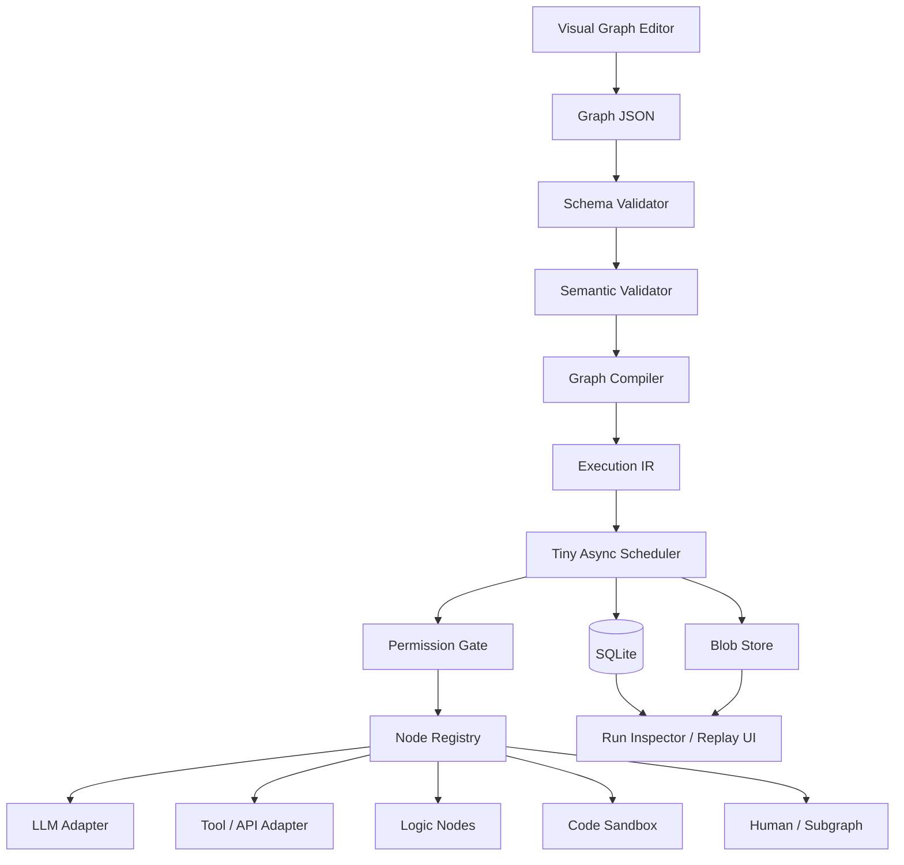
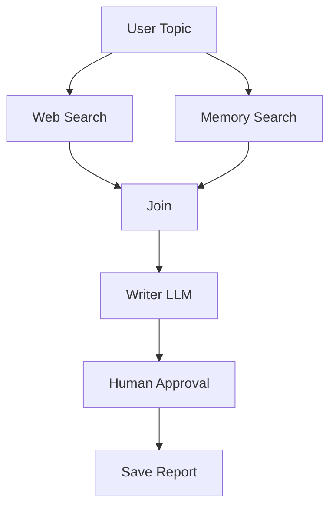
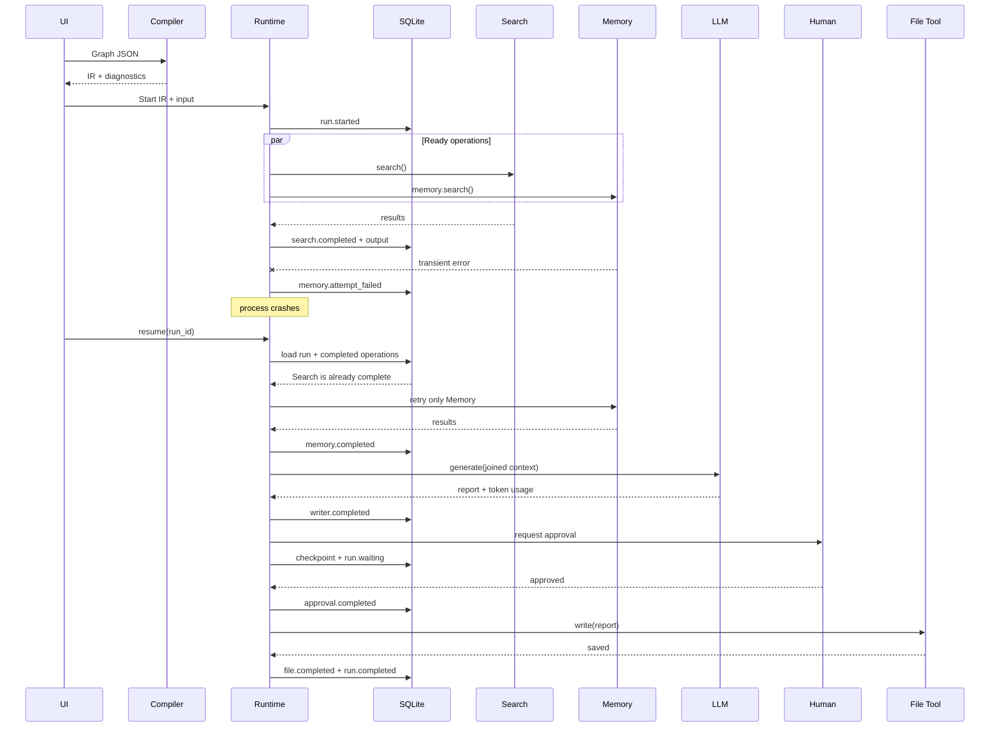
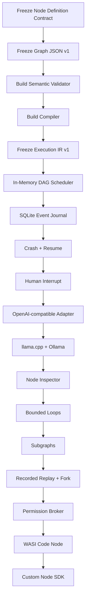

# Lightweight Harness Architecture: Graph Compiler, Execution IR, and Resumable Local-First Runtime

## Executive summary

The strongest architecture for the Harness is **not** to build a miniature Temporal, Kubernetes, LangGraph, or n8n. It is to separate four concerns aggressively:

```text
Visual graph
    ↓
Portable Graph JSON
    ↓
Validator + Compiler
    ↓
Small immutable Execution IR
    ↓
Single-process async runtime
    ↓
SQLite journal + checkpoints
```

The runtime should be able to execute a workflow from a local directory with **no required Redis, Postgres, Kafka, Docker, container runtime, vector database, workflow server, or cloud account**. SQLite is sufficient for local durability because it provides transactional persistence, supports simultaneous readers, and in WAL mode lets readers proceed while a writer is active; the important limitation is that SQLite still permits only one simultaneous write transaction and WAL is intended for processes on the same host. citeturn15view1turn15view2

The central architectural decision should be:

> **The visual graph is source code. The Execution IR is the executable. The event journal is runtime truth.**

Do not execute editor objects directly.

The editor representation should preserve labels, positions, colors, comments, groups, handles, and other UI information. The compiler should remove that information, resolve symbolic node IDs to compact indexes, validate connections, permissions, types and control flow, lower structured loops and subgraphs, normalize retry policies, and emit an immutable IR identified by a content hash.

The runtime then needs surprisingly little machinery. At any point it only needs to know which operations are complete, which have failed, which are waiting, and which are now ready. Ready nodes are run concurrently up to a configurable concurrency ceiling. Node completions and externally meaningful state transitions are journaled to SQLite in short serialized transactions. Node.js already supplies asynchronous I/O, `AbortSignal` composition for cancellation, worker threads when CPU-bound JavaScript really needs them, and a test runner with mocking facilities, so a TypeScript prototype does not require an orchestration framework. citeturn14view5turn15view4turn14view6

For crash recovery, the Harness should **not initially attempt Temporal-style deterministic workflow re-execution**. Temporal obtains durable execution by comparing commands generated during replay against an Event History and consequently places determinism restrictions on workflow code. citeturn14view1turn14view2 That is unnecessarily restrictive for a Harness whose nodes may invoke LLMs, shell tools, HTTP APIs, local models, arbitrary plugins and humans.

Instead, the Harness should implement three clearly differentiated concepts:

| Mode | Meaning |
|---|---|
| **Resume** | Reconstruct the frontier from durable completed-node records and continue only unfinished work. |
| **Recorded replay** | Re-run pure graph/control logic while substituting recorded results for LLMs, tools, API calls, random values and human inputs. |
| **Fork** | Start a new run from a previous checkpoint and deliberately execute downstream effects again. |

This distinction matters because **an LLM call is not meaningfully deterministic just because its graph node is deterministic**. API responses, model implementations, sampling, time, network state and external systems can change. A recorded-output replay is therefore much more useful for debugging an AI harness than pretending all downstream computations are reproducible. Temporal itself separates deterministic workflow control from non-deterministic Activities and records event history for recovery; that underlying separation is worth borrowing without borrowing the whole infrastructure. citeturn16view6turn16view7

The recommended first implementation is **TypeScript on Node.js LTS + JSON Schema/Ajv + SQLite + React Flow**, with the scheduler and compiler written as framework-free libraries. JSON Schema Draft 2020-12 provides a standardized wire-level schema language, and Ajv compiles schemas into JavaScript validation functions. React Flow is MIT-licensed, exposes nodes and edges directly and supports custom React node components and connection handles, making it a good editor rather than something the runtime must depend on. citeturn15view8turn15view7turn13search0turn13search12

The first local model adapters should be **llama.cpp** and **Ollama**. `llama.cpp` is particularly aligned with the lightweight goal: its official project describes a plain C/C++ implementation, aggressive quantization support, and an OpenAI-compatible local server. Ollama is an easy second adapter because it is MIT-licensed and exposes OpenAI-compatible APIs for common usage. vLLM and SGLang should be subsequent high-throughput GPU-server adapters; TensorRT-LLM should remain an optional NVIDIA-specific optimization rather than a Harness dependency. citeturn14view7turn14view9turn15view11turn14view8turn15view14turn14view10

The most important scope restriction is **structured control flow rather than arbitrary graph cycles**. v0.x should support DAGs plus explicit `loop`, `router`, `join`, `human`, and `subgraph` constructs. Arbitrary strongly connected components should be rejected. That slightly reduces expressiveness, but it drastically simplifies deadlock detection, checkpointing, visualization, resumption, and static validation.

The resulting core can remain conceptually small:



The architectural target is therefore not merely “a node editor that calls models.” It is a compact **workflow virtual machine for AI tasks**, where models and tools are replaceable peripherals.

## Architectural thesis and lightweight boundaries

Several existing systems provide useful ideas, but the Harness should copy their **semantics**, not their operational weight.

Node-RED demonstrates the value of a minimal node abstraction: nodes receive data, perform work and emit data; its custom nodes separate runtime JavaScript from editor metadata and are packaged as modules. Node-RED also distinguishes node-, flow-, and global-scoped context and can persist state locally rather than requiring a remote database. citeturn16view1turn16view2 The Harness should take the same philosophical direction, while making execution durability, types, permissions and AI observability first-class.

LangGraph demonstrates why checkpoints and interrupts matter for AI execution: its persistence layer records graph state, enabling fault tolerance, human-in-the-loop operation and time travel, while interrupts pause execution and later resume it. LangGraph also warns that code around an interrupt may execute again, which means side effects need idempotency. citeturn0search1turn16view0 The Harness can simplify this considerably by making human approval a **first-class node boundary** instead of allowing arbitrary user code to interrupt itself anywhere.

Temporal provides the strongest conceptual model for event histories, retries, recovery and idempotency. It records workflow progress as events and recovers after crashes from durable history; its documentation also explicitly notes the classic failure window where an external action succeeds but the worker crashes before completion is durably recorded, meaning the action can be executed again. Temporal therefore recommends idempotent Activities and stable idempotency keys. citeturn14view1turn16view6turn16view7 The Harness should adopt those principles while deliberately avoiding a Temporal service cluster.

That leads to a set of **non-negotiable lightweight boundaries**:

| Core capability | Required in core? | Design decision |
|---|---:|---|
| Visual editor | Yes | Editor can be a separate frontend package. |
| Graph JSON/DSL | Yes | Human-readable, portable, versioned. |
| Compiler | Yes | No direct execution of UI graph. |
| Execution IR | Yes | Immutable, canonical, compact. |
| Async scheduler | Yes | One process, bounded concurrency. |
| Persistent state | Yes | SQLite-first. |
| Large artifacts | Yes | Filesystem content-addressed blob store. |
| Redis | No | Optional future distributed adapter only. |
| Postgres | No | Optional future multi-host store. |
| Kafka / broker | No | Event log is SQLite locally. |
| Docker | No | Never required for ordinary workflows. |
| Containers | No | Optional isolation backend. |
| Workflow server | No | Runtime can be library + CLI. |
| Vector database | No | Memory adapter may add one later. |
| Model server | No | Harness can call cloud or local endpoints. |
| Embedded model engine | No | Keep model runtimes outside the core process. |
| OpenTelemetry collector | No | Export adapter later; local events first. |
| ORM | No | A handful of explicit SQL statements is sufficient. |
| Arbitrary `eval()` | No | It undermines validation and security. |
| Arbitrary cyclic graphs | No initially | Structured loop node instead. |

This boundary has an important consequence: **the core runtime should know almost nothing about LLMs**.

The scheduler should see:

```text
operation
inputs
policy
timeout
retry policy
executor
result
events
```

It should not care whether the executor is GPT, Qwen through llama.cpp, an HTTP request, a local Python process, an MCP tool, an approval form or a condition node.

That separation keeps the compiler and scheduler reusable even if the model ecosystem changes completely.

A useful mental model is:

```text
                control plane
Graph JSON → Compiler → Execution IR
                         │
                         ▼
                 runtime state machine
                         │
             ┌───────────┼───────────┐
             ▼           ▼           ▼
          adapters     storage     observers
```

**What “lightweight” should actually mean.** Binary/download size is only one dimension. More important are installation surface, baseline RAM, number of processes, background services, startup latency, configuration burden, persistent-service requirements, idle CPU, failure modes, and upgrade complexity. A 40 MB runtime that starts instantly and needs one SQLite file is operationally lighter than a 10 MB client that depends on four network services.

Therefore, I would define Harness lightweightness with five rules:

1. A new user can run a graph with one Harness process and one writable directory.
2. The default persistence backend is a local SQLite file.
3. Model runtimes are adapters, not linked into the Harness.
4. Scale-out components never leak into the core Graph or IR format.
5. Every optional subsystem has an interface boundary so replacing the local implementation does not change graph semantics.

That last rule matters most. A later Postgres store or distributed worker pool should implement an interface such as `RunStore`, not require a new graph language.

## Graph language, node contract, compiler and Execution IR

The Harness should have **three representations**, not one:

```text
Editor model       Graph source          Execution IR
-----------        ------------          ------------
positions          semantic nodes        indexed ops
dimensions         edges/ports           resolved refs
colors              policies             lowered control
selection           schemas              normalized retry
groups              subgraphs            no UI metadata
comments            version              hashes/version pins
```

React Flow already models node-and-edge based editors and permits multiple explicitly identified source and target handles. That makes it suitable for the presentation layer, but its node objects should be translated into Harness Graph JSON rather than becoming the persistence/runtime schema. citeturn13search5turn13search7

**The Graph JSON should be the public interchange format.** Use JSON Schema Draft 2020-12 for validation, and make that schema the wire-level source of truth. Ajv can compile the schema into efficient validators instead of interpreting it repeatedly. citeturn15view8turn15view7

A useful core value model is deliberately boring:

```ts
type Json =
  | null
  | boolean
  | number
  | string
  | Json[]
  | { [key: string]: Json };

type NodeKind =
  | "llm"
  | "tool"
  | "code"
  | "api"
  | "memory"
  | "condition"
  | "router"
  | "join"
  | "loop"
  | "human"
  | "subgraph";

type Permission = string;
```

The user-facing representations should look approximately like this:

| Entity | Compact source shape | Important semantics | What compilation removes or resolves |
|---|---|---|---|
| **Graph** | `v`, `id`, `inputs`, `outputs`, `nodes`, `edges`, `policy`, `opts` | Public workflow source and version boundary | Editor metadata, defaults, symbolic lookups |
| **Node** | `id`, `kind`, `type`, `ver`, `config`, `permissions`, `retry`, `timeoutMs`, `meta` | Instance of a registered node definition | UI position, labels; resolves type/version and permission requirements |
| **Edge** | `from:{node,port}`, `to:{node,port}`, optional `when` | Data/control dependency | String IDs become op indexes and compiled branch predicates |
| **Node definition** | Schemas + `execute()` + permission resolver | Plugin/SDK contract | Registry lookup becomes pinned executable identity |
| **Execution IR** | `v`, hashes, `ops`, `entry`, `outputs`, policy | Canonical executable plan | Nothing; it is immutable runtime input |
| **IR op** | index, kind, bindings, deps, config, policy, retry, timeout | Small scheduler instruction | Already normalized |
| **IR reference** | `["i",port]`, `["o",index,port]`, `["c",value]` | Input/output/constant addressing | Avoids repeated symbolic string traversal |

A fuller TypeScript contract could be:

```ts
type JsonSchema = Record<string, Json>;

interface Graph {
  v: 1;
  id: string;
  name?: string;

  inputs?: Record<string, JsonSchema>;
  outputs?: Record<string, GraphRef>;

  nodes: GraphNode[];
  edges: GraphEdge[];

  policy?: PermissionPolicy;

  opts?: {
    maxConcurrency?: number;
    defaultTimeoutMs?: number;
  };

  meta?: {
    description?: string;
    tags?: string[];
  };
}

interface GraphNode {
  id: string;

  // Logical family understood by the runtime/compiler.
  kind: NodeKind;

  // Registry identity, e.g. "harness.llm", "acme.github.issue".
  type: string;
  ver?: string;

  config?: Json;

  // Requested permissions can be explicit;
  // the registry may derive additional permissions from config.
  permissions?: Permission[];

  retry?: RetryPolicy;
  timeoutMs?: number;

  // Editor-only information. Never enters executable semantics.
  meta?: {
    label?: string;
    x?: number;
    y?: number;
    width?: number;
    height?: number;
    group?: string;
  };
}

interface GraphEdge {
  from: {
    node: string;
    port: string;
  };
  to: {
    node: string;
    port: string;
  };

  // Only for control edges / routers.
  when?: string;
}

type GraphRef =
  | { kind: "input"; port: string }
  | { kind: "output"; node: string; port: string }
  | { kind: "const"; value: Json };

interface RetryPolicy {
  maxAttempts: number;
  backoffMs?: number;
  factor?: number;
  jitter?: number;
  retryOn?: string[];
}

interface PermissionPolicy {
  allow: Permission[];
  deny?: Permission[];
}
```

The **universal node definition** is more important than the graph representation itself. Node-RED's split between reusable node definition and editor-facing configuration is a useful precedent, but the Harness node contract should explicitly include schemas, permissions and normalized runtime behavior. citeturn16view1

I recommend:

```ts
interface NodeDefinition<I extends Json, C extends Json, O extends Json> {
  type: string;
  version: string;
  kind: NodeKind;

  inputSchema: JsonSchema;
  configSchema: JsonSchema;
  outputSchema: JsonSchema;

  /**
   * Calculate capabilities required for this exact configuration.
   * Example:
   * { host: "api.github.com" } -> ["net:https:api.github.com"]
   */
  permissions(config: C): Permission[];

  /**
   * Optional compile-time lowering.
   * Ordinary nodes usually do not need this.
   */
  compile?(
    node: GraphNode,
    ctx: CompileContext
  ): Partial<CompiledOp>;

  execute(
    input: I,
    config: C,
    ctx: RunContext
  ): Promise<NodeResult<O>>;
}

type NodeResult<O extends Json> =
  | { status: "ok"; output: O }
  | { status: "waiting"; interrupt: InterruptRequest }
  | { status: "skipped"; reason?: string };

interface RunContext {
  runId: string;
  nodeId: string;
  attempt: number;
  iteration: number;

  signal: AbortSignal;

  emit(event: NodeEvent): void;

  // Brokered capabilities, not raw unrestricted host APIs.
  capabilities: CapabilityBroker;
}

interface InterruptRequest {
  type: string;
  payload: Json;
}

interface NodeEvent {
  type:
    | "log"
    | "progress"
    | "stream"
    | "metric"
    | "tool_call"
    | "tool_result";

  data: Json;
}

interface NodeError {
  code: string;
  message: string;

  class:
    | "transient"
    | "permanent"
    | "timeout"
    | "cancelled"
    | "permission"
    | "invalid";

  retryable: boolean;
  details?: Json;
}
```

A key detail is that `emit()` is preferable to making every plugin implement an `AsyncGenerator`. It preserves a simple `Promise<NodeResult>` contract while still supporting streaming tokens, progress notifications, subprocess logs and tool-call events.

The contract also means **nodes do not receive the SQLite database, secrets dictionary or unrestricted filesystem object**. They get capabilities through `RunContext`.

### Node semantics

The same contract is sufficient for all requested node types:

| Node kind | Execution meaning | Side effects | Special compiler/runtime treatment |
|---|---|---:|---|
| `llm` | Invoke model adapter | Usually external | Record model, usage, route and final result |
| `tool` | Execute registered tool | Maybe | Permission + idempotency policy |
| `code` | Run user code | Maybe | Sandbox selection required |
| `api` | HTTP/RPC operation | Maybe | Host scopes, retry classification |
| `memory` | Read/write memory provider | Maybe | Explicit read/write scopes |
| `condition` | Pure boolean/expression | No | Prefer deterministic expression language |
| `router` | Select downstream branch(es) | No | Compiler resolves branch labels |
| `join` | Synchronize selected branches | No | Explicit `all`/`any` semantics |
| `loop` | Repeat structured body | Body-dependent | Mandatory bound initially |
| `human` | Request external decision | Yes, as event | Always durable interrupt boundary |
| `subgraph` | Invoke nested graph | Depends | Flatten initially with namespace preservation |

**LLM and tool nodes should be separate concepts.** OpenAI's tool-calling API illustrates why: the model generates a tool request using tool schemas, the application performs the operation, and the result is fed back to the model. citeturn14view14 A Harness `llm` node can therefore internally iterate through model/tool calls while each actual tool invocation still goes through the Harness permission and event layers.

### Graph semantics

The default graph is a DAG, but “DAG-only” does not mean “no loops.” It means **cycles are expressed structurally**.

For v0.x:

```text
Allowed:
DAG
router
parallel fan-out
all-join
any-join
bounded loop node
human interrupt
nested subgraph

Rejected:
arbitrary A → B → C → A
recursive subgraph call
unbounded graph cycle
implicit join semantics
dynamic eval-created edge
```

A loop should be something like:

```json
{
  "id": "improve",
  "kind": "loop",
  "type": "harness.loop",
  "config": {
    "body": "refine-report",
    "maxIterations": 5,
    "until": "$body.score >= 0.9"
  }
}
```

The runtime now has a simple persistent key:

```text
(run_id, loop_node_id, iteration)
```

instead of trying to infer how many times an arbitrary cycle has already traversed.

**Parallelism requires no special parallel node.** If several nodes become ready after the same completion, schedule all of them up to `maxConcurrency`.

**Join semantics must be explicit.** At minimum:

```text
all → wait for every activated upstream branch to terminate
any → release after first successful activated branch
```

A branch that a router never activates is not “unfinished”; it becomes `SKIPPED`. Without that distinction an `all` join after mutually exclusive routing can deadlock.

**Interrupts should initially be node boundaries.** LangGraph's general interrupt implementation pauses execution and persists state, but resumed nodes can restart from their beginning; it consequently warns about effects before interrupts. citeturn16view0 A dedicated `human` node avoids that ambiguity:

```text
LLM → Human Approval → Publish
      ^ checkpoint
```

rather than:

```text
arbitrary plugin:
    do_something()
    maybe_interrupt()
    continue()
```

### Static validation

Compilation should fail before execution on defects that can be known statically.

I would divide diagnostics into these classes:

| Validation class | Representative rules |
|---|---|
| **Identity** | Unique graph/node IDs; known node type/version; valid subgraph reference |
| **Ports** | Source output exists; target input exists; one binding where cardinality is singular |
| **Schema** | Config conforms to definition schema; required inputs supplied; compatible port types |
| **Control** | No arbitrary SCC/cycle; router has valid branches; joins reference reachable branches |
| **Liveness** | Entry nodes exist; no mandatory input depends on permanently unreachable path |
| **Loop safety** | Explicit maximum iterations; body exists; recursive subgraphs rejected |
| **Permissions** | Derived node capabilities are subset of graph/user grant |
| **Effects** | Retryable write nodes declare `pure`, `idempotent`, or `nonIdempotent` behavior |
| **Timeout/retry** | Positive bounds; retry policy valid; impossible combinations rejected |
| **Secrets** | References resolve by name but secret values never appear in source/IR |
| **Versioning** | Node versions resolvable and compatible with compiler/runtime |
| **Resources** | Graph concurrency and configured payload limits fall within policy |

JSON Schema should handle **shape validation**, while graph semantics need a second pass. Ajv is ideal for the first half because it validates JSON against compiled schemas. citeturn15view7

For port compatibility, do not try to solve arbitrary JSON Schema implication in v0.1. Use either nominal schema IDs or a deliberately constrained structural type system:

```text
string
number
boolean
bytes/blob-ref
array<T>
object<schema-id>
any
```

Runtime validation can remain at node boundaries even after compile-time checking.

### Compiler pipeline

A clean compiler would perform:


The compiler should produce diagnostics rather than only exceptions:

```ts
interface Diagnostic {
  severity: "error" | "warning" | "info";
  code: string;
  message: string;

  nodeId?: string;
  edgeId?: string;
  path?: string;

  suggestion?: string;
}
```

This directly powers editor UX:

```text
❌ report_writer.context
   expected object<ResearchBundle>
   received string

⚠ publish
   retry policy enabled for non-idempotent operation

❌ shell
   requests process.exec
   graph policy does not grant process.exec
```

### Compact Execution IR

The IR should not be pleasant for a human to author. That is the source graph's job.

A reasonable interface is:

```ts
interface ExecutionIR {
  v: 1;

  graphId: string;
  graphHash: string;
  irHash: string;

  compilerVersion: string;
  registryHash: string;

  maxConcurrency: number;

  ops: CompiledOp[];

  entry: number[];
  outputs: Record<string, IRRef>;

  policy: CompiledPermissionPolicy;
}

interface CompiledOp {
  id: string;
  k: NodeKind;

  // Inputs already translated to direct references.
  b: Record<string, IRRef>;

  // Normalized configuration.
  c?: Json;

  // Upstream op indexes.
  d?: number[];

  // Compact retry tuple:
  // attempts, initial backoff, factor, jitter
  r?: [number, number, number, number];

  t?: number;             // timeout ms
  p?: Permission[];       // required capabilities

  // Optional control-flow metadata.
  ctl?: CompiledControl;
}

type IRRef =
  | ["i", string]              // graph input
  | ["o", number, string]      // op output
  | ["c", Json];               // constant
```

For example, source:

```json
{
  "v": 1,
  "id": "research-report",
  "nodes": [
    {
      "id": "search",
      "kind": "tool",
      "type": "web.search",
      "config": {}
    },
    {
      "id": "memory",
      "kind": "memory",
      "type": "memory.search",
      "config": {}
    },
    {
      "id": "combine",
      "kind": "join",
      "type": "harness.join",
      "config": { "mode": "all" }
    },
    {
      "id": "writer",
      "kind": "llm",
      "type": "model.generate",
      "config": { "model": "auto" }
    },
    {
      "id": "approval",
      "kind": "human",
      "type": "human.approval"
    },
    {
      "id": "save",
      "kind": "tool",
      "type": "fs.write",
      "config": { "path": "report.md" }
    }
  ]
}
```

might compile to approximately:

```json
{
  "v": 1,
  "graphId": "research-report",
  "graphHash": "sha256:7cf...",
  "irHash": "sha256:4a8...",
  "compilerVersion": "0.1.0",
  "registryHash": "sha256:c12...",
  "maxConcurrency": 4,

  "ops": [
    {
      "id": "search",
      "k": "tool",
      "b": { "query": ["i", "topic"] },
      "c": { "tool": "web.search" },
      "p": ["net.http:web"],
      "r": [3, 500, 2, 0.2],
      "t": 15000
    },
    {
      "id": "memory",
      "k": "memory",
      "b": { "query": ["i", "topic"] },
      "c": { "op": "search" },
      "p": ["memory.read"]
    },
    {
      "id": "combine",
      "k": "join",
      "d": [0, 1],
      "b": {
        "web": ["o", 0, "results"],
        "memory": ["o", 1, "results"]
      },
      "c": { "mode": "all" }
    },
    {
      "id": "writer",
      "k": "llm",
      "d": [2],
      "b": { "context": ["o", 2, "output"] },
      "c": { "model": "auto" },
      "p": ["model.invoke"]
    },
    {
      "id": "approval",
      "k": "human",
      "d": [3],
      "b": { "document": ["o", 3, "text"] },
      "p": ["human.request"]
    },
    {
      "id": "save",
      "k": "tool",
      "d": [4],
      "b": { "content": ["o", 3, "text"] },
      "c": { "tool": "fs.write", "path": "report.md" },
      "p": ["fs.write:workspace"]
    }
  ],

  "entry": [0, 1],
  "outputs": {
    "report": ["o", 3, "text"]
  },

  "policy": {
    "allow": [
      "net.http:web",
      "memory.read",
      "model.invoke",
      "human.request",
      "fs.write:workspace"
    ]
  }
}
```

Notice what disappeared: coordinates, node dimensions, color, handles, explanatory labels, duplicated defaults and string-to-string dependency traversal.

The important things added are hashes, pinned registry identity, normalized policies and resolved references.

That is why compilation deserves its own layer.

## Runtime, checkpointing and replay semantics

The minimal runtime should be a **single event-loop scheduler with bounded concurrency**, not a persistent worker farm.

Conceptually:

```ts
while (!run.isTerminal()) {
  const ready = getReadyOps(run);

  launchUpToConcurrencyLimit(ready);

  const completion = await nextCompletion();

  await persistCompletion(completion);

  updateFrontier(completion);
}
```

The scheduler state machine can stay tiny:

```text
PENDING
  ↓
READY
  ↓
RUNNING ────────────────┐
  │                     │
  ├─ OK → COMPLETED     │
  ├─ SKIP → SKIPPED     │
  ├─ WAIT → WAITING     │
  ├─ ERROR → RETRY_WAIT ├→ READY
  ├─ ERROR → FAILED     │
  └─ ABORT → CANCELLED  │
```

A downstream node is eligible when:

```text
required dependencies are terminal
AND
required branch is activated
AND
required values exist
AND
run is not cancelled
AND
its retry delay has expired
```

Node.js's asynchronous APIs fit this I/O-heavy orchestration model; its own documentation says worker threads are primarily useful for CPU-intensive JavaScript while built-in asynchronous I/O is more efficient for I/O-intensive work. citeturn15view4 Thus **do not put every node in a worker thread**. Use the event loop for HTTP/model/tool orchestration; reserve child processes/workers/sandboxes for code nodes or genuine CPU-heavy local tasks.

Cancellation maps cleanly onto `AbortController`/`AbortSignal`, including combining the overall run cancellation signal with a node timeout. Node supports `AbortSignal.any()` for combining signals. citeturn14view5

For example:

```ts
const timeoutSignal = AbortSignal.timeout(op.t ?? defaults.timeoutMs);

const signal = AbortSignal.any([
  runAbortController.signal,
  timeoutSignal
]);

await definition.execute(input, config, {
  ...ctx,
  signal
});
```

This is cooperative cancellation. Arbitrary JavaScript or native code that ignores the signal cannot be forcibly stopped safely inside the same process. That is one reason user-supplied code belongs in an isolated process or sandbox.

### SQLite-first durability

The local database should contain execution metadata, events and references to artifacts, not giant model/file payloads.

SQLite WAL is a strong default for a single-host Harness: WAL permits readers to continue while a writer is active and usually reduces writer/reader interference, but SQLite still allows only one simultaneous write transaction, so writes should be short and serialized. citeturn15view1turn15view2

A minimal schema:

```sql
CREATE TABLE graphs (
  graph_id       TEXT NOT NULL,
  version        TEXT NOT NULL,
  source_hash    TEXT NOT NULL,
  source_json    TEXT NOT NULL,
  created_at     INTEGER NOT NULL,
  PRIMARY KEY (graph_id, version)
);

CREATE TABLE runs (
  run_id             TEXT PRIMARY KEY,
  graph_id           TEXT NOT NULL,
  graph_version      TEXT NOT NULL,
  graph_hash         TEXT NOT NULL,
  ir_hash            TEXT NOT NULL,

  status             TEXT NOT NULL,
  input_json         TEXT,

  parent_run_id      TEXT,
  fork_checkpoint_id TEXT,

  created_at         INTEGER NOT NULL,
  updated_at         INTEGER NOT NULL
);

CREATE TABLE node_runs (
  run_id         TEXT NOT NULL,
  node_id        TEXT NOT NULL,
  iteration      INTEGER NOT NULL DEFAULT 0,
  attempt        INTEGER NOT NULL,

  status         TEXT NOT NULL,

  started_at     INTEGER,
  ended_at       INTEGER,

  input_ref      TEXT,
  output_ref     TEXT,
  error_json     TEXT,
  usage_json     TEXT,

  PRIMARY KEY (
    run_id,
    node_id,
    iteration,
    attempt
  )
);

CREATE TABLE events (
  seq            INTEGER PRIMARY KEY AUTOINCREMENT,
  run_id         TEXT NOT NULL,
  node_id        TEXT,
  attempt        INTEGER,

  ts             INTEGER NOT NULL,
  type           TEXT NOT NULL,
  data_json      TEXT
);

CREATE TABLE checkpoints (
  checkpoint_id  TEXT PRIMARY KEY,
  run_id         TEXT NOT NULL,
  seq            INTEGER NOT NULL,

  frontier_json  TEXT NOT NULL,
  control_json   TEXT NOT NULL,

  created_at     INTEGER NOT NULL
);

CREATE TABLE blobs (
  hash           TEXT PRIMARY KEY,
  size           INTEGER NOT NULL,
  media_type     TEXT,
  path           TEXT NOT NULL
);
```

The actual directory can remain understandable:

```text
project/
  harness.json
  graphs/
  .harness/
    harness.db
    blobs/
      17/
        178a...
      a4/
        a4f1...
```

Small JSON values can stay in SQLite. Large search outputs, images, videos, embeddings, archives, audio, model artifacts and other binary data should be represented by immutable references:

```json
{
  "$blob": "sha256:a4f1...",
  "mediaType": "application/json",
  "bytes": 8312741
}
```

This avoids turning every checkpoint into a multi-megabyte copy operation.

### Checkpoint semantics

A checkpoint should not duplicate every previous output. Outputs are already immutable execution records.

It only needs enough scheduler/control state to reconstruct the frontier:

```json
{
  "completed": [0, 1, 2, 3],
  "skipped": [],
  "waiting": [4],
  "failed": [],
  "loops": {},
  "activatedBranches": {},
  "pendingRetry": {}
}
```

I recommend persisting:

```text
node result
+
terminal node event
+
relevant frontier change
```

in one short transaction.

Then a crash after the commit means the node is known complete. A crash before the commit means the Harness cannot safely assume completion.

That produces the unavoidable distributed-systems ambiguity around external side effects:

```text
Harness ──────► payment/API/filesystem
    │                  │
    │             effect succeeds
    │                  │
    X process crash    │
    │
database never sees completion
```

When restarted, the Harness does not know whether the effect occurred.

No checkpoint design can magically resolve that. Temporal's documentation describes exactly this class of failure and recommends idempotent Activities and stable idempotency keys because an Activity can execute more than once even though the workflow ultimately observes a single completion. citeturn16view6

Therefore every node definition should advertise:

```ts
type EffectClass =
  | "pure"
  | "read"
  | "idempotent-write"
  | "non-idempotent-write";
```

For retryable writes, derive a stable effect identifier from the logical operation, not the physical attempt:

```text
effect_id =
SHA256(
  run_id
  + node_id
  + iteration
  + logical_invocation
)
```

The retry attempts:

```text
attempt 1
attempt 2
attempt 3
```

all reuse the same `effect_id`.

Where an external provider accepts idempotency keys, pass this value. Where it does not, the Harness can only provide **at-least-once execution plus reconciliation**, not exactly-once side effects.

### Resume-from-node semantics

“Resume from node” should actually mean **fork from the checkpoint immediately preceding the desired node**, because modifying node N may invalidate its descendants.

Example:

```text
A ✓
│
B ✓
│
C ✓
│
D ✗
│
E
```

Selecting “retry D”:

```text
same run
A recorded
B recorded
C recorded
D new attempt
```

Selecting “edit C and resume from C”:

```text
new run / fork
parent = old run
checkpoint = after B

A recorded parent result
B recorded parent result
C executes new version/config
D executes
E executes
```

Do not mutate historical execution data in place.

### Replay taxonomy

A major design mistake would be putting one **Replay** button in the UI without explaining what it does.

Use three operations:

**Audit replay** reads the durable event stream only. Nothing executes.

```text
event 100 node.started
event 101 model.request
event 102 model.usage
event 103 node.completed
```

**Recorded-effect replay** executes deterministic control logic but substitutes recorded outputs for effect nodes:

```text
condition     → execute
router        → execute
join          → execute
LLM           → recorded output
HTTP          → recorded output
tool write    → recorded output
human         → recorded answer
random/time   → recorded value
```

Temporal calls an Event History an append-only durable record that enables recovery and debugging, and its side-effect mechanism similarly records non-deterministic results rather than recomputing them during replay. citeturn16view7 This is the right conceptual basis for Harness replay.

**Live fork** deliberately performs real effects again.

This avoids promising deterministic replay where none exists.

### End-to-end crash and resume example

Consider:



Execution:



The key observation is that **the successful search is never repeated simply because its parallel sibling failed**. LangGraph's persistence mechanisms similarly preserve successful work in some parallel failure scenarios; this is an important characteristic to reproduce. citeturn0search1

Retries should use bounded exponential backoff plus jitter for transient remote failures. OpenAI's current API guidance, for example, recommends respecting `Retry-After` where supplied and otherwise applying exponential backoff with jitter and bounded attempts/time; it also warns against accidentally layering duplicate retry loops on top of SDK-level retries. citeturn15view9 The Harness adapter contract should therefore report whether an adapter has already retried internally.

## Adapters, local model runtimes and security

The Harness should have one abstraction for models regardless of whether they are local or remote:

```ts
interface ModelAdapter {
  id: string;

  capabilities(): Promise<ModelCapabilities[]>;

  generate(
    req: ModelRequest,
    ctx: AdapterContext
  ): Promise<ModelResponse>;
}

interface ModelRequest {
  model: string;

  messages?: Json[];
  input?: Json;

  tools?: ToolSchema[];
  responseSchema?: JsonSchema;

  temperature?: number;
  maxOutputTokens?: number;

  stream?: boolean;
}

interface ModelResponse {
  output: Json;

  finishReason?: string;

  usage?: {
    inputTokens?: number;
    outputTokens?: number;
    cachedInputTokens?: number;
    reasoningTokens?: number;
  };

  model: string;
  provider: string;

  rawMetadata?: Json;
}
```

For OpenAI, the adapter should target the current Responses API for direct model requests; OpenAI's documentation recommends Responses for text-generation requests, while its function-calling flow exposes tools through schemas and returns tool calls that the application executes. citeturn15view10turn14view14

The same Harness adapter can address local runtimes through OpenAI-compatible endpoints where available. That minimizes adapter code, although “OpenAI-compatible” should be understood as an interoperability surface rather than a guarantee that every vendor implements every API feature.

The routing architecture becomes:

```text
LLM node
   │
   ▼
Model Router
   │
   ├──── policy: local-only
   ├──── capability: tools
   ├──── structured output
   ├──── context requirement
   ├──── latency class
   ├──── cost ceiling
   └──── hardware availability
   │
   ├── OpenAI adapter
   ├── OpenAI-compatible HTTP
   │     ├── llama.cpp
   │     ├── Ollama
   │     ├── vLLM
   │     ├── SGLang
   │     └── TensorRT-LLM
   └── provider-specific adapter when needed
```

Crucially, **record the routing decision**:

```json
{
  "requestedModel": "auto",
  "selectedProvider": "llama.cpp",
  "selectedModel": "Qwen3.5-8B-Q4_K_M",
  "routeReason": [
    "local-only",
    "tools=false",
    "context>=32768"
  ]
}
```

Otherwise two executions of the same graph can silently take radically different model paths.

### Local model runtime comparison

The table below is intentionally qualitative because raw latency or memory numbers across these systems are meaningless unless the model, quantization, prompt length, output length, hardware, batch size and concurrency are held constant.

| Runtime | Latency/throughput profile | Memory profile | Harness integration | Hardware focus | License | Priority |
|---|---|---|---|---|---|---|
| **llama.cpp** | Excellent fit for interactive local/single-user workloads; built around efficient native inference rather than a large serving stack | Extensive low-bit quantization; supports running much smaller representations of models | **Very easy**: official project includes an OpenAI-compatible server | CPU, Apple Silicon, x86 and several GPU backends | MIT | **P0** |
| **Ollama** | Optimized primarily for convenient interactive local model use rather than being a specialized high-concurrency serving engine | Local model footprint plus resident Ollama service; model-dependent | **Very easy**: simple daemon/API and OpenAI compatibility for common endpoints | macOS, Windows, Linux/local hardware | MIT | **P0** |
| **vLLM** | Designed explicitly for high-throughput, memory-efficient serving; particularly attractive once several runs/users share GPUs | Paged serving architecture targets efficient accelerator memory use | **Easy**: official OpenAI-compatible server | GPU/server-oriented | Apache-2.0 | **P1** |
| **SGLang** | Explicitly designed for low-latency, high-throughput serving with prefix caching/RadixAttention | Server-oriented; optimizes repeated prefixes and accelerator utilization rather than minimal process footprint | **Easy** through OpenAI-compatible APIs | NVIDIA, AMD and additional accelerator platforms | Apache-2.0 | **P1** |
| **TensorRT-LLM** | Highly optimized NVIDIA-specific inference stack with custom kernels and runtime optimizations | Can exploit NVIDIA-specific quantization/optimization techniques; operational stack is heavier than llama.cpp | **Medium**: serving interface exists, but deployment/hardware coupling is stronger | NVIDIA GPUs | Apache-2.0 project overall, with component-specific licenses | **P2 specialized** |

`llama.cpp`'s official repository describes a plain C/C++ implementation, OpenAI-compatible server, support for multiple CPU architectures and integer quantization levels intended to reduce memory consumption. citeturn14view7 Ollama's official repository is MIT-licensed and provides local installers across major desktop/server operating systems, while Ollama documents compatibility with OpenAI's Chat Completions interface. citeturn14view9turn15view11

vLLM describes itself as a high-throughput, memory-efficient serving engine and includes an OpenAI-compatible API; its repository uses Apache License 2.0. citeturn14view8turn15view12 SGLang describes its serving runtime as designed for low latency and high throughput using techniques including RadixAttention and prefix caching, and documents OpenAI API compatibility and broad accelerator support; its project is Apache-2.0 licensed. citeturn15view14turn15view15

TensorRT-LLM is explicitly NVIDIA-focused and includes custom kernels and numerous runtime optimizations for efficient GPU inference. Its project license is Apache 2.0 overall, while NVIDIA's license file identifies bundled/derived portions with other licenses, so a marketplace should not reduce the situation to “everything is Apache-2.0.” citeturn14view10turn15view13

For **your lightweight/local-first goal**, I would therefore implement:

```text
first:
Generic OpenAI-compatible adapter
       ├─ llama.cpp
       └─ Ollama

then:
       ├─ vLLM
       └─ SGLang

later:
       └─ TensorRT-LLM
```

This is better than embedding llama.cpp or any other inference runtime into the Harness executable. A separate local model process means a 500 MB–50 GB model footprint does not become a property of the workflow engine itself.

### Model router

The router should use capabilities rather than provider names:

```ts
interface ModelRequirement {
  local?: boolean;
  tools?: boolean;
  vision?: boolean;
  structuredOutput?: boolean;

  minContextTokens?: number;

  maxCostPer1MTokens?: number;
  maxLatencyClass?: "interactive" | "normal" | "batch";

  preferredProviders?: string[];
}
```

Node:

```json
{
  "kind": "llm",
  "config": {
    "model": {
      "select": {
        "local": true,
        "tools": true,
        "minContextTokens": 32768
      }
    }
  }
}
```

rather than:

```json
{
  "model": "qwen-something-hardcoded"
}
```

Provider-specific overrides can still exist under an extension namespace.

### Permission model

Security should be capability-based from the beginning even if sandboxing comes later.

Example graph grant:

```json
{
  "policy": {
    "allow": [
      "model.invoke",
      "net.https:api.github.com",
      "fs.read:workspace",
      "fs.write:workspace/output",
      "memory.read:project",
      "secrets.use:github"
    ],
    "deny": [
      "process.exec",
      "fs.read:home"
    ]
  }
}
```

Example capability taxonomy:

```text
model.invoke
tool.invoke:<tool>

net.http:<host-pattern>
net.listen:<interface>

fs.read:<scope>
fs.write:<scope>

memory.read:<scope>
memory.write:<scope>

secrets.use:<secret-name>

process.exec:<command/profile>

human.request

subgraph.invoke:<graph>
```

Enforcement occurs twice:

```text
compile time:
requested permissions ⊆ granted permissions

runtime:
actual capability request ⊆ node's compiled permissions
```

The second check is essential. A plugin must not be able to lie during compilation and later open another resource.

**Secrets should never be included in Graph JSON, Execution IR, checkpoints, node input logs, event payloads or marketplace metadata.**

The IR contains:

```json
{
  "$secret": "openai-primary"
}
```

At runtime:

```text
Node
 ↓ requests secret capability
Capability Broker
 ↓ verifies "secrets.use:openai-primary"
Secret Provider
 ↓ supplies value directly to adapter
```

The logger should receive only a redacted representation.

### Sandboxing strategy

There is no single sandbox suitable for every node. The right design is a hierarchy.

| Execution type | Recommended default | Isolation quality | Weight | Compatibility |
|---|---|---:|---:|---:|
| Built-in trusted logic | Same process | Low by design | **Lowest** | Highest |
| Trusted CPU-heavy JS | Worker thread | Low security isolation | Low | High |
| User WASM/WASI | Wasmtime | Strong capability-oriented boundary | Low–medium | Limited to WASM ecosystem |
| Native user process | Separate OS process + restricted account/resources | Moderate operational isolation, not enough for hostile multi-tenancy | Medium | High |
| Untrusted containerized workloads | gVisor `runsc` | Stronger syscall isolation | Medium–high | Good Linux/container compatibility |
| High-risk multi-tenant workloads | Firecracker microVM | Strong VM-style isolation | Highest | Linux/KVM + VM environment |

Worker threads are **not a security sandbox**: Node documents that worker threads belong to the same process and can share memory. citeturn15view4 They are a performance/isolation-of-work mechanism, not a hostile-code boundary.

For user-created code that can compile to WebAssembly, **WASM/WASI through Wasmtime is the best first sandbox adapter**. Wasmtime's WASI filesystem model is capability-based, so guest code can be limited to explicitly granted files/directories. citeturn14view11 That matches the Harness permission model almost perfectly:

```text
Harness fs.read:workspace/input
            │
            ▼
WASI preopen only:
  /input
```

No `/home`, SSH keys or unrelated directories need to exist in the guest's namespace.

For code requiring a general Linux userspace, gVisor gives stronger isolation than ordinary process execution by interposing its Sentry and restricting direct interaction with the host system API. But gVisor itself explicitly warns that a sandbox does not replace secure architecture and notes that sandboxed applications can still access files and networks made available to them. citeturn14view12turn15view16 Therefore the Harness capability broker must still control mounts, secrets and networking.

Firecracker adds a microVM boundary and its production tooling includes thread-specific seccomp filtering and a jailer using cgroups/namespaces and privilege dropping. citeturn14view13 It should be an optional high-isolation backend rather than a core requirement because it violates the “zero Docker/virtualization requirements” spirit if made mandatory.

It is also important not to market Firecracker—or any sandbox—as infallible. Firecracker published a Jailer security advisory concerning a host-file-overwrite vulnerability, illustrating why isolation software still needs patching and defense in depth. citeturn15view17

The security recommendation is therefore:

```text
trusted built-in nodes
    ↓
same process

untrusted portable code
    ↓
WASM/WASI

untrusted arbitrary Linux code
    ↓
gVisor worker [optional]

highest-risk multi-tenant code
    ↓
Firecracker worker [optional]
```

The local Harness itself remains container-free.

## Observability, testing and developer experience

Observability should derive from the same event journal used for durability rather than from a completely independent tracing subsystem.

Temporal's durable Event History serves both crash recovery and debugging/auditing, which is a valuable pattern for this Harness. citeturn16view7 The Harness event schema can remain much smaller.

A useful event:

```json
{
  "seq": 183,
  "ts": 1788492332123,
  "runId": "run_92H...",
  "nodeId": "writer",
  "attempt": 1,

  "type": "model.completed",

  "data": {
    "provider": "llama.cpp",
    "model": "Qwen3.5-8B-Q4_K_M",

    "inputTokens": 7428,
    "outputTokens": 1821,

    "durationMs": 4128
  }
}
```

Recommended canonical event classes:

```text
run.created
run.started
run.waiting
run.resumed
run.cancel_requested
run.cancelled
run.failed
run.completed

node.ready
node.started
node.progress
node.completed
node.skipped
node.failed
node.retry_scheduled
node.cancelled

model.routed
model.request
model.stream
model.completed

tool.request
tool.completed

permission.request
permission.denied

checkpoint.created
checkpoint.restored

human.requested
human.responded
```

Do **not** persist one SQLite event for every individual streamed token by default. Streaming can produce enormous histories. Send fine-grained token events live to observers, while persisting sampled/coalesced chunks or only summary records. Temporal itself imposes Event History size/count limits because indefinitely growing histories have performance implications. citeturn16view7

### Node inspector

Clicking any node in the visual graph should open:

| Inspector tab | Fields |
|---|---|
| **Summary** | State, node type/version, start/end, duration, attempts |
| **Inputs** | Resolved inputs, source node/port, payload size/hash |
| **Config** | Effective config after defaults |
| **Outputs** | Structured output, blob links, schema validation |
| **Timeline** | `ready → running → retry → completed` |
| **Model** | Provider, model, router decision, sampling config |
| **Tokens** | Input/output/cached/reasoning token counts when available |
| **Cost** | Provider-reported or locally estimated amount |
| **Tools** | Tool name, args preview, result preview, latency |
| **Permissions** | Granted capabilities actually used |
| **Retries** | Attempts, error class, backoff, idempotency ID |
| **Logs** | Structured logs with levels |
| **Checkpoints** | Before/after checkpoint IDs |
| **Errors** | Normalized error plus redacted stack/cause |
| **Artifacts** | Files/images/blobs produced |
| **Raw** | Sanitized event records |

The graph itself can become a live debugger:

```text
┌─────────────┐
│ Web Search  │
│ ✓ 1.82 sec  │
└──────┬──────┘
       │
       ├───────────────┐
       ▼               ▼
┌────────────┐   ┌────────────┐
│ Memory     │   │ Other Tool │
│ ↻ attempt2 │   │ ✓ 0.14 sec │
└─────┬──────┘   └─────┬──────┘
      └────────┬────────┘
               ▼
       ┌──────────────┐
       │ Writer       │
       │ ○ pending    │
       └──────────────┘
```

### What to measure

The Harness should benchmark **itself separately from model inference**.

Otherwise a five-second LLM call can hide a 100 ms scheduler regression.

**Compiler benchmark matrix**

| Workload | Measurements |
|---|---|
| 10-node graph | parse, validate, compile latency |
| 100-node graph | same + peak memory |
| 1,000-node graph | same + IR size |
| Deep subgraphs | lowering/namespace overhead |
| Large fan-out | dependency analysis |
| Invalid graphs | diagnostic latency/count |
| Repeated compile | schema validator/cache behavior |

Collect:

```text
compile_ms
validate_ms
IR_bytes
IR_bytes_per_node
peak_RSS
diagnostic_count
```

**Runtime no-op benchmark**

Use nodes that resolve immediately:

```text
10 nodes
100 nodes
1,000 nodes
10,000 nodes
```

Measure:

```text
scheduler_overhead_us_per_node
nodes_per_second
event_write_latency_p50/p95/p99
checkpoint_latency_p50/p95/p99
resume_latency
idle_CPU
peak_RSS
DB_growth_bytes_per_node
```

**Concurrency benchmark**

Run mocked I/O nodes:

```text
10 ms artificial operation
100 ms artificial operation
1 s artificial operation
```

at:

```text
concurrency 1
concurrency 4
concurrency 16
concurrency 64
```

Measure actual makespan, event-loop delay and cancellation latency.

**Crash-recovery benchmark**

Inject process termination at every interesting boundary:

```text
before node execution
after external effect begins
after effect returns
before DB commit
during DB transaction
after DB commit
before child scheduling
during retry wait
during human wait
```

Then measure:

```text
lost completed nodes
duplicated effects
resume latency
re-executed nodes
state divergence
database corruption
```

The target for pure/idempotent nodes should be **zero loss of durably committed completions**. For non-idempotent effects, tests should explicitly demonstrate the unavoidable ambiguous window rather than concealing it.

**Model benchmark**

Model runtime comparisons should fix:

```text
exact model
exact weight format / quantization
hardware
context length
prompt
output length
sampling parameters
concurrency
warm/cold state
```

Then collect:

```text
startup/model-load time
time to first token
prefill tokens/sec
decode tokens/sec
total latency
peak host RAM
peak VRAM
energy if measurable
concurrency throughput
request failure rate
```

That makes the llama.cpp/vLLM/Ollama/SGLang/TensorRT comparison empirical rather than ideological.

### Cost accounting

The universal record should distinguish raw usage from derived pricing:

```ts
interface Usage {
  inputTokens?: number;
  outputTokens?: number;
  cachedInputTokens?: number;
  reasoningTokens?: number;

  providerCost?: number;
  estimatedCost?: number;
  currency?: string;

  localComputeMs?: number;
}
```

For local models:

```text
providerCost = 0
```

does **not** necessarily mean actual cost is zero. A later accounting plugin could estimate GPU time or electricity, but the core should record compute time rather than pretending to know local economics.

### Graph testing framework

Testing needs to exist before marketplace plugins.

A graph fixture should be able to specify:

```json
{
  "graph": "./graphs/report.json",

  "input": {
    "topic": "SQLite WAL"
  },

  "mocks": {
    "web.search": {
      "fixture": "./fixtures/search.json"
    },

    "model.generate": {
      "fixture": "./fixtures/report.json"
    }
  },

  "expect": {
    "status": "completed",

    "output": {
      "schema": "report-output.schema.json"
    },

    "neverCalled": [
      "dangerous.tool"
    ]
  }
}
```

Tests should exist at several layers:

| Test type | Purpose |
|---|---|
| JSON Schema tests | Reject malformed graph/config |
| Compiler golden tests | Known source → canonical IR |
| Compiler negative tests | Verify diagnostic codes |
| Generated graph/property tests | Stress graph structures |
| Scheduler tests | Readiness, joins, branches, cancellation |
| Retry tests | Backoff and retry classification |
| Crash injection | Validate resume |
| Adapter contract tests | All model/tool adapters obey same semantics |
| Permission tests | Denied capabilities never reach adapter |
| Sandbox tests | Files/network unavailable unless granted |
| Replay tests | Recorded effect replay is stable |
| Migration tests | Old graph versions compile predictably |

Node.js's built-in test runner includes mocks and timer mocking, making it possible to test retry schedules without actually sleeping for real backoff intervals. citeturn14view6

### Custom-node SDK

The author experience should be close to:

```ts
export default defineNode({
  type: "example.fetch-json",
  version: "1.0.0",
  kind: "api",

  input: {
    type: "object",
    required: ["url"],
    properties: {
      url: { type: "string" }
    }
  },

  config: {
    type: "object",
    properties: {
      timeoutMs: { type: "integer" }
    }
  },

  output: {
    type: "object"
  },

  permissions(config) {
    return ["net.http"];
  },

  async execute(input, config, ctx) {
    const response = await ctx.capabilities.http.fetch(
      input.url,
      {
        signal: ctx.signal
      }
    );

    return {
      status: "ok",
      output: await response.json()
    };
  }
});
```

Schemas should automatically generate a basic editor form. Custom UI becomes optional.

This improves substantially on requiring plugin developers to maintain separate runtime and form definitions. Node-RED's current custom-node model demonstrates the usefulness of packaging node runtime and editor metadata together, but Harness can derive more editor UI directly from schemas. citeturn16view1

### Versioning

Graphs should be immutable once executed:

```text
graph source
   ↓ canonicalize
source hash
   ↓ compile
IR hash
```

An execution records:

```text
graph source hash
compiler version
IR hash
node registry hash
node versions
```

Editing a graph creates a new version.

```text
research-report@17
      │
      ├─ execution A
      ├─ execution B
      │
      └── edit writer node
               ↓
research-report@18
```

This is important for replay because Temporal's documentation similarly highlights code-version changes as a major source of replay nondeterminism. citeturn14view2

A future graph diff should be semantic:

```diff
 writer:
- model: local:qwen-8b
+ model: auto

+ review node
+ edge writer.text -> review.input

 publish:
- maxAttempts: 3
+ maxAttempts: 1
```

### Marketplace

The marketplace should be late, because the moment arbitrary developers can distribute executable nodes, the Harness becomes a software supply-chain system.

A marketplace package needs at minimum:

```json
{
  "name": "@author/github-tools",
  "version": "2.3.1",
  "publisher": "...",
  "license": "MIT",

  "integrity": "sha256:...",
  "minHarnessVersion": "0.8.0",

  "nodes": [
    "github.read-issue",
    "github.create-pr"
  ],

  "permissions": [
    "net.https:api.github.com",
    "secrets.use:github"
  ]
}
```

Later additions should include signatures, revocation, trust levels, vulnerability metadata and sandbox requirements.

Most importantly:

> **Installing a node must not silently grant its requested capabilities.**

Installation and permission granting must remain separate actions.

## Prototype stack, tradeoffs and implementation roadmap

For the first implementation, I would choose **TypeScript/Node.js**, not because it is universally optimal, but because it lets the editor, Graph interfaces, node SDK, compiler and runtime share a type ecosystem while using Node's native async primitives. Worker threads remain available for CPU-bound work, `AbortSignal` supplies cancellation composition, and current Node releases include a built-in SQLite API, although that API is synchronous at the connection level. citeturn15view4turn14view5turn15view6

The synchronous SQLite API is acceptable for an initial Harness if transactions are very short. If profiling later shows event-loop stalls, persistence can be moved behind a dedicated database worker without changing `RunStore`.

### Recommended prototype stack

| Layer | Recommendation | Why |
|---|---|---|
| Language | **TypeScript** | Shared contracts across editor, SDK and runtime |
| Runtime | **Node.js LTS** | Async I/O, cancellation, workers, testing |
| Visual editor | **React + `@xyflow/react`** | Mature open-source node/edge editor, custom nodes/handles |
| Graph schema | **JSON Schema Draft 2020-12** | Portable runtime-independent schema |
| Validation | **Ajv** | Compiles JSON schemas into validators |
| Compiler | **Custom TypeScript package** | Graph semantics are the core IP; keep dependency-free |
| Runtime scheduler | **Custom TypeScript package** | Needs little code and preserves exact semantics |
| Database | **SQLite, WAL mode** | Local single-file durability |
| Artifact storage | **Filesystem + SHA-256 references** | Prevent database bloat |
| Internal events | **Small typed event emitter** | No broker needed |
| Cancellation | **AbortController / AbortSignal** | Native Node primitive |
| Testing | **`node:test`** | Built-in mocking/test runner |
| Local model P0 | **llama.cpp** | Native lightweight server, quantization, OpenAI-style endpoint |
| Local model P0 | **Ollama** | Lowest-friction local model UX |
| GPU serving P1 | **vLLM / SGLang** | High-throughput serving adapters |
| NVIDIA P2 | **TensorRT-LLM** | Specialized optimization backend |
| Cloud model | **OpenAI Responses adapter** | Current official direct-generation API |
| Code isolation P1 | **Wasmtime/WASI** | Capability-oriented sandbox |
| Heavy isolation P2 | **gVisor** | Optional Linux sandbox |
| Heavy isolation P3 | **Firecracker** | Optional microVM boundary |

React Flow is MIT-licensed and already provides node dragging, zoom/pan, selection, customizable nodes and edge connectivity, so rebuilding a graph canvas would not advance the Harness compiler/runtime. citeturn13search0turn13search12 JSON Schema and Ajv similarly eliminate the need to invent a configuration-schema language. citeturn15view8turn15view7

The parts worth building yourself are therefore:

```text
Graph semantics
Compiler
Execution IR
Scheduler
Persistence protocol
Node lifecycle
Permission broker
Replay model
Observability model
```

Those are the pieces that define the product.

### Suggested package layout

```text
harness/
  packages/
    schema/
      graph.schema.json
      events.schema.json

    compiler/
      validator.ts
      compiler.ts
      control-flow.ts
      diagnostics.ts
      canonicalize.ts

    ir/
      types.ts
      serialize.ts

    runtime/
      scheduler.ts
      frontier.ts
      retry.ts
      cancellation.ts
      execution.ts

    store-sqlite/
      schema.sql
      run-store.ts
      migrations.ts

    node-sdk/
      define-node.ts
      context.ts
      permissions.ts

    nodes-core/
      condition/
      router/
      join/
      loop/
      human/
      memory/

    adapters/
      openai/
      openai-compatible/
      llama-cpp/
      ollama/

    sandbox-wasi/
      runner.ts

    editor/
      ...

    cli/
      ...
```

The runtime itself should be usable without the editor:

```bash
harness validate research.json
harness compile research.json
harness run research.json --input input.json
harness inspect run_92H
harness resume run_92H
harness replay run_92H
harness fork run_92H --from writer
```

That prevents the frontend from becoming an architectural dependency.

### Tradeoffs of the lightweight approach

**SQLite versus a network database.** SQLite makes installation and backup radically simpler and is a good fit for local single-host execution. The cost is that there is only one simultaneous writer and WAL is not a general multi-host shared-filesystem solution. citeturn15view1turn15view2 The correct response is not to start with Postgres; it is to define `RunStore` cleanly so a distributed implementation can be added later.

```ts
interface RunStore {
  createRun(...): Promise<Run>;
  loadRun(id: string): Promise<Run>;

  beginNode(...): Promise<void>;
  completeNode(...): Promise<void>;
  failNode(...): Promise<void>;

  appendEvents(...): Promise<void>;

  createCheckpoint(...): Promise<Checkpoint>;
  loadLatestCheckpoint(...): Promise<Checkpoint | null>;
}
```

**Structured loops versus arbitrary cycles.** Structured loops sacrifice some visual freedom, but dramatically improve static analysis, liveness reasoning, checkpointing and debugging. Arbitrary cycles can be reconsidered only when a concrete workload proves they are necessary.

**Recorded replay versus deterministic replay.** Recorded replay consumes some storage but works naturally with non-deterministic LLMs and APIs. Full deterministic replay gives stronger formal behavior but would restrict user code and require far more complex versioning, similar to constraints documented by durable-execution systems such as Temporal. citeturn14view2

**In-process nodes versus sandboxing.** In-process built-ins are extremely cheap; untrusted plugins are unsafe. The answer is per-node execution policy, not sandboxing every condition node inside a VM.

**JSON versus richer binary IR formats.** JSON is somewhat larger than a binary protocol, but it makes early debugging, inspection and compatibility easy. The compact indexed IR outlined above will already remove most graph-editor bloat. Do not introduce Protobuf/FlatBuffers until profiling demonstrates serialization is material.

**Fine-grained observability versus database growth.** Every meaningful state transition should be durable, but token-by-token persistence is excessive. Separate live transient events from durable summary events.

**Universal contract versus specialized features.** A single contract risks becoming a lowest-common-denominator abstraction. Solve that with optional namespaced capabilities rather than creating separate schedulers:

```ts
ctx.extensions?.model
ctx.extensions?.sandbox
ctx.extensions?.browser
```

while preserving universal lifecycle and error semantics.

### Implementation roadmap

A sensible dependency order is:

| Milestone | Scope | Effort | Main risk | Exit criterion |
|---|---|---:|---|---|
| **Graph foundation** | Graph schema, registry, ports, Ajv validation, diagnostics | **Medium** | Source format churn | Invalid graphs fail with node/port-level diagnostics |
| **Compiler + IR** | Normalization, dependency analysis, indexing, canonical IR, hashing | **Medium** | Locking bad semantics too early | Same graph deterministically produces same canonical IR |
| **DAG runtime** | Ready queue, bounded async parallelism, joins, router, cancellation | **Medium** | Race conditions | Parallel deterministic mock graphs pass stress tests |
| **SQLite durability** | Run/event/node schemas, WAL, transactional completion | **Medium** | Persistence boundary mistakes | Kill/restart tests recover committed work |
| **Retries + effects** | Timeouts, exponential backoff, effect classes, idempotency IDs | **Medium** | Duplicate side effects | Fault tests prove documented at-least-once behavior |
| **Human interrupts** | Waiting state, checkpoint, resume payload | **Medium** | Resume semantics | Process can terminate while awaiting approval and resume later |
| **Core adapters** | HTTP/tool, filesystem, memory, OpenAI, OpenAI-compatible | **Medium** | Provider-specific incompatibilities | Same LLM graph runs cloud and local without graph rewrite |
| **Local model path** | llama.cpp + Ollama discovery/config | **Low–Medium** | Model capability variation | `model:auto local` successfully routes to local endpoint |
| **Loops + subgraphs** | Bounded loop body, namespaced flattening, nested observability | **Medium–High** | Control-flow complexity | Loop crash/resume preserves exact iteration |
| **Replay + fork** | audit replay, recorded-effect replay, checkpoint forks | **High** | Confusing semantics / version drift | UI clearly distinguishes all three modes |
| **Observability UI** | Graph status overlay, timeline, inspector, usage/cost | **Medium** | Data volume | Every node can be inspected from durable event data |
| **Graph testing SDK** | fixtures, mocks, fake timers, compiler goldens, fault injection | **Medium** | Insufficient failure coverage | CI runs completely offline |
| **Permission broker** | compile/runtime scope checks, secrets references, HTTP/filesystem mediation | **High** | Capability bypasses | Unauthorized node operations fail before host access |
| **WASI sandbox** | Wasmtime runner, resource limits, capability mapping | **High** | Ecosystem compatibility | User WASM cannot see ungranted files/network |
| **Custom-node SDK** | `defineNode`, generated forms, package manifests | **Medium** | API compatibility commitments | Third-party node works without editor/runtime internals |
| **Graph versioning** | immutable versions, semantic diff, node version pins | **Medium** | Plugin code drift | Historical run resolves exact graph/registry identity |
| **Heavy sandboxes** | gVisor/Firecracker execution adapters | **High** | Platform/ops complexity | Optional; zero impact on default install |
| **Marketplace** | package discovery, signatures, permission review, integrity | **High** | Supply-chain security | Only after permission/sandbox foundations mature |
| **Distributed backend** | Optional Postgres/remote worker interfaces | **High** | Accidentally contaminating core semantics | Same IR runs unchanged on local and distributed runtimes |

The first truly useful product boundary is reached much earlier than the whole table:

```text
Graph editor
    ↓
Schema validation
    ↓
Compiler
    ↓
Execution IR
    ↓
Async DAG runtime
    ↓
SQLite
    ↓
OpenAI-compatible model adapter
    ↓
Human pause/resume
    ↓
Run inspector
```

That is **Harness v0.1**.

Everything after that should be justified by a measured limitation.

### What I would deliberately postpone

The following are attractive but should not enter the first core:

```text
distributed execution
Kafka/event broker
Postgres requirement
multi-region durability
arbitrary cyclic graphs
agent-created graph mutations
dynamic marketplace installation
untrusted native plugins in process
microVMs by default
vector database requirement
multi-agent abstractions
automatic model benchmarking service
workflow collaboration
CRDT graph editing
remote worker autoscaling
```

They are all compatible with the architecture later; none is necessary to prove the execution model.

### The critical implementation order

The next engineering attack should be even narrower than “build the Harness”:



I would **not** start by implementing ten node types independently. Start with four primitive behaviors:

```text
pure node
effect node
control node
interrupt node
```

Then express the requested catalogue through them:

```text
LLM        → effect
Tool       → effect
Code       → effect/pure
API        → effect
Memory     → effect
Condition  → pure/control
Router     → control
Join       → control
Loop       → control
Human      → interrupt
Subgraph   → compile-time structural construct
```

That substantially reduces the amount of runtime machinery.

The ultimate core can therefore remain remarkably small:

```text
Compiler:
    parse
    validate
    resolve
    lower
    hash

Runtime:
    ready?
    execute
    persist
    retry
    wait
    resume

Storage:
    runs
    node results
    events
    checkpoints
    blobs

Security:
    capability check

Everything else:
    adapter
```

That is the architectural sweet spot for a **lightweight Harness**: sophisticated behavior emerges from compilation, durable state and composable nodes, rather than from a heavyweight orchestration infrastructure. SQLite supplies the local transactional foundation; structured control keeps the scheduler tractable; recorded effects make AI workflows debuggable without pretending LLM execution is deterministic; an immutable Execution IR separates editor evolution from runtime semantics; and optional adapters let the system expand from one laptop running `llama.cpp` to high-throughput vLLM/SGLang or isolated gVisor/Firecracker workers without changing what a graph means. citeturn15view1turn14view2turn14view7turn14view8turn15view14turn14view12turn14view13